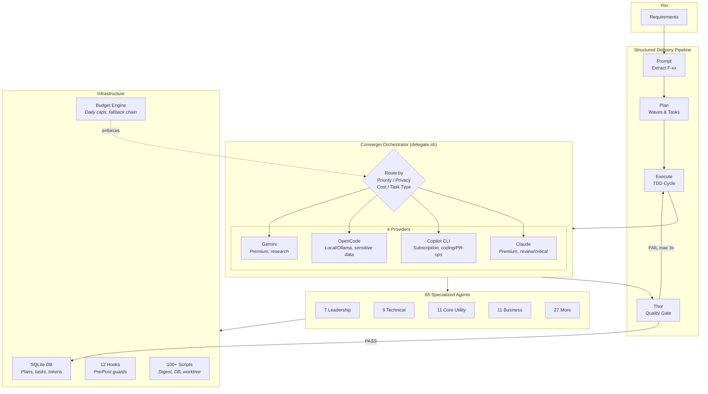
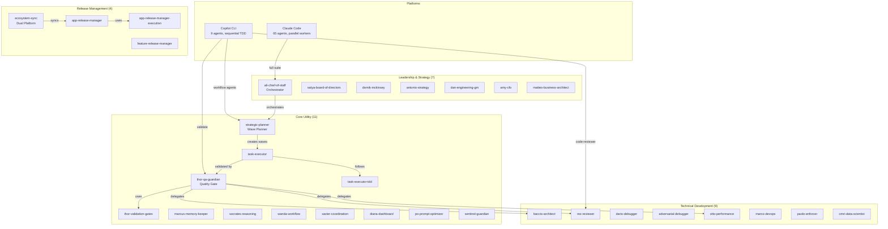
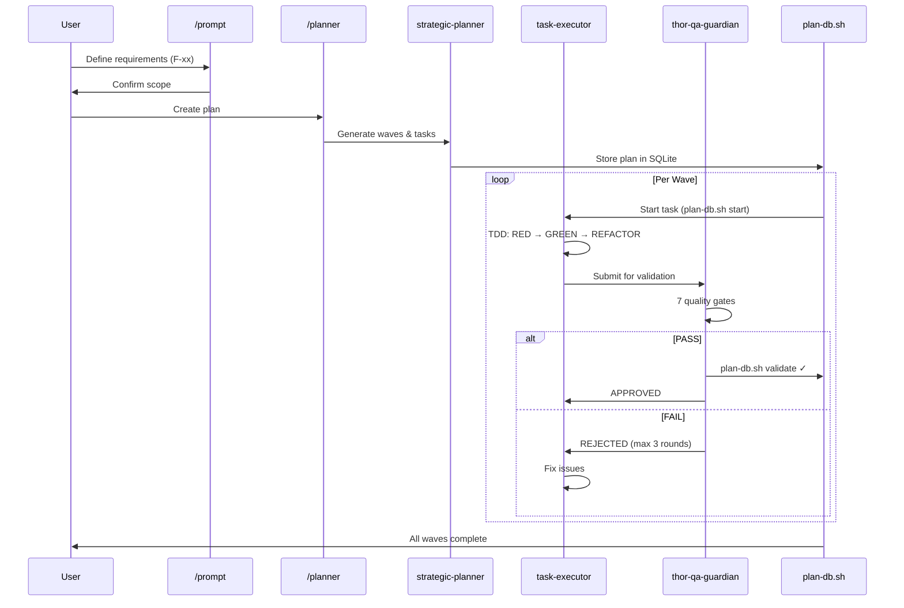
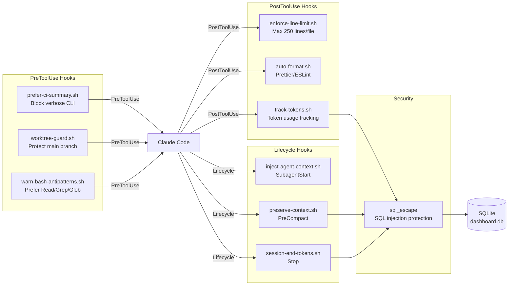
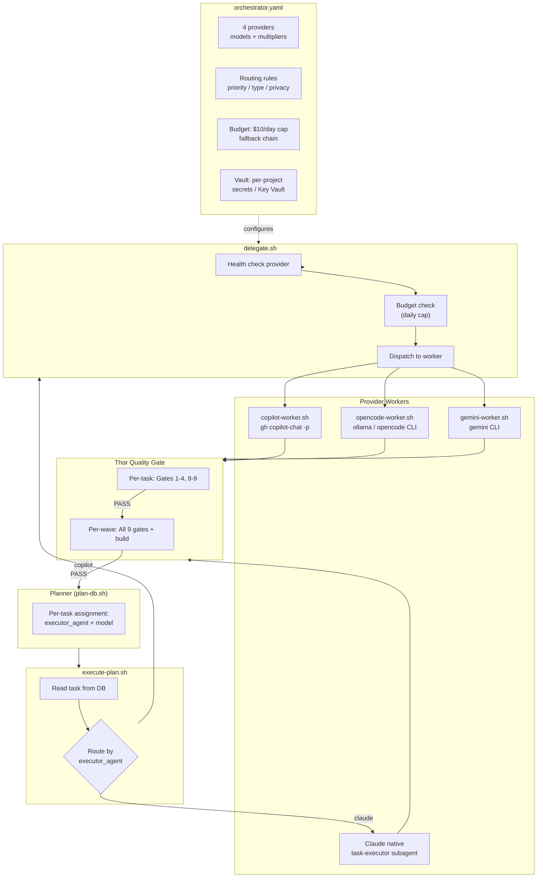
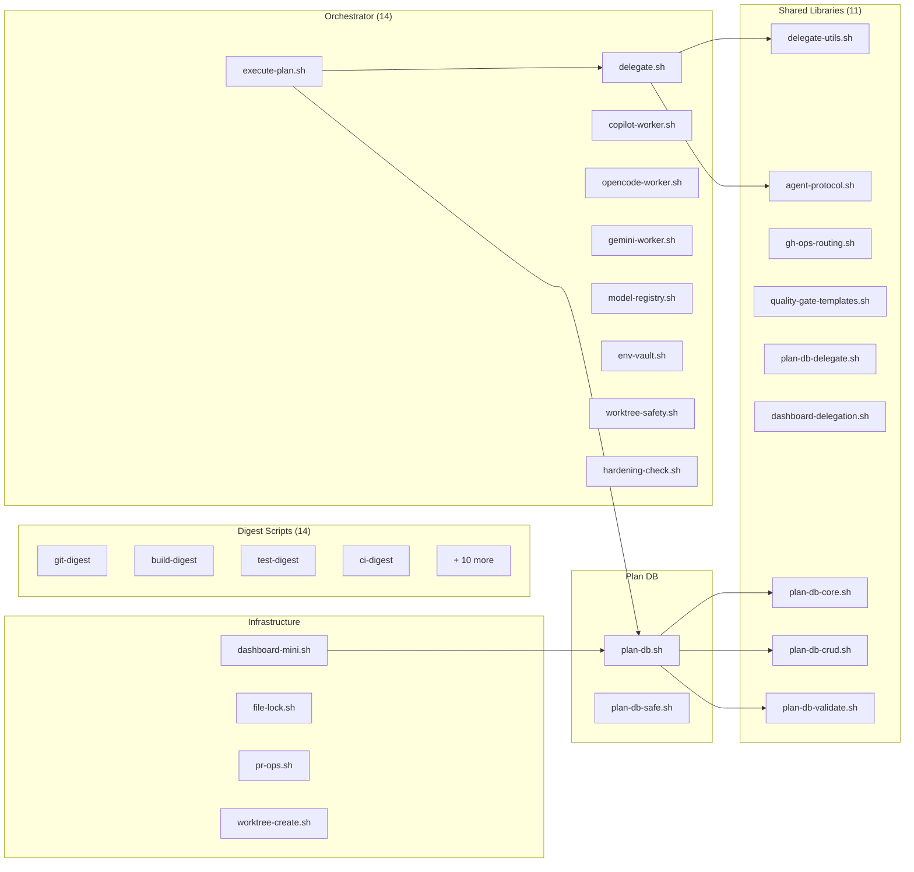
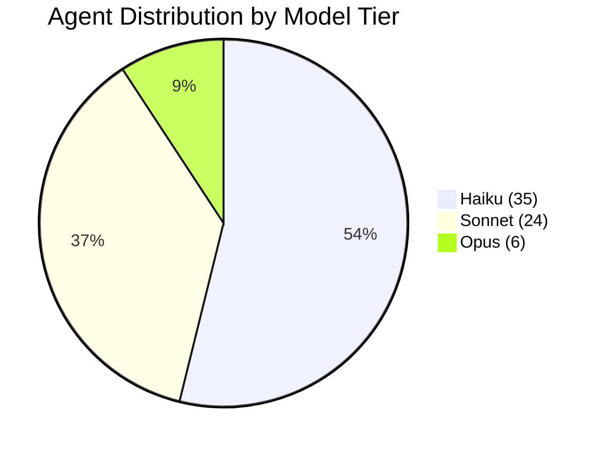

<div align="center">

# MyConvergio - Claude Code Plugin


**v6.2.0** | 65 Specialized Agents | Multi-Provider Orchestrator | Copilot CLI | CLI Dashboard

> _"Intent is human, momentum is agent"_
> — [The Agentic Manifesto](./AgenticManifesto.md)

[](https://creativecommons.org/licenses/by-nc-sa/4.0/)

</div>

---

## What's New in v6.0.0

**Convergio Orchestrator: multi-provider intelligent delegation across Claude, Copilot CLI, OpenCode (local), and Gemini.**

### Convergio Orchestrator

- **`delegate.sh`** — Central dispatcher routing tasks to the optimal provider based on priority, privacy, cost, and task type
- **4 provider workers**: `copilot-worker.sh`, `opencode-worker.sh`, `gemini-worker.sh`, Claude (native)
- **`orchestrator.yaml`** config — Providers, routing rules, budget caps, vault references
- **Privacy-aware routing** — Sensitive data never leaves local models (OpenCode/Ollama)
- **Budget enforcement** — Daily caps, fallback chains, alert thresholds
- **Per-task model assignment** — Planner assigns `executor_agent` + `model` per task in DB
- **14 new orchestrator scripts** + libs for delegation, agent protocol, quality gates

### Supporting Infrastructure

- **`model-registry.sh`** — Refresh/list/diff/check model registry from orchestrator.yaml
- **`env-vault.sh`** — Per-project secrets management with Key Vault integration
- **`worktree-safety.sh`** — Pre-flight checks for worktree isolation
- **`hardening-check.sh`** — Personal data scanner for public repo safety
- **`execute-plan.sh`** — Unified plan executor with per-task engine routing
- **`cross-repo-learnings.yaml`** — Codified patterns from 400-commit analysis (7 problems, 4 quality gates)
- **25 tests** — Full test suite with 0 failures (pure bash, SCRIPT_DIR portable)

### Previous Highlights

- Copilot CLI support with 9 agents (v5.0.0)
- Ecosystem sync agent with blocklist/sanitization (v5.0.0)
- 65 specialized agents, 89+ scripts, CLI dashboard (v4.8.0)
- Agent Teams, Tasks API, multi-terminal support (v4.7.0)

---

## Quick Start

### Installation

#### Option A: Clone & Use (Recommended)

```bash
git clone https://github.com/roberdan/MyConvergio.git
cd MyConvergio
claude --plugin-dir .
```

#### Option B: Global npm Install

```bash
# Full install (all 65 agents)
npm install -g myconvergio

# Or choose a profile for lower context usage:
MYCONVERGIO_PROFILE=minimal npm install -g myconvergio  # 9 agents, ~50KB
MYCONVERGIO_PROFILE=lean npm install -g myconvergio     # 65 agents, ~600KB
```

Copies agents to `~/.claude/agents/`. See [Context Optimization Guide](./docs/CONTEXT_OPTIMIZATION.md) for details.

#### Option C: Claude Marketplace (Coming Soon)

```bash
claude plugins install myconvergio
```

_Pending Anthropic approval_

#### Option D: GitHub Copilot CLI

MyConvergio ships Copilot CLI agents in `copilot-agents/`. To use them:

```bash
# Copy agents to your Copilot config
cp copilot-agents/*.agent.md ~/.copilot/agents/

# Or symlink for auto-updates
ln -sf "$(pwd)/copilot-agents"/*.agent.md ~/.copilot/agents/
```

Available Copilot agents: `@code-reviewer`, `@compliance-checker`, `@execute`, `@planner`, `@prompt`, `@strategic-planner`, `@tdd-executor`, `@validate`, `@ecosystem-sync`

### Usage

**Claude Code — invoke any agent:**

```bash
@ali-chief-of-staff Help me design our global expansion strategy
@baccio-tech-architect Design microservices architecture for healthcare platform
@rex-code-reviewer Review this pull request for security issues
```

**Copilot CLI — invoke workflow agents:**

```bash
@prompt Extract requirements for user authentication feature
@planner Create execution plan from requirements
@execute Run task-001 with TDD workflow
@validate Verify completed wave meets quality gates
```

**Use slash commands (Claude Code):**

```bash
/myconvergio:status    # Show ecosystem status
/myconvergio:team      # List all 65 agents by category
/myconvergio:plan      # Create a strategic execution plan
```

---

## How It Works



### Core Concept: Multi-Provider Intelligent Delegation

Unlike single-vendor frameworks, MyConvergio's **Convergio Orchestrator** routes each task to the optimal provider:

| Routing Dimension | How It Works                                                                          |
| ----------------- | ------------------------------------------------------------------------------------- |
| **Priority**      | P0 critical → Claude/Gemini; P2 backlog → Copilot; P3 bulk → OpenCode (local)         |
| **Task Type**     | Coding → Copilot/Claude; Research → Gemini; Review → Claude Opus; Tests → Copilot     |
| **Privacy**       | Public → any provider; Internal → Copilot/OpenCode; Sensitive → OpenCode only (local) |
| **Budget**        | Daily cap enforced; automatic fallback chain: Claude → Copilot → Gemini → OpenCode    |

The planner assigns `executor_agent` + `model` per task in the DB. The executor reads this and routes accordingly — no runtime decision needed.

---

## Workflow (Prompt → Plan → Execute → Verify)

MyConvergio follows a structured delivery flow that mirrors Claude Code best practices.
See `docs/workflow.md` for the full reference.

### 1) Prompt

Use `/prompt` to extract requirements (F-xx) and confirm scope before planning.

Docs: `.claude/commands/prompt.md`

### 2) Planner

Use `/planner` to generate a multi-wave plan with tasks tied to F-xx criteria.

Docs: `.claude/commands/planner.md`

### 3) Execution (Executor Tracking)

Use the executor tracking helpers to log execution state and generate task markdown.

Docs: `EXECUTOR_TRACKING.md`  
Scripts: `.claude/scripts/executor-tracking.sh`, `.claude/scripts/generate-task-md.sh`

### 4) Thor QA Guardian

Use the Thor agent to validate completion, evidence, and quality gates.

Agent: `.claude/agents/core_utility/thor-quality-assurance-guardian.md`

### 5) Dashboard

Monitor plans, waves, tasks, and token usage via the CLI mini-dashboard:

```bash
dashboard-mini.sh              # Full project overview
dashboard-mini.sh --overview   # Cross-project summary
dashboard-mini.sh --help       # All options
```

**Requirements**: `bash` + `sqlite3` (preinstalled on macOS/Linux). On Windows, use WSL2.

---

## Convergio Orchestrator

The Convergio Orchestrator is the core innovation of v6.0.0. It enables **intelligent multi-provider task delegation** — each task in your execution plan is routed to the best AI provider based on four dimensions.

### How Delegation Works

1. **Planner assigns per-task routing**: When `/planner` creates the execution plan, each task gets `executor_agent` (which provider) and `model` (which model) stored in SQLite
2. **Executor reads routing from DB**: `/execute` reads the task's routing and dispatches accordingly
3. **delegate.sh orchestrates**: Health-checks the provider, enforces budget, dispatches to the appropriate worker script
4. **Workers execute independently**: Each worker (`copilot-worker.sh`, `opencode-worker.sh`, `gemini-worker.sh`, or Claude native) runs the task with provider-specific CLI flags
5. **Thor validates independently**: Quality gates run after every task regardless of provider

### Routing Dimensions

| Dimension            | Rules                                                                                                    | Example                            |
| -------------------- | -------------------------------------------------------------------------------------------------------- | ---------------------------------- |
| **Priority (P0-P3)** | P0 critical → Claude/Gemini; P1 sprint → Copilot/Claude; P2 backlog → Copilot/Gemini; P3 bulk → OpenCode | Production bug fix → Claude Opus   |
| **Task Type**        | Coding → Copilot; Research → Gemini; Code review → Claude; Tests → Copilot; Bulk → OpenCode              | API research → Gemini 2.5 Pro      |
| **Privacy**          | Public → all providers; Internal → Copilot/OpenCode; Sensitive (PII) → OpenCode only                     | Healthcare data → local Ollama     |
| **Budget**           | $10/day cap; fallback chain: Claude → Copilot → Gemini → OpenCode; alert at 80%                          | Cap hit → auto-fallback to Copilot |

### Configuration (`orchestrator.yaml`)

```yaml
providers:
  claude: # Premium, cloud (Anthropic)
  copilot: # Included in GitHub Copilot subscription
  opencode: # Free, local (Ollama)
  gemini: # Premium, cloud (Google)

routing:
  by_priority: { P0: [claude, gemini], P1: [copilot, claude], ... }
  by_type: { coding: copilot, research: gemini, review: claude, ... }
  by_privacy: { sensitive: [opencode], internal: [copilot, opencode], ... }

budget:
  max_premium_per_day: 10.00
  fallback_chain: [claude, copilot, gemini, opencode]
  enforce_budget: true
```

### Provider Workers

| Worker               | CLI                      | Use Case                   | Cost                             |
| -------------------- | ------------------------ | -------------------------- | -------------------------------- |
| `copilot-worker.sh`  | `gh copilot-chat`        | Coding, tests, PR-ops      | Included in Copilot subscription |
| `opencode-worker.sh` | `opencode` / Ollama      | Sensitive data, bulk tasks | Free (local)                     |
| `gemini-worker.sh`   | `gemini` CLI             | Research, analysis         | Metered                          |
| Claude (native)      | `task-executor` subagent | Reviews, critical tasks    | Premium                          |

### Quality Gates (Same for All Providers)

Every task, regardless of which provider executed it, goes through the same Thor validation:

- **Per-task**: Gates 1-4 (compliance, quality, standards, repo) + 8 (TDD) + 9 (constitution)
- **Per-wave**: All 9 gates + full build verification
- **Max 3 rejection rounds** before escalation to user

This ensures consistent quality whether code was written by Claude, Copilot, Gemini, or a local model.

---

## CLI Dashboard

**Terminal-native project dashboard — no browser, no server, no dependencies.**

### Features

- **Project Overview**: Plans, waves, tasks with progress bars and status
- **Token Tracking**: API token consumption and cost monitoring
- **Wave/Task Drilldown**: Detailed per-wave and per-task status
- **Human Tasks**: Highlights tasks requiring manual intervention
- **Git Integration**: Branch status, PR data (via `gh` CLI, optional)
- **Cross-Platform**: macOS, Linux, WSL2 (bash + sqlite3)
- **Multi-Machine Sync**: Optional remote sync via `sync-dashboard-db.sh`

### Quick Start

```bash
# Make sure dashboard-mini.sh is in your PATH
export PATH="$HOME/.claude/scripts:$PATH"

# Run the dashboard
dashboard-mini.sh

# Overview of all active projects
dashboard-mini.sh --overview
```

### Database

Reads the same SQLite database as Claude Code (`~/.claude/data/dashboard.db`). No additional configuration required.

> **Note**: The web dashboard (Node.js, port 31415) was removed in v5.0.0 in favor of this CLI dashboard. The web version is available in the git history (v4.8.0 and earlier) for reference.

---

## Agent Portfolio (65 Specialists)

### Leadership & Strategy (7)

| Agent                                     | Description                                             |
| ----------------------------------------- | ------------------------------------------------------- |
| `ali-chief-of-staff`                      | Master orchestrator for complex multi-domain challenges |
| `satya-board-of-directors`                | Board-level strategic advisor                           |
| `domik-mckinsey-strategic-decision-maker` | McKinsey Partner-level strategic decisions              |
| `antonio-strategy-expert`                 | Strategy frameworks (OKR, Lean, Agile)                  |
| `amy-cfo`                                 | Chief Financial Officer for financial strategy          |
| `dan-engineering-gm`                      | Engineering General Manager                             |
| `matteo-strategic-business-architect`     | Business strategy architect                             |

### Technical Development (9)

| Agent                           | Description                                  |
| ------------------------------- | -------------------------------------------- |
| `baccio-tech-architect`         | Elite Technology Architect for system design |
| `marco-devops-engineer`         | DevOps for CI/CD and infrastructure          |
| `dario-debugger`                | Systematic debugging expert                  |
| `rex-code-reviewer`             | Code review specialist                       |
| `otto-performance-optimizer`    | Performance optimization                     |
| `paolo-best-practices-enforcer` | Coding standards enforcer                    |
| `omri-data-scientist`           | Data Scientist for ML and AI                 |
| `adversarial-debugger`          | 3-hypothesis parallel bug diagnosis          |
| `task-executor-tdd`             | TDD workflow module (RED→GREEN→REFACTOR)     |

### Business Operations (11)

| Agent                                      | Description                               |
| ------------------------------------------ | ----------------------------------------- |
| `davide-project-manager`                   | Project Manager (Agile, Scrum, Waterfall) |
| `marcello-pm`                              | Product Manager for strategy and roadmaps |
| `oliver-pm`                                | Senior Product Manager                    |
| `luke-program-manager`                     | Program Manager for portfolios            |
| `anna-executive-assistant`                 | Executive Assistant with task management  |
| `andrea-customer-success-manager`          | Customer Success Manager                  |
| `fabio-sales-business-development`         | Sales & Business Development              |
| `sofia-marketing-strategist`               | Marketing Strategist                      |
| `steve-executive-communication-strategist` | Executive Communication                   |
| `enrico-business-process-engineer`         | Business Process Engineer                 |
| `dave-change-management-specialist`        | Change Management specialist              |

### Design & UX (3)

| Agent                                 | Description                            |
| ------------------------------------- | -------------------------------------- |
| `jony-creative-director`              | Creative Director for brand innovation |
| `sara-ux-ui-designer`                 | UX/UI Designer                         |
| `stefano-design-thinking-facilitator` | Design Thinking facilitator            |

### Compliance & Legal (5)

| Agent                                   | Description                        |
| --------------------------------------- | ---------------------------------- |
| `elena-legal-compliance-expert`         | Legal & Compliance expert          |
| `luca-security-expert`                  | Cybersecurity expert               |
| `dr-enzo-healthcare-compliance-manager` | Healthcare Compliance (HIPAA, FDA) |
| `sophia-govaffairs`                     | Government Affairs specialist      |
| `guardian-ai-security-validator`        | AI Security validator              |

### Specialized Experts (14)

| Agent                                    | Description                           |
| ---------------------------------------- | ------------------------------------- |
| `behice-cultural-coach`                  | Cultural intelligence expert          |
| `fiona-market-analyst`                   | Market Analyst for financial research |
| `michael-vc`                             | Venture Capital analyst               |
| `angela-da`                              | Senior Decision Architect             |
| `ethan-da`                               | Data Analytics specialist             |
| `evan-ic6da`                             | Principal Decision Architect (IC6)    |
| `ava-analytics-insights-virtuoso`        | Analytics virtuoso                    |
| `riccardo-storyteller`                   | Narrative designer                    |
| `jenny-inclusive-accessibility-champion` | Accessibility champion                |
| `giulia-hr-talent-acquisition`           | HR & Talent Acquisition               |
| `sam-startupper`                         | Silicon Valley startup expert         |
| `wiz-investor-venture-capital`           | Venture Capital investor              |
| `coach-team-coach`                       | Team Coach                            |
| `research-report-generator`              | Morgan Stanley-style research reports |

### Core Utility (11)

| Agent                                            | Description                       |
| ------------------------------------------------ | --------------------------------- |
| `marcus-context-memory-keeper`                   | Institutional memory guardian     |
| `thor-quality-assurance-guardian`                | Quality watchdog                  |
| `thor-validation-gates`                          | Validation gates module for Thor  |
| `diana-performance-dashboard`                    | Performance dashboard specialist  |
| `socrates-first-principles-reasoning`            | First principles reasoning master |
| `strategic-planner`                              | Wave-based execution plan creator |
| `taskmaster-strategic-task-decomposition-master` | Task decomposition expert         |
| `po-prompt-optimizer`                            | Prompt engineering expert         |
| `wanda-workflow-orchestrator`                    | Workflow orchestrator             |
| `xavier-coordination-patterns`                   | Coordination patterns architect   |
| `sentinel-ecosystem-guardian`                    | Ecosystem config auditor          |

### Release Management (3)

| Agent                           | Description                            |
| ------------------------------- | -------------------------------------- |
| `app-release-manager`           | Release engineering with quality gates |
| `app-release-manager-execution` | Execution phases (3-5) module          |
| `feature-release-manager`       | Feature completion and issue closure   |

---

## Plugin Structure

```
MyConvergio/
├── .claude-plugin/
│   └── plugin.json           # Plugin manifest
├── .claude/
│   ├── CLAUDE.md             # Main config
│   ├── agents/               # 65 agents (8 categories)
│   ├── config/               # orchestrator.yaml, cross-repo-learnings.yaml
│   ├── docs/                 # gemini-setup.md, ADRs
│   ├── hooks/                # model-registry-refresh.sh
│   ├── rules/                # Execution rules
│   ├── scripts/              # 100+ scripts (digest, orchestrator, DB, worktree)
│   │   └── lib/              # Shared libs (delegate-utils, agent-protocol, etc.)
│   ├── reference/            # 11 on-demand operational docs
│   ├── skills/               # 10 reusable workflows + hardening
│   └── templates/            # State tracking templates
├── copilot-agents/           # 9 Copilot CLI agents
├── hooks/                    # 12 enforcement hooks + lib/
├── commands/                 # 3 slash commands
├── scripts/                  # Install/backup/test scripts
├── tests/                    # 25 test files (0 failures)
└── bin/myconvergio.js        # CLI entry point
```

---

## Architecture

### Agent Ecosystem



### Execution Flow (Prompt → Plan → Execute → Verify)



### Hook System & Token Optimization



### Convergio Orchestrator Architecture



### Script Architecture (100+ Scripts)



### Model Tiering



---

## Skills

Reusable workflows you can reference in your projects:

| Skill                 | Use Case                                                       |
| --------------------- | -------------------------------------------------------------- |
| `structured-research` | **NEW** Hypothesis-driven research with confidence calibration |
| `code-review`         | Systematic code review process                                 |
| `debugging`           | Root cause analysis methodology                                |
| `architecture`        | System design patterns                                         |
| `security-audit`      | Security assessment framework                                  |
| `performance`         | Performance optimization                                       |
| `strategic-analysis`  | McKinsey-style analysis                                        |
| `release-management`  | Release engineering                                            |
| `project-management`  | Agile/Scrum workflows                                          |
| `orchestration`       | Multi-agent coordination                                       |

### Structured Research (NEW)

Based on [Anthropic best practices](https://docs.anthropic.com/en/docs/build-with-claude/prompt-engineering/overview):

- Generate 2-4 competing hypotheses
- Track confidence levels (0-100%) with evidence
- Verify across multiple independent sources
- Iterative self-critique: "What am I missing?"
- Maintain research state (`hypothesis-tree.json`, `research-notes.md`)

**Example:**

```bash
Research the best approach for implementing authentication in our app.
Use structured-research skill to evaluate OAuth2 vs JWT vs session cookies.
```

---

## Rules

MyConvergio includes two rule systems:

### Primary Rules (Active)

Located in `.claude/rules/` - **Use these for new work:**

| Rule                       | Purpose                                                                                                      |
| -------------------------- | ------------------------------------------------------------------------------------------------------------ |
| `execution.md`             | **UPDATED** How work gets done (context awareness, parallel calls, anti-overengineering, Definition of Done) |
| `guardian.md`              | **NEW** Thor enforcement, PR comment resolution, completion verification                                     |
| `agent-discovery.md`       | **UPDATED** Agent routing, subagent orchestration patterns                                                   |
| `engineering-standards.md` | **UPDATED** Code quality, security (OWASP), testing, API design                                              |
| `file-size-limits.md`      | **NEW** Max 250 lines per file with split strategies                                                         |
| `README.md`                | Rules hierarchy and usage guide                                                                              |

### Domain-Specific Rules

Copy to your project's `.claude/rules/` for consistent standards:

- `code-style.md` - ESLint, Prettier, PEP8
- `security-requirements.md` - OWASP Top 10
- `testing-standards.md` - Unit, integration, coverage
- `documentation-standards.md` - JSDoc, README, ADRs
- `api-development.md` - REST, versioning
- `ethical-guidelines.md` - Privacy, accessibility

### State Tracking Templates (NEW)

Located in `.claude/templates/` for multi-session work:

- `tests.json` - Structured test status tracking
- `progress.txt` - Unstructured progress notes
- `README.md` - Usage guidelines for context refresh scenarios

---

## Execution Framework

This repository is **fully self-contained** with two rule systems:

### Primary Rules (Active)

| Document                                                             | Purpose                                                                              | Priority |
| -------------------------------------------------------------------- | ------------------------------------------------------------------------------------ | -------- |
| [CONSTITUTION.md](./agents/CONSTITUTION.md)                          | Security, Ethics, Identity                                                           | SUPREME  |
| [execution.md](./.claude/rules/execution.md)                         | **NEW** How Work Gets Done (context awareness, parallel calls, anti-overengineering) | 2nd      |
| [guardian.md](./.claude/rules/guardian.md)                           | **NEW** Thor enforcement, PR comment resolution, completion verification             | 3rd      |
| [engineering-standards.md](./.claude/rules/engineering-standards.md) | Code quality, security, testing, API design                                          | 4th      |

### Legacy System (Backward Compatibility)

| Document                                                                         | Purpose                                                        | Priority |
| -------------------------------------------------------------------------------- | -------------------------------------------------------------- | -------- |
| [EXECUTION_DISCIPLINE.md](./.claude/agents/core_utility/EXECUTION_DISCIPLINE.md) | Legacy execution rules (maintained for backward compatibility) | -        |
| CommonValuesAndPrinciples.md                                                     | Organizational Values                                          | -        |

**Recommendation:** New work should reference `.claude/rules/execution.md` instead of EXECUTION_DISCIPLINE.md. See [.claude/rules/README.md](./.claude/rules/README.md) for hierarchy details.

**No external configuration files are required.**

---

## Security Framework

All agents implement the [MyConvergio Constitution](./agents/CONSTITUTION.md):

| Article | Protection                                                  |
| ------- | ----------------------------------------------------------- |
| I       | Identity Lock - Immutable agent identity                    |
| II      | Ethical Principles - Fairness, transparency, accountability |
| III     | Security Directives - Anti-hijacking, input validation      |
| IV      | Operational Boundaries - Role adherence                     |
| V       | Failure Modes - Graceful degradation                        |
| VI      | Collaboration - Safe inter-agent communication              |
| VII     | **Accessibility & Inclusion (NON-NEGOTIABLE)**              |
| VIII    | Accountability - Logging and audit trails                   |

---

## The Agentic Manifesto

_Human purpose. AI momentum._

### What we believe

1. **Intent is human, momentum is agent.**
2. **Impact must reach every mind and body.**
3. **Trust grows from transparent provenance.**
4. **Progress is judged by outcomes, not output.**

### How we act

1. Humans stay accountable for decisions and effects.
2. Agents amplify capability, never identity.
3. We design from the edge first: disability, language, connectivity.
4. Safety rails precede scale.
5. Learn in small loops, ship value early.

_Read the full [Agentic Manifesto](./AgenticManifesto.md)_

---

## How MyConvergio Differs from Market Solutions

The agentic AI space is crowded with frameworks (Microsoft Agent Framework, AutoGen, CrewAI, LangGraph, OpenAI Agents SDK). MyConvergio takes a fundamentally different approach.

### Comparison Matrix

| Dimension             | Microsoft Agent Framework / AutoGen    | CrewAI / LangGraph         | MyConvergio                                                        |
| --------------------- | -------------------------------------- | -------------------------- | ------------------------------------------------------------------ |
| **Runtime**           | Python/.NET SDK, cloud deployment      | Python SDK, server process | CLI-native (bash + sqlite3), zero server                           |
| **LLM Lock-in**       | Azure OpenAI / single provider         | Single provider per agent  | Multi-provider routing: Claude, Copilot, OpenCode (local), Gemini  |
| **Cost Model**        | Pay-per-token, no budget controls      | Pay-per-token              | Budget caps, multi-tier fallback chain, per-task cost tracking     |
| **Privacy**           | Cloud-only (data leaves your machine)  | Cloud-only                 | Privacy-aware: sensitive data routes to local models only          |
| **Quality Assurance** | Agents self-report success             | Agents self-report success | Independent Thor validation (9 gates, reads files directly)        |
| **State Management**  | Redis/Pinecone/cloud DB                | In-memory or cloud DB      | SQLite file, portable, inspectable, no dependencies                |
| **Git Safety**        | No git awareness                       | No git awareness           | Worktree isolation per plan, branch protection hooks               |
| **Execution**         | API calls via SDK                      | API calls via SDK          | Real CLI tools (claude, copilot, opencode, gemini)                 |
| **Agent Count**       | Generic agent templates                | Role-based templates       | 65 domain-specialized agents with personas                         |
| **Workflow**          | Freeform or graph-based                | Role-based or graph-based  | Structured pipeline: Prompt > Plan > Execute (TDD) > Thor > Verify |
| **Setup**             | pip install + cloud config             | pip install + API keys     | `git clone` or `npm install -g`, works immediately                 |
| **Target User**       | Platform engineers building agent apps | Python developers          | Software engineers using AI coding assistants daily                |

### Key Architectural Differences

**1. Multi-Provider Intelligence (vs Single-Vendor Lock-in)**

MyConvergio routes tasks to the best provider based on priority, privacy, cost, and task type. A P0 critical bug goes to Claude Opus; a bulk refactoring goes to Copilot; sensitive data stays on local OpenCode models. No other framework offers this routing intelligence.

**2. Independent Quality Validation (vs Self-Reporting)**

In every other framework, agents report their own success. MyConvergio's Thor agent validates independently: reads files, runs tests, checks 9 quality gates. An agent claiming "tests pass" means nothing until Thor confirms it. This is the single biggest reliability differentiator.

**3. CLI-Native, Zero Infrastructure**

No Python runtime, no Docker, no cloud accounts, no servers. Just `bash` + `sqlite3` (preinstalled on macOS/Linux). The entire orchestration layer runs in your terminal alongside your existing coding workflow. Market frameworks require deploying infrastructure before writing a single line of code.

**4. Cost Awareness as First-Class Citizen**

Daily budget caps, automatic fallback chains (Claude > Copilot > Gemini > OpenCode), per-task token tracking, cost-per-wave reporting. Other frameworks treat cost as an afterthought; MyConvergio treats it as an architectural constraint.

**5. Git Worktree Isolation**

Every execution plan runs in an isolated git worktree. No risk of corrupting your main branch. Concurrent plans work on separate branches simultaneously. No other agentic framework provides git-level execution isolation.

### When to Use What

| Scenario                                                 | Best Choice                          |
| -------------------------------------------------------- | ------------------------------------ |
| Building a multi-agent SaaS product                      | Microsoft Agent Framework, LangGraph |
| Research prototype with agent dialogue                   | AutoGen, CrewAI                      |
| Content generation with role-based teams                 | CrewAI                               |
| **Daily software engineering with AI coding assistants** | **MyConvergio**                      |
| **Multi-provider cost optimization**                     | **MyConvergio**                      |
| **Privacy-sensitive codebases**                          | **MyConvergio**                      |

MyConvergio is not competing with agent frameworks. It is a **practitioner's toolkit** for engineers who use AI coding assistants every day and need structure, quality gates, cost control, and multi-provider flexibility.

---

## Engineering Foundations

MyConvergio's workflow is informed by two Microsoft engineering references:

- **[ISE Code-with-Engineering Playbook](https://microsoft.github.io/code-with-engineering-playbook/)** — The Industry Solutions Engineering team's internal standard for all customer engagements. Covers testing, code reviews, CI/CD, design reviews, security, observability, and agile practices.
- **[HVE Core](https://github.com/microsoft/hve-core)** — Hierarchical Verifiable Execution framework for AI agents. Research-Plan-Implement-Review-Discover lifecycle with schema validation and failed approach tracking.

### Alignment with ISE Engineering Playbook

| ISE Playbook Concept         | MyConvergio Equivalent                                         | Status                                                           |
| ---------------------------- | -------------------------------------------------------------- | ---------------------------------------------------------------- |
| Definition of Ready          | `/prompt` F-xx extraction + Technical Clarification (step 1.6) | Aligned                                                          |
| Definition of Done (feature) | Thor per-task validation (Gates 1-4, 8, 9)                     | **Enhanced** — automated, independent agent reads files directly |
| Definition of Done (sprint)  | Thor per-wave validation (all 9 gates + build)                 | **Enhanced** — no self-reporting, 3-round rejection cycle        |
| PR author checklist          | Pre-commit hooks (lint, typecheck, test) + TF-pr task          | Aligned                                                          |
| PR reviewer checklist        | Thor Gates 2 (code quality) + 3 (ISE standards) + 8 (TDD)      | **Enhanced** — automated, zero human reviewer bottleneck         |
| Code review SLA              | Not applicable (agents review immediately)                     | Adapted                                                          |
| Design reviews / ADRs        | `/research` phase + Thor Gate 9 (Constitution & ADR)           | Aligned                                                          |
| Trade studies                | ADR with alternatives in Context section                       | Aligned                                                          |
| Sprint goal                  | Wave-level task grouping with shared F-xx refs                 | Adapted                                                          |
| Conventional commits         | Enforced by Git Hygiene gate (Gate 6)                          | Aligned                                                          |
| Branch naming convention     | `feature/`, `fix/`, `chore/` enforced by worktree-create.sh    | Aligned                                                          |
| Credential scanning (CI)     | Thor Gate 3: grep for AWS/API/GitHub/password patterns         | Aligned                                                          |
| TDD (Red-Green-Refactor)     | Thor Gate 8 (MANDATORY) + task-executor-tdd module             | **Enhanced** — enforced per-task, not just in CI                 |
| 80%+ code coverage           | Thor approval criteria: coverage >= 80% new files              | Aligned                                                          |
| Secrets in Key Vault         | `env-vault.sh` + coding-standards.md rules                     | Aligned                                                          |
| Documentation-as-code        | Thor Gate 5 (docs updated if behavior changed)                 | Aligned                                                          |
| Retrospectives               | Knowledge Codification (errors -> ADR + ESLint rules)          | Adapted — machine-readable instead of meeting-based              |

### Patterns Adopted from HVE Core

| HVE Core Pattern               | MyConvergio Implementation                                                                                                                             |
| ------------------------------ | ------------------------------------------------------------------------------------------------------------------------------------------------------ |
| **Failed Approaches Tracking** | Executor logs `{task_id, approach, reason}` on max retries via `plan-db.sh log-failure`. Planner reads prior failures to avoid repeating them.         |
| **Schema-Driven Validation**   | `plan-spec-schema.json` validates spec.json structure before plan import. Catches missing `verify` arrays, invalid task IDs, effort outside 1-3 range. |
| **Phase 5 Discover**           | Knowledge Codification rule: errors discovered during execution are codified as ADRs and ESLint rules, not just fixed.                                 |
| **Discrepancy Logging**        | F-xx verification report with `[x] PASS` / `[ ] FAIL` evidence per requirement.                                                                        |

### Where MyConvergio Goes Beyond Both

- **Multi-provider routing** — Neither ISE Playbook nor HVE Core address multi-provider orchestration
- **Independent quality validation** — ISE relies on human reviewers; HVE Core uses self-review. Thor is a separate agent that trusts nothing.
- **Budget-aware execution** — Daily caps, fallback chains, per-task cost tracking
- **Git worktree isolation** — Plans execute in isolated branches; no main branch corruption risk

---

## Migration from npm Package

If upgrading from v2.x (npm package):

```bash
# Uninstall npm version
npm uninstall -g myconvergio

# Install plugin version
claude plugins install myconvergio
```

---

## License & Legal

Copyright 2025 Convergio.io

Licensed under [Creative Commons Attribution-NonCommercial-ShareAlike 4.0 International](./LICENSE)

### Disclaimers

- **Experimental Software**: Provided "AS IS" without warranties
- **Non-Commercial Use Only**: See LICENSE file for details
- **No Corporate Affiliation**: Not affiliated with Anthropic, OpenAI, or Microsoft
- **Personal Project**: Author is a Microsoft employee; this is a personal initiative

**Author Note**: Roberto D'Angelo is a Microsoft employee. This project is a personal initiative created independently during personal time. This project is NOT affiliated with, endorsed by, or representing Microsoft Corporation.

---

## Contributing

Contributions are welcome! See [CONTRIBUTING.md](./CONTRIBUTING.md) for guidelines.

For questions about commercial licensing: roberdan@fightthestroke.org

---

<div align="center">

_Built with AI assistance in Milano, following the Agentic Manifesto principles_

**v6.2.0** | February 2026 | Multi-Provider Orchestrator + Claude Code + Copilot CLI

</div>
