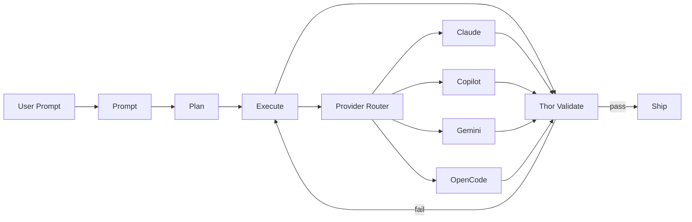
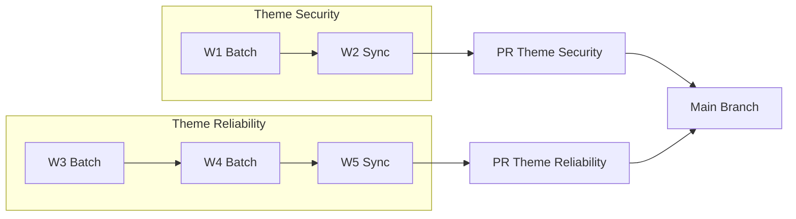
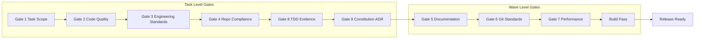
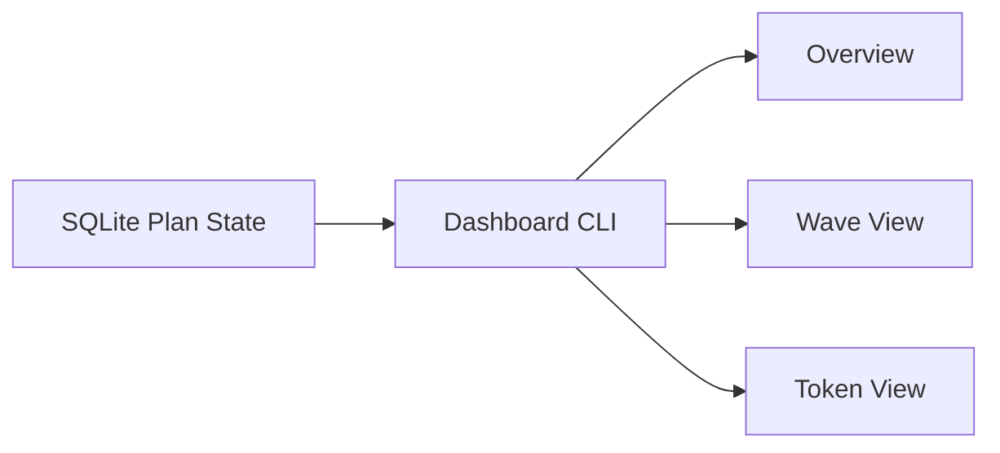
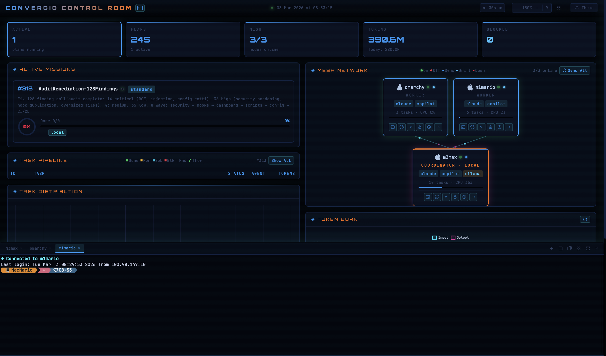

<div align="center">

# MyConvergio v10


[](./VERSION)
[](#agent-portfolio)
[](#agent-portfolio)
[](#agent-portfolio)
[](./LICENSE)

**Open source AI engineering orchestration for real shipping teams.**
_Intent is human, momentum is agent._

</div>

---

## Why MyConvergio
### Problem
Open source teams can generate code fast, but consistency and release safety still break down:
- One assistant session cannot reliably coordinate multi-wave delivery.
- Validation is often self-reported instead of independently enforced.
- Merge flow is manual and noisy when many tasks land at once.
- Model lock-in makes cost, speed, and quality hard to balance.

### Solution
MyConvergio gives you a provider-agnostic Prompt to Plan to Execute to Thor to Ship pipeline with:
- Independent Thor validation before merge.
- Wave-aware merge strategy for fewer cleaner PRs.
- Configurable model routing per task complexity.
- Structured state and dashboard visibility for execution at scale.

---

## Architecture
### Core pipeline with provider routing


### Merge strategy by wave theme


### Thor 9 gate validation flow


### CLI dashboard data flow


---

## Multi provider routing table

| Task Type | Primary Provider | Default Model | Fallback Providers | Configurable In |
| --- | --- | --- | --- | --- |
| Requirements extraction | Claude | claude-opus-4.6 | Gemini Pro | Planner model strategy |
| Strategic planning | Claude | claude-opus-4.6-1m | Gemini Pro | Planner model strategy |
| Code generation and TDD | Copilot | gpt-5.3-codex | Claude Sonnet | Executor task routing |
| Validation and review | Claude | claude-opus-4.6 | Copilot review agent | Validation routing |
| Bulk mechanical fixes | Copilot | gpt-5-mini | Claude Haiku | Executor task routing |
| Research and analysis | Gemini | gemini-3-pro-preview | Claude Sonnet | Planner model strategy |

> Model assignment is configurable per task. Use fast models for repetitive work and premium models for architecture, security, and release gates.

---

## Comparison

| Category | Typical Pattern | MyConvergio v10 |
| --- | --- | --- |
| Cursor, Windsurf, Aider | Strong coding UX but mostly single session execution | Multi-wave orchestration, independent Thor validation, merge aware delivery |
| Copilot Workspace, Devin | End to end automation but provider lock-in and limited routing control | Provider-agnostic routing, configurable models, explicit gate based validation |
| AutoGen, CrewAI frameworks | Flexible framework primitives that require custom assembly | Ready to run platform with scripts, agents, gates, dashboard, and docs hub |

---

## Quick Start
### Option A: Clone and Make
```bash
git clone https://github.com/roberdan/MyConvergio.git && cd MyConvergio
make install
```

### Option B: One line install
```bash
curl -sSL https://raw.githubusercontent.com/roberdan/MyConvergio/main/checksums.txt -o /tmp/mc-checksums.txt
curl -sSL https://raw.githubusercontent.com/roberdan/MyConvergio/main/install.sh -o /tmp/mc-install.sh
sha256sum -c /tmp/mc-checksums.txt --ignore-missing && bash /tmp/mc-install.sh

# direct install
curl -sSL https://raw.githubusercontent.com/roberdan/MyConvergio/main/install.sh | bash
```

### Option C: Modular install
```bash
myconvergio install --minimal
myconvergio install --standard
myconvergio install --lean
```

### Option D: GitHub Copilot CLI
```bash
cp copilot-agents/*.agent.md ~/.copilot/agents/
```

---

## CLI Dashboard
Terminal first visibility for plans, waves, quality gates, and token usage.
```bash
~/.claude/scripts/dashboard-mini.sh
~/.claude/scripts/dashboard-mini.sh -n
~/.claude/scripts/dashboard-mini.sh -p 281
~/.claude/scripts/dashboard-mini.sh -v
```


---

## Agent Portfolio
### Actual file counts in this repository
- Claude catalog files in `.claude/agents`: **81**
- Copilot agent files in `copilot-agents`: **83**
- Total agent files: **164**

| Claude Catalog Area | File Count |
| --- | --- |
| leadership_strategy | 7 |
| technical_development | 11 |
| business_operations | 11 |
| core_utility | 23 |
| compliance_legal | 5 |
| specialized_experts | 14 |
| design_ux | 3 |
| release_management | 5 |
| research_report | 1 |
| root orchestrators | 1 |

---

## Skills
MyConvergio ships reusable skill workflows for recurring engineering work:
- architecture
- debugging
- code-review
- security-audit
- performance
- orchestration
- review-pr
- design-systems
- ui-design
- release
- planner
- execute
- validate

Skill files currently present in `.claude/skills`: **23**.

---

## Documentation Hub
- [Getting Started](./docs/getting-started.md)
- [Core Concepts](./docs/concepts.md)
- [Workflow Guide](./docs/workflow.md)
- [Infrastructure](./docs/infrastructure.md)
- [Use Cases](./docs/use-cases.md)
- [Agent Portfolio](./docs/agents/agent-portfolio.md)
- [Comparison](./docs/agents/comparison.md)
- [Architecture Notes](./docs/agents/architecture.md)
- [ADRs](./docs/adr/INDEX.md)

---

## License
Licensed under [CC BY-NC-SA 4.0](./LICENSE).

---

<div align="center">

**MyConvergio v10.0.0** | **28 Feb 2026** | **164 agent files total** | **81 Claude catalog + 83 Copilot**

</div>
