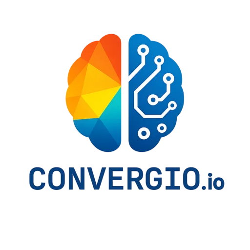
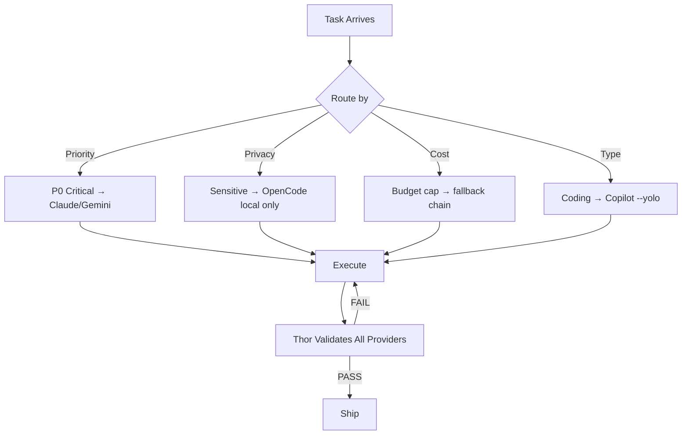

<div align="center">

# MyConvergio — Your Night Agents at Work



**v9.18.0** | 157 Agent Files (74 Claude + 83 Copilot) | Multi-Provider Orchestrator | Independent Quality Validation
<!-- AGENT_COUNTS: claude:74 copilot:83 total:157 -->

> _"Intent is human, momentum is agent"_
> — [The Agentic Manifesto](./AgenticManifesto.md)

[](https://creativecommons.org/licenses/by-nc-sa/4.0/)

</div>

```mermaid
graph LR
    U[User] --> PR[/prompt<br/>Extract F-xx]
    PR --> PL[/planner<br/>Waves & Tasks]
    PL --> EX[/execute<br/>TDD Cycle]
    EX --> TH[Thor<br/>9 Quality Gates]
    TH -->|PASS| SH[Ship<br/>Merge & Release]
    TH -->|FAIL| EX
    subgraph Providers
        CL[Claude] & CP[Copilot --yolo] & GE[Gemini] & OC[OpenCode local]
    end
    EX --> Providers
    Providers --> TH
```

---

## The Problem

AI coding assistants are powerful but chaotic. You get raw generation with **zero guardrails**:

- Agents self-report success — no independent validation
- Single-provider lock-in — no cost control or fallback
- No git safety — changes land directly on your branch
- No CI discipline — push-fix-push-fix loops waste hours
- Technical debt accumulates — issues deferred indefinitely

A solopreneur using Claude or Copilot has immense power with no structure.

## The Solution

MyConvergio adds **157 agent files (74 Claude + 83 Copilot)** + independent quality validation + multi-provider routing + budget caps + worktree isolation on top of your existing AI tools.

Three enforcement policies make it production-grade:

- **CI Batch Fix** — Agents wait for full CI, collect ALL failures, fix ALL in one commit, push once. Max 3 rounds. No push-fix-repeat loops.
- **Zero Technical Debt** — Every issue resolved before marking done. Nothing deferred. Accumulated debt is a violation.
- **Copilot `--yolo` Mode** — Full autonomous execution via `copilot-worker.sh --yolo`. Agents run without confirmation prompts for maximum throughput.

---

## Quick Start

### Option A: Clone & Make (Recommended)

```bash
git clone https://github.com/roberdan/MyConvergio.git && cd MyConvergio
make install          # Full install to ~/.claude/
```

### Option B: One-Line Install

```bash
# Verify integrity first (optional)
curl -sSL https://raw.githubusercontent.com/roberdan/MyConvergio/main/checksums.txt -o /tmp/mc-checksums.txt
curl -sSL https://raw.githubusercontent.com/roberdan/MyConvergio/main/install.sh -o /tmp/mc-install.sh
sha256sum -c /tmp/mc-checksums.txt --ignore-missing && bash /tmp/mc-install.sh

# Or direct (trusting the source)
curl -sSL https://raw.githubusercontent.com/roberdan/MyConvergio/main/install.sh | bash
```

### Option C: Modular Install

```bash
myconvergio install --minimal    # 9 core agents (~50KB)
myconvergio install --standard   # 20 agents (~200KB)
myconvergio install --lean       # 74 Claude agent files, 50% smaller
```

### Option D: GitHub Copilot CLI

```bash
cp copilot-agents/*.agent.md ~/.copilot/agents/
```

**Prerequisites**: `bash` + `sqlite3` + `jq` (preinstalled on macOS/Linux). Zero external dependencies.

### Usage

**Claude Code — invoke any agent:**

```bash
@ali-chief-of-staff Help me design our global expansion strategy
@baccio-tech-architect Design microservices architecture for healthcare platform
@rex-code-reviewer Review this pull request for security issues
@thor Validate the current task against quality gates
```

**Copilot CLI — invoke workflow agents:**

```bash
@prompt Extract requirements for user authentication feature
@planner Create execution plan from requirements
@execute Run task-001 with TDD workflow
@validate Verify completed wave meets quality gates
```

**Slash commands (Claude Code):**

```bash
/myconvergio:status    # Show ecosystem status
/myconvergio:team      # List all 74 Claude agent files by category
/myconvergio:plan      # Create a strategic execution plan
```

📖 [Full Getting Started Guide →](./docs/getting-started.md)

---

## Key Features

| #   | Feature                 | Description                                                       | Docs                                                |
| --- | ----------------------- | ----------------------------------------------------------------- | --------------------------------------------------- |
| 1   | 157 Agent Files         | 74 Claude + 83 Copilot agent files with specialized personas      | [Agent Portfolio](./docs/agents/agent-portfolio.md) |
| 2   | Thor 9-Gate Validation  | Independent QA — reads files, never trusts agent self-reports     | [Concepts](./docs/concepts.md)                      |
| 3   | Multi-Provider Routing  | Claude + Copilot + Gemini + OpenCode with priority/privacy/budget | [Concepts](./docs/concepts.md)                      |
| 4   | TDD Enforcement         | RED → GREEN → REFACTOR cycle required for every task              | [Workflow](./docs/workflow.md)                      |
| 5   | Worktree Isolation      | Each plan runs in its own git worktree — no branch conflicts      | [Concepts](./docs/concepts.md)                      |
| 6   | SQLite State Management | Portable, inspectable DB — no cloud dependencies                  | [Concepts](./docs/concepts.md)                      |
| 7   | CI Batch Fix            | Wait full CI → fix ALL → push once. Max 3 rounds                  | [Workflow](./docs/workflow.md)                      |
| 8   | Zero Technical Debt     | Every issue resolved, nothing deferred                            | [Workflow](./docs/workflow.md)                      |
| 9   | Copilot `--yolo` Mode   | Full autonomous delegation via `copilot-worker.sh --yolo`         | [Getting Started](./docs/getting-started.md)        |
| 10  | Token-Aware Writing     | <5% comments, compact commits/PRs, enforced by hooks + Thor       | [Concepts](./docs/concepts.md)                      |

---

## Agent Portfolio

**74 Claude agent files** across 8 categories:

| Category              | Count | Key Agents                                                   |
| --------------------- | ----- | ------------------------------------------------------------ |
| Leadership & Strategy | 7     | `ali-chief-of-staff`, `satya-board`, `domik-mckinsey`        |
| Technical Development | 9     | `baccio-architect`, `rex-reviewer`, `dario-debugger`         |
| Core Utility          | 11    | `strategic-planner`, `thor-qa-guardian`, `marcus-memory`     |
| Business Operations   | 11    | `davide-project-manager`, `oliver-pm`, `anna-exec-assistant` |
| Compliance & Legal    | 5     | `elena-legal-compliance`, `luca-security`, `dr-enzo-hipaa`   |
| Design & UX           | 3     | `jony-creative-director` (5 skills), `sara-ux-ui`            |
| Specialized Experts   | 14    | `fiona-market-analyst`, `omri-data-scientist`, `sam-startup` |
| Release Management    | 3     | `app-release-manager`, `feature-release-manager`             |

**Model tiering**: 54% Haiku (fast/cheap) · 37% Sonnet (specialists) · 9% Opus (critical orchestration)

📖 [Full Agent Portfolio →](./docs/agents/agent-portfolio.md)

---

## Multi-Provider Routing



| Provider | Worker               | Use Case                | Cost         | Agents Using |
| -------- | -------------------- | ----------------------- | ------------ | ------------ |
| Copilot  | `copilot-worker.sh`  | Coding, tests, PR-ops   | Subscription | technical_development (9) |
| OpenCode | `opencode-worker.sh` | Sensitive data, bulk    | Free (local) | compliance_legal (5) |
| Gemini   | `gemini-worker.sh`   | Research, analysis      | Metered      | leadership_strategy (7), specialized_experts (14) |
| Claude   | `task-executor`      | Reviews, critical tasks | Premium      | All categories via escalation |

**Provider Selection**: Each agent declares its `providers` field (see AGENTS.md Agent Metadata). Router follows priority order, enables intelligent fallback, and respects constraints (cost, privacy, capability).

---

## Workflow: Prompt → Plan → Execute → Verify → Ship

| Step | Command    | What Happens                                        |
| ---- | ---------- | --------------------------------------------------- |
| 1    | `/prompt`  | Extract F-xx traceable requirements from user input |
| 2    | `/planner` | Generate multi-wave plan with tasks in SQLite DB    |
| 3    | `/execute` | TDD cycle + CI batch fix + zero-debt enforcement    |
| 4    | Thor       | Independent 9-gate validation per task and per wave |
| 5    | Ship       | `wave-worktree.sh` merge → PR → CI → squash merge   |

📖 [Full Workflow Guide →](./docs/workflow.md)

---

## Security Framework

All agents implement the [MyConvergio Constitution](./.claude/agents/core_utility/CONSTITUTION.md):

| Article | Protection                                     |
| ------- | ---------------------------------------------- |
| I       | Identity Lock — Immutable agent identity       |
| II      | Ethical Principles — Fairness, transparency    |
| III     | Security Directives — Anti-hijacking           |
| IV      | Operational Boundaries — Role adherence        |
| V       | Failure Modes — Graceful degradation           |
| VI      | Collaboration — Safe inter-agent communication |
| VII     | **Accessibility & Inclusion (NON-NEGOTIABLE)** |
| VIII    | Accountability — Logging and audit trails      |

---

## Market Position

MyConvergio is not an agent framework — it's a **practitioner's toolkit** for engineers who use AI coding assistants daily and need structure, quality gates, cost control, and multi-provider flexibility.

| Dimension         | Agent Frameworks (AutoGen, CrewAI) | MyConvergio                                |
| ----------------- | ---------------------------------- | ------------------------------------------ |
| Runtime           | Python SDK, cloud deployment       | CLI-native (bash + sqlite3), zero server   |
| LLM Lock-in       | Single provider per agent          | 4 providers with intelligent routing       |
| Quality Assurance | Agents self-report success         | Thor 9-gate independent validation         |
| CI Discipline     | None                               | CI batch fix (wait → fix all → push once)  |
| Debt Policy       | None                               | Zero technical debt enforcement            |
| Autonomous Mode   | None                               | `--yolo` full autonomy for Copilot workers |
| Setup             | pip install + cloud config         | `curl \| bash`, zero dependencies          |

📖 [Detailed Comparison →](./docs/agents/comparison.md)

---

## CLI Dashboard

**Terminal-native project dashboard — no browser, no server, no dependencies.**

```bash
dashboard-mini.sh              # Full project overview
dashboard-mini.sh --overview   # Cross-project summary
plan-db.sh list-tasks 42       # Task-level drilldown
```

| Feature            | Description                                    |
| ------------------ | ---------------------------------------------- |
| Project Overview   | Plans, waves, tasks with progress bars         |
| Token Tracking     | API token consumption and cost monitoring      |
| Wave Drilldown     | Detailed per-wave and per-task status          |
| Human Tasks        | Highlights tasks requiring manual intervention |
| Git Integration    | Branch status, PR data (via `gh` CLI)          |
| Multi-Machine Sync | Remote sync via `sync-dashboard-db.sh`         |

Reads the SQLite database at `~/.claude/data/dashboard.db`. No configuration required.

---

## Skills

Reusable workflows you can reference in any agent context:

| Skill                  | Use Case                                                 |
| ---------------------- | -------------------------------------------------------- |
| `code-review`          | Systematic code review process                           |
| `debugging`            | Root cause analysis methodology                          |
| `architecture`         | System design patterns                                   |
| `security-audit`       | Security assessment framework                            |
| `performance`          | Performance optimization                                 |
| `orchestration`        | Multi-agent coordination                                 |
| `review-pr`            | Pre-PR review targeting Copilot patterns (3-layer stack) |
| `design-systems`       | Design system creation (Apple HIG) + Figma specs         |
| `brand-identity`       | Brand identity + executive presentation design           |
| `ui-design`            | UI/UX screen design + design-to-code translation         |
| `presentation-builder` | Animated React slide decks with HLS video + liquid glass |

---

## Token-Aware Writing

Every token costs money and latency, multiplied by every agent that reads it.

**Principle**: Text exists only if it changes agent behavior. Everything else is overhead.

| Artifact        | Token-Aware Approach                           |
| --------------- | ---------------------------------------------- |
| Code comments   | Only WHY, never WHAT. Target <5% comment lines |
| Commit messages | Conventional commit, 1 subject line            |
| PR descriptions | `## Summary` (2-3 bullets) + `## Test plan`    |
| Review comments | Direct: issue + fix. No hedging                |

**Enforcement**: `code-pattern-check.sh` check #9 flags >20% comment density. Thor Gate 4b validates.

---

## The Agentic Manifesto

_Human purpose. AI momentum._

1. **Intent is human, momentum is agent.**
2. **Impact must reach every mind and body.**
3. **Trust grows from transparent provenance.**
4. **Progress is judged by outcomes, not output.**

_Read the full [Agentic Manifesto](./AgenticManifesto.md)_

---

## Documentation Hub

| Document                                          | Description                                                        |
| ------------------------------------------------- | ------------------------------------------------------------------ |
| [Getting Started](./docs/getting-started.md)      | End-to-end tutorial from install to completed plan                 |
| [Core Concepts](./docs/concepts.md)               | Glossary with Thor gates, enforcement policies, token optimization |
| [Workflow Guide](./docs/workflow.md)              | Full Prompt → Plan → Execute → Verify → Ship pipeline guide        |
| [Agent Showcase](./docs/agents/agent-showcase.md) | Deep dive into 5 hero agents with examples                         |
| [Use Cases](./docs/use-cases.md)                  | 5 solopreneur workflow scenarios with mermaid diagrams             |
| [Infrastructure](./docs/infrastructure.md)        | Scripts ecosystem, hooks, SQLite DB, concurrency control           |
| [Comparison](./docs/agents/comparison.md)         | Market analysis vs Squad, AutoGen, CrewAI, LangGraph               |

---

## License & Legal

Copyright 2025 Convergio.io · Licensed under [CC BY-NC-SA 4.0](./LICENSE)

- **Experimental Software**: Provided "AS IS" without warranties
- **Non-Commercial Use Only**: See LICENSE file for details
- **No Corporate Affiliation**: Not affiliated with Anthropic, OpenAI, or Microsoft

**Author Note**: Roberto D'Angelo is a Microsoft employee. This project is a personal initiative created independently during personal time. Not affiliated with, endorsed by, or representing Microsoft Corporation.

---

## Contributing

Contributions welcome! See [CONTRIBUTING.md](./CONTRIBUTING.md) for guidelines.
Commercial licensing: roberdan@fightthestroke.org

---

<div align="center">

_Built with AI assistance in Milano, following the Agentic Manifesto principles_

**v9.18.0** | February 2026 | 157 Agent Files (74 Claude + 83 Copilot) · Multi-Provider · Thor Validation · Claude Code + Copilot CLI

</div>
