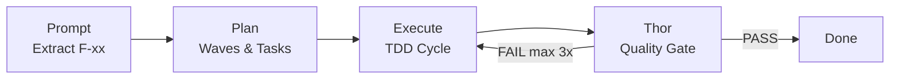

<div align="center">

# MyConvergio - Your night agents at work.


**v6.2.0** | 65 Specialized Agents | Multi-Provider Orchestrator | Copilot CLI | CLI Dashboard

> _"Intent is human, momentum is agent"_
> — [The Agentic Manifesto](./AgenticManifesto.md)

[](https://creativecommons.org/licenses/by-nc-sa/4.0/)

</div>

---

## What's New in v6.0.0

**Convergio Orchestrator: multi-provider intelligent delegation across Claude, Copilot CLI, OpenCode (local), and Gemini.**

- **`delegate.sh`** — Routes tasks to optimal provider (priority, privacy, cost, task type)
- **4 provider workers**: `copilot-worker.sh`, `opencode-worker.sh`, `gemini-worker.sh`, Claude (native)
- **Privacy-aware routing** — Sensitive data never leaves local models (OpenCode/Ollama)
- **Budget enforcement** — Daily caps, fallback chains, alert thresholds
- **25 tests** — Full suite with 0 failures (pure bash, SCRIPT_DIR portable)

---

## Quick Start

### Installation

#### Option A: Clone & Use (Recommended)

```bash
git clone https://github.com/roberdan/MyConvergio.git
cd MyConvergio
claude --plugin-dir .
```

#### Option B: Global npm Install

```bash
# Full install (all 65 agents)
npm install -g myconvergio

# Or choose a profile for lower context usage:
MYCONVERGIO_PROFILE=minimal npm install -g myconvergio  # 9 agents, ~50KB
MYCONVERGIO_PROFILE=lean npm install -g myconvergio     # 65 agents, ~600KB
```

Copies agents to `~/.claude/agents/`. See [Context Optimization Guide](./docs/CONTEXT_OPTIMIZATION.md) for details.

#### Option C: Makefile-Based (Advanced)

```bash
cd MyConvergio
make install          # Install to ~/.claude/
make install-copilot  # Install Copilot CLI agents
make test             # Run test suite (25 tests, 0 failures)
```

#### Option D: GitHub Copilot CLI

MyConvergio ships Copilot CLI agents in `copilot-agents/`:

```bash
# Copy agents to your Copilot config
cp copilot-agents/*.agent.md ~/.copilot/agents/

# Or symlink for auto-updates
ln -sf "$(pwd)/copilot-agents"/*.agent.md ~/.copilot/agents/
```

Available: `@code-reviewer`, `@compliance-checker`, `@execute`, `@planner`, `@prompt`, `@strategic-planner`, `@tdd-executor`, `@validate`, `@ecosystem-sync`

### Usage

**Claude Code — invoke any agent:**

```bash
@ali-chief-of-staff Help me design our global expansion strategy
@baccio-tech-architect Design microservices architecture for healthcare platform
@rex-code-reviewer Review this pull request for security issues
```

**Copilot CLI — invoke workflow agents:**

```bash
@prompt Extract requirements for user authentication feature
@planner Create execution plan from requirements
@execute Run task-001 with TDD workflow
@validate Verify completed wave meets quality gates
```

**Use slash commands (Claude Code):**

```bash
/myconvergio:status    # Show ecosystem status
/myconvergio:team      # List all 65 agents by category
/myconvergio:plan      # Create a strategic execution plan
```

---

## Agent Portfolio

MyConvergio ships with **65 specialized agents** across 8 categories:

| Category               | Count | Examples                                                     |
| ---------------------- | ----- | ------------------------------------------------------------ |
| Leadership & Strategy  | 7     | `ali-chief-of-staff`, `satya-board`, `domik-mckinsey`        |
| Technical Development  | 9     | `baccio-architect`, `rex-reviewer`, `dario-debugger`         |
| Core Utility           | 11    | `strategic-planner`, `thor-qa-guardian`, `marcus-memory`     |
| Business Operations    | 11    | `davide-project-manager`, `oliver-pm`, `anna-exec-assistant` |
| Compliance & Legal     | 5     | `elena-legal-compliance`, `luca-security`, `dr-enzo-hipaa`   |
| Design & UX            | 3     | `jony-creative-director`, `sara-ux-ui`, `stefano-designthink`|
| Specialized Experts    | 14    | `fiona-market-analyst`, `omri-data-scientist`, `sam-startup` |
| Release Management     | 3     | `app-release-manager`, `feature-release-manager`             |

**Cost Optimization**: 54% run on fast, low-cost Haiku. Premium Opus models reserved for critical tasks.

📖 [Full Agent Portfolio →](./docs/agents/agent-portfolio.md)

---

## Convergio Orchestrator

Multi-provider intelligent delegation based on **4 dimensions**:

| Dimension   | How It Works                                                                          |
| ----------- | ------------------------------------------------------------------------------------- |
| **Priority**| P0 critical → Claude/Gemini; P2 backlog → Copilot; P3 bulk → OpenCode (local)         |
| **Task Type**| Coding → Copilot/Claude; Research → Gemini; Review → Claude Opus; Tests → Copilot    |
| **Privacy** | Public → any provider; Internal → Copilot/OpenCode; Sensitive → OpenCode only (local)|
| **Budget**  | Daily cap enforced; fallback chain: Claude → Copilot → Gemini → OpenCode            |

### Provider Workers

| Worker               | CLI                      | Use Case                   | Cost                             |
| -------------------- | ------------------------ | -------------------------- | -------------------------------- |
| `copilot-worker.sh`  | `gh copilot-chat`        | Coding, tests, PR-ops      | Included in Copilot subscription |
| `opencode-worker.sh` | `opencode` / Ollama      | Sensitive data, bulk tasks | Free (local)                     |
| `gemini-worker.sh`   | `gemini` CLI             | Research, analysis         | Metered                          |
| Claude (native)      | `task-executor` subagent | Reviews, critical tasks    | Premium                          |

📖 [Orchestrator Architecture →](./docs/agents/orchestrator.md)

---

## Workflow: Prompt → Plan → Execute → Verify



### 1. Prompt

Use `/prompt` to extract requirements (F-xx) and confirm scope before planning.

Docs: `.claude/commands/prompt.md`

### 2. Planner

Use `/planner` to generate a multi-wave plan with tasks tied to F-xx criteria.

Docs: `.claude/commands/planner.md`

### 3. Execution

Use the executor tracking helpers to log execution state and generate task markdown.

Docs: `EXECUTOR_TRACKING.md`  
Scripts: `.claude/scripts/executor-tracking.sh`, `.claude/scripts/generate-task-md.sh`

### 4. Thor QA Guardian

Use the Thor agent to validate completion, evidence, and quality gates.

Agent: `.claude/agents/core_utility/thor-quality-assurance-guardian.md`

### 5. Dashboard

Monitor plans, waves, tasks, and token usage:

```bash
dashboard-mini.sh              # Full project overview
dashboard-mini.sh --overview   # Cross-project summary
```

**Requirements**: `bash` + `sqlite3` (preinstalled on macOS/Linux). On Windows, use WSL2.

---

## CLI Dashboard

**Terminal-native project dashboard — no browser, no server, no dependencies.**

### Features

- **Project Overview**: Plans, waves, tasks with progress bars
- **Token Tracking**: API token consumption and cost monitoring
- **Wave/Task Drilldown**: Detailed per-wave and per-task status
- **Human Tasks**: Highlights tasks requiring manual intervention
- **Git Integration**: Branch status, PR data (via `gh` CLI, optional)
- **Multi-Machine Sync**: Optional remote sync via `sync-dashboard-db.sh`

Reads the same SQLite database as Claude Code (`~/.claude/data/dashboard.db`). No configuration required.

---

## Skills

Reusable workflows you can reference:

| Skill                 | Use Case                                                       |
| --------------------- | -------------------------------------------------------------- |
| `structured-research` | Hypothesis-driven research with confidence calibration         |
| `code-review`         | Systematic code review process                                 |
| `debugging`           | Root cause analysis methodology                                |
| `architecture`        | System design patterns                                         |
| `security-audit`      | Security assessment framework                                  |
| `performance`         | Performance optimization                                       |
| `strategic-analysis`  | McKinsey-style analysis                                        |
| `release-management`  | Release engineering                                            |
| `orchestration`       | Multi-agent coordination                                       |

---

## Rules & Execution Framework

### Primary Rules (Active)

| Document                                                             | Purpose                                                                              | Priority |
| -------------------------------------------------------------------- | ------------------------------------------------------------------------------------ | -------- |
| [CONSTITUTION.md](./agents/CONSTITUTION.md)                          | Security, Ethics, Identity                                                           | SUPREME  |
| [execution.md](./.claude/rules/execution.md)                         | How Work Gets Done (context awareness, parallel calls, anti-overengineering)         | 2nd      |
| [guardian.md](./.claude/rules/guardian.md)                           | Thor enforcement, PR comment resolution, completion verification                     | 3rd      |
| [engineering-standards.md](./.claude/rules/engineering-standards.md) | Code quality, security, testing, API design                                          | 4th      |

This repository is **fully self-contained**. No external configuration files required.

---

## Security Framework

All agents implement the [MyConvergio Constitution](./agents/CONSTITUTION.md):

| Article | Protection                                                  |
| ------- | ----------------------------------------------------------- |
| I       | Identity Lock - Immutable agent identity                    |
| II      | Ethical Principles - Fairness, transparency, accountability |
| III     | Security Directives - Anti-hijacking, input validation      |
| IV      | Operational Boundaries - Role adherence                     |
| V       | Failure Modes - Graceful degradation                        |
| VI      | Collaboration - Safe inter-agent communication              |
| VII     | **Accessibility & Inclusion (NON-NEGOTIABLE)**              |
| VIII    | Accountability - Logging and audit trails                   |

---

## The Agentic Manifesto

_Human purpose. AI momentum._

### What we believe

1. **Intent is human, momentum is agent.**
2. **Impact must reach every mind and body.**
3. **Trust grows from transparent provenance.**
4. **Progress is judged by outcomes, not output.**

### How we act

1. Humans stay accountable for decisions and effects.
2. Agents amplify capability, never identity.
3. We design from the edge first: disability, language, connectivity.
4. Safety rails precede scale.
5. Learn in small loops, ship value early.

_Read the full [Agentic Manifesto](./AgenticManifesto.md)_

---

## Market Differentiation

| Dimension             | Microsoft Agent / AutoGen / CrewAI     | MyConvergio                                                        |
| --------------------- | -------------------------------------- | ------------------------------------------------------------------ |
| **Runtime**           | Python SDK, cloud deployment           | CLI-native (bash + sqlite3), zero server                           |
| **LLM Lock-in**       | Single provider per agent              | Multi-provider routing: Claude, Copilot, OpenCode (local), Gemini  |
| **Cost Model**        | Pay-per-token, no budget controls      | Budget caps, multi-tier fallback chain, per-task cost tracking     |
| **Privacy**           | Cloud-only (data leaves your machine)  | Privacy-aware: sensitive data routes to local models only          |
| **Quality Assurance** | Agents self-report success             | Independent Thor validation (9 gates, reads files directly)        |
| **State Management**  | Redis/Pinecone/cloud DB                | SQLite file, portable, inspectable, no dependencies                |
| **Git Safety**        | No git awareness                       | Worktree isolation per plan, branch protection hooks               |
| **Setup**             | pip install + cloud config             | `git clone` or `npm install -g`, works immediately                 |

**MyConvergio is not competing with agent frameworks.** It's a **practitioner's toolkit** for engineers who use AI coding assistants daily and need structure, quality gates, cost control, and multi-provider flexibility.

📖 [Detailed Comparison →](./docs/agents/comparison.md)

---

## Architecture

📖 [Full Architecture Diagrams →](./docs/agents/architecture.md)

---

## License & Legal

Copyright 2025 Convergio.io

Licensed under [Creative Commons Attribution-NonCommercial-ShareAlike 4.0 International](./LICENSE)

### Disclaimers

- **Experimental Software**: Provided "AS IS" without warranties
- **Non-Commercial Use Only**: See LICENSE file for details
- **No Corporate Affiliation**: Not affiliated with Anthropic, OpenAI, or Microsoft
- **Personal Project**: Author is a Microsoft employee; this is a personal initiative

**Author Note**: Roberto D'Angelo is a Microsoft employee. This project is a personal initiative created independently during personal time. This project is NOT affiliated with, endorsed by, or representing Microsoft Corporation.

---

## Contributing

Contributions are welcome! See [CONTRIBUTING.md](./CONTRIBUTING.md) for guidelines.

For questions about commercial licensing: roberdan@fightthestroke.org

---

<div align="center">

_Built with AI assistance in Milano, following the Agentic Manifesto principles_

**v6.2.0** | February 2026 | Multi-Provider Orchestrator + Claude Code + Copilot CLI

</div>
