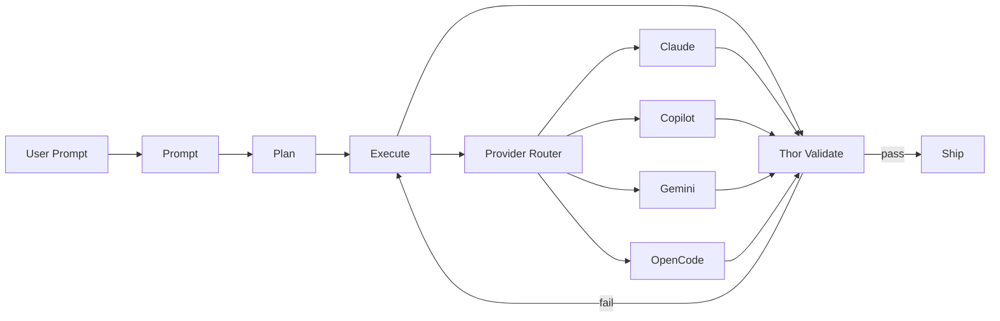
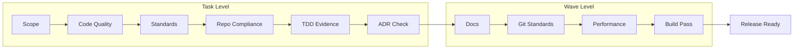
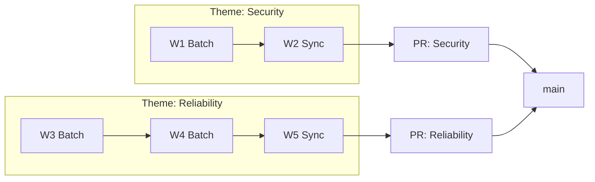
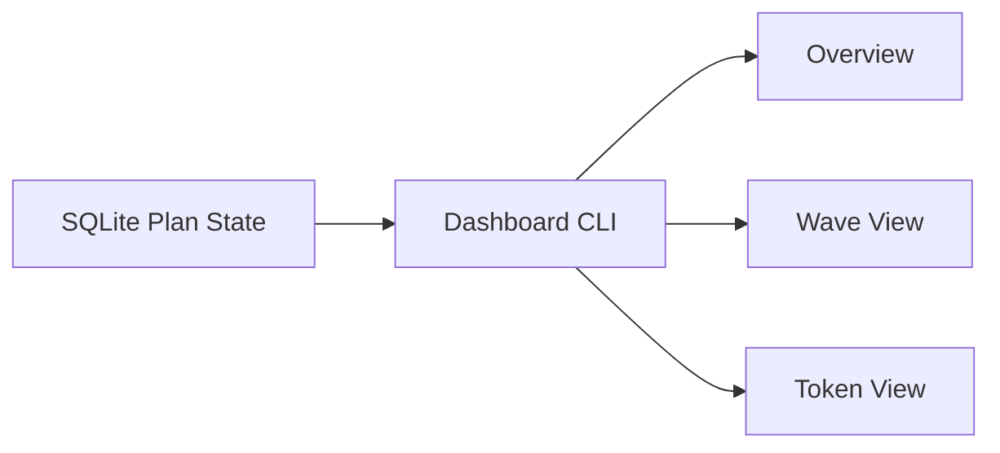

<!-- AGENT_COUNTS: claude:76 copilot:83 total:159 -->
<div align="center">

# MyConvergio v10


[](./VERSION)
[](#agent-portfolio)
[](#agent-portfolio)
[](#agent-portfolio)
[](./LICENSE)

**A trust layer between AI agents and your codebase.**

</div>

---

## The problem no one is solving

AI coding agents are fast. They are also unreliable at scale.

| Finding                                                                                                 | Source                                                                                                                                            |
| ------------------------------------------------------------------------------------------------------- | ------------------------------------------------------------------------------------------------------------------------------------------------- |
| AI-assisted code produces **1.7x more logical bugs** than human code                                    | [CodeRabbit 2026 Report](https://www.coderabbit.ai/blog/state-of-ai-vs-human-code-generation-report)                                              |
| 90% AI adoption increase correlates with **+9% bug rate**, **+91% code review time**, **+154% PR size** | [Google DORA Report 2025](https://dora.dev)                                                                                                       |
| Cognitive complexity rises **39%** in agent-assisted repositories                                       | [Faros AI 2026 Review](https://www.faros.ai/blog/best-ai-coding-agents-2026)                                                                      |
| Change failure rate **+30%**, incidents per PR **+23.5%** with AI-generated code                        | [TFIR AI Code Quality 2026](https://tfir.io/ai-code-quality-2026-guardrails/)                                                                     |
| Cursor's multi-agent approach with equal-status agents and file locking **failed**                      | [Codebridge Orchestration Guide](https://www.codebridge.tech/articles/mastering-multi-agent-orchestration-coordination-is-the-new-scale-frontier) |

The pattern that works is **Planner, Worker, Judge** — not equal-status agents hoping for the best.

Three things break when you scale AI coding without guardrails:

1. **Agents self-report as done when they are not.** No independent check, broken code reaches main.
2. **Parallel agents overwrite each other silently.** Last write wins, no conflict, no error, just lost work.
3. **Context windows fill with noise.** A single CI log is 2000+ lines. Agents waste 30% of their reasoning capacity on irrelevant output.

---

## What MyConvergio does

MyConvergio adds independent validation, file isolation, and merge automation to any AI coding workflow. It works with Claude Code, GitHub Copilot CLI, Gemini, and OpenCode.

### Before and after

| Without trust layer                          | With MyConvergio                                                                               |
| -------------------------------------------- | ---------------------------------------------------------------------------------------------- |
| Agent says "done" and you trust it           | Thor validator independently checks 9 quality gates before merge                               |
| Two agents edit the same file, last one wins | File locking blocks the second agent, zero silent overwrites                                   |
| CI log dumps 2000 lines into agent context   | Digest scripts compress to 50-line JSON, 10x less token waste                                  |
| "How many tasks are done?" — no idea         | SQLite plan state with CLI dashboard, real-time execution tree                                 |
| Manual merge, pray nothing breaks            | Wave-based auto merge: rebase, CI, squash, cleanup                                             |
| Locked into one model provider               | Route each task to the best model: Opus for architecture, Codex for code, Haiku for bulk fixes |

---

## How it works

### Core pipeline



**Prompt** extracts requirements into structured features. **Plan** decomposes into waves of parallel tasks with dependency tracking. **Execute** runs isolated agents per task with file locking and TDD. **Thor** validates each task against 9 gates before allowing merge. **Ship** merges via wave-based PR strategy with CI verification.

### Thor: the agent that says no

The industry consensus for 2026 is clear: [generation without verification is a net negative](https://vadim.blog/verification-gate-research-to-practice). Thor is the independent validator that rejects incomplete work.



Thor runs as a **separate agent with fresh context** — no assumptions inherited from the executor. It checks scope compliance, code quality, engineering standards, repo conventions, TDD evidence, documentation, git hygiene, performance, and build pass. Tasks move from `submitted` to `done` **only** through Thor. A SQLite trigger enforces this at the database level — even raw SQL cannot bypass it.

### Wave merge strategy



Tasks are grouped into waves by theme. Each wave gets its own git worktree and PR. Merge is automated: rebase onto main, push, CI check, review comment resolution, squash merge, worktree cleanup. Fewer PRs, cleaner git history, no manual coordination.

---

## Model routing

Use the right model for each task. No provider lock-in.

| Task            | Primary | Model                | Fallback       |
| --------------- | ------- | -------------------- | -------------- |
| Requirements    | Claude  | claude-opus-4.6      | Gemini Pro     |
| Planning        | Claude  | claude-opus-4.6-1m   | Gemini Pro     |
| Code generation | Copilot | gpt-5.3-codex        | Claude Sonnet  |
| Validation      | Claude  | claude-opus-4.6      | Copilot review |
| Bulk fixes      | Copilot | gpt-5-mini           | Claude Haiku   |
| Research        | Gemini  | gemini-3-pro-preview | Claude Sonnet  |

> Frontier models for reasoning, fast models for execution. [The Plan-and-Execute pattern can reduce costs by 90%](https://www.pulumi.com/blog/ai-predictions-2026-devops-guide/) compared to using frontier models for everything.

---

## Comparison

| Tool              | Parallel agents | Independent validation     | File isolation           | Merge automation        | Provider agnostic                 |
| ----------------- | --------------- | -------------------------- | ------------------------ | ----------------------- | --------------------------------- |
| **MyConvergio**   | Yes, wave-based | Thor 9 gates               | File locking + worktrees | Auto rebase, CI, squash | Claude, Copilot, Gemini, OpenCode |
| Cursor, Windsurf  | Limited         | None                       | None                     | None                    | Single provider                   |
| Devin             | Single agent    | Self-reported              | N/A                      | Manual                  | Single provider                   |
| Copilot Workspace | Single agent    | Self-reported              | N/A                      | Manual                  | GitHub only                       |
| CrewAI, AutoGen   | Yes             | Custom (build it yourself) | Custom                   | Custom                  | Yes                               |

The [Codebridge 2026 analysis](https://www.codebridge.tech/articles/mastering-multi-agent-orchestration-coordination-is-the-new-scale-frontier) found that the successful multi-agent architecture requires three distinct roles: **Planners** that explore and create tasks, **Workers** that execute without coordinating with each other, and **Judges** that determine quality at each cycle. MyConvergio implements exactly this pattern.

---

## Quick start

### Option A: Clone and make

```bash
git clone https://github.com/roberdan/MyConvergio.git && cd MyConvergio
make install
```

### Option B: One line install

```bash
curl -sSL https://raw.githubusercontent.com/roberdan/MyConvergio/main/checksums.txt -o /tmp/mc-checksums.txt
curl -sSL https://raw.githubusercontent.com/roberdan/MyConvergio/main/install.sh -o /tmp/mc-install.sh
sha256sum -c /tmp/mc-checksums.txt --ignore-missing && bash /tmp/mc-install.sh

# direct install
curl -sSL https://raw.githubusercontent.com/roberdan/MyConvergio/main/install.sh | bash
```

### Option C: Modular install

```bash
myconvergio install --minimal    # core pipeline only
myconvergio install --standard   # pipeline + agents + dashboard
myconvergio install --lean       # standard without Copilot agents
```

### Option D: GitHub Copilot CLI only

```bash
cp copilot-agents/*.agent.md ~/.copilot/agents/
```

---

## CLI dashboard

Terminal-first visibility into plans, waves, quality gates, and token usage.

```bash
dashboard-mini.sh            # interactive overview
dashboard-mini.sh -n         # single-shot, no interaction
dashboard-mini.sh -p 281     # drill into a specific plan
dashboard-mini.sh -v         # verbose token tracking
```




---

## Agent portfolio

159 agent files covering the full delivery lifecycle.

| Area                    | Claude | Copilot |
| ----------------------- | ------ | ------- |
| Leadership and strategy | 7      | 7       |
| Technical development   | 11     | 11      |
| Business operations     | 11     | 11      |
| Core utility            | 23     | 23      |
| Compliance and legal    | 5      | 5       |
| Specialized experts     | 14     | 14      |
| Design and UX           | 3      | 3       |
| Release management      | 5      | 5       |
| Research                | 1      | 1       |
| Orchestrators           | 1      | 3       |
| **Total**               | **76** | **83**  |

## Skills

23 reusable workflows for recurring engineering tasks: architecture, debugging, code-review, security-audit, performance, orchestration, review-pr, design-systems, ui-design, release, planner, execute, validate, and more.

---

## Documentation

| Guide                                               | Description                                   |
| --------------------------------------------------- | --------------------------------------------- |
| [Getting Started](./docs/getting-started.md)        | Installation, first plan, first execution     |
| [Core Concepts](./docs/concepts.md)                 | Plans, waves, Thor, file locking, merge queue |
| [Workflow Guide](./docs/workflow.md)                | End-to-end delivery flow                      |
| [Infrastructure](./docs/infrastructure.md)          | SQLite schema, scripts, hooks                 |
| [Use Cases](./docs/use-cases.md)                    | Real-world examples                           |
| [Agent Portfolio](./docs/agents/agent-portfolio.md) | Full agent catalog                            |
| [Comparison](./docs/agents/comparison.md)           | Detailed tool comparison                      |
| [Architecture](./docs/agents/architecture.md)       | Design decisions                              |
| [ADRs](./docs/adr/INDEX.md)                         | Architecture Decision Records                 |

---

## License

Licensed under [CC BY-NC-SA 4.0](./LICENSE).

---

<div align="center">

**MyConvergio v10.0.0** | **28 Feb 2026**

_The industry is shifting from a race for bigger models to a race for better coordination._
_Competitive advantage comes from how effectively you orchestrate agents into a reliable system._

</div>
