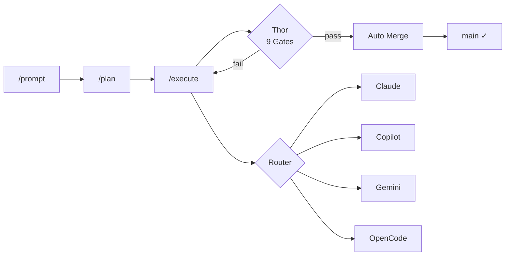
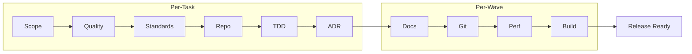
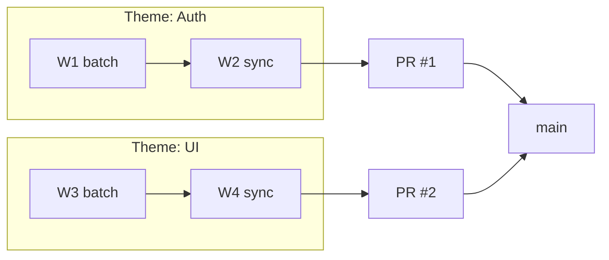
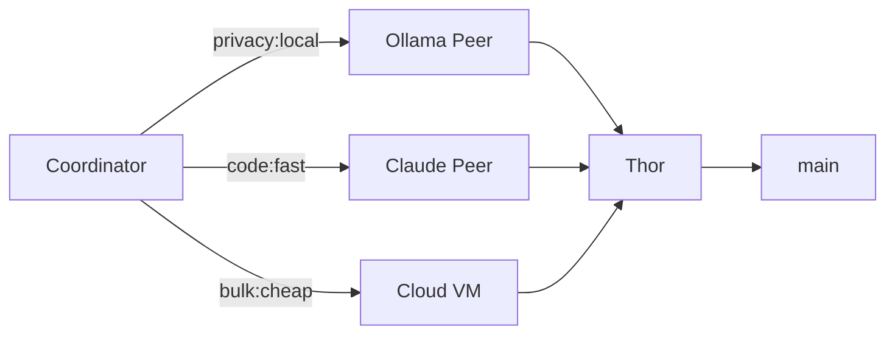

<!-- AGENT_COUNTS: claude:79 copilot:83 total:162 -->
<div align="center">

# MyConvergio


[](./VERSION)
[](#agent-portfolio)
[](#skills)
[](#enforcement-layer)
[](./LICENSE)

**Your AI agents are fast. They are also lying to you about being done.**

</div>

---

## The problem

AI coding agents ship broken code at scale. The data is clear:

| Finding                                                                   | Source                                                                                                                             |
| ------------------------------------------------------------------------- | ---------------------------------------------------------------------------------------------------------------------------------- |
| AI-assisted code produces **1.7x more logical bugs** than human code      | [CodeRabbit 2026](https://www.coderabbit.ai/blog/state-of-ai-vs-human-code-generation-report)                                      |
| 90% AI adoption → **+9% bugs**, **+91% review time**, **+154% PR size**   | [Google DORA 2025](https://dora.dev)                                                                                               |
| Cognitive complexity rises **39%** in agent-assisted repos                | [Faros AI 2026](https://www.faros.ai/blog/best-ai-coding-agents-2026)                                                              |
| Change failure rate **+30%**, incidents per PR **+23.5%**                 | [TFIR 2026](https://tfir.io/ai-code-quality-2026-guardrails/)                                                                      |
| Cursor's multi-agent with equal-status agents and file locking **failed** | [Codebridge 2026](https://www.codebridge.tech/articles/mastering-multi-agent-orchestration-coordination-is-the-new-scale-frontier) |

Three things break when you scale AI coding without guardrails:

1. **Agents self-report as done when they are not.** No independent check — broken code reaches main.
2. **Parallel agents overwrite each other.** Last write wins. No conflict, no error, just lost work.
3. **Context windows fill with noise.** A single CI log is 2000+ lines. Agents burn 30% of reasoning on irrelevant output.

The pattern that works is **Planner → Worker → Judge**. Not equal-status agents hoping for the best.

---

## What MyConvergio does

MyConvergio is an open-source trust layer for AI coding agents. It adds independent validation, file isolation, and merge automation to Claude Code, GitHub Copilot CLI, Gemini, and OpenCode.

| Without trust layer                  | With MyConvergio                                              |
| ------------------------------------ | ------------------------------------------------------------- |
| Agent says "done" and you trust it   | Thor validator checks 9 quality gates independently           |
| Two agents edit the same file        | File locking blocks the second agent — zero silent overwrites |
| CI dumps 2000 lines into context     | Digest scripts compress to 50-line JSON — 10x less tokens     |
| "How many tasks are done?" — no idea | SQLite plan DB + real-time Control Room dashboard             |
| Manual merge, pray nothing breaks    | Wave-based auto merge: rebase → CI → squash → cleanup         |
| Locked into one AI provider          | Route each task to the best model across providers            |

---

## Who is this for

- **Solo devs using AI coding tools** who want quality gates without a team
- **Tech leads** who need visibility into what AI agents are actually shipping
- **Teams running Claude Code or Copilot CLI** at scale and hitting reliability issues
- **Anyone who has merged AI-generated code and found bugs in production**

You don't need to change your editor or workflow. MyConvergio installs as a layer on top of what you already use.

---

## The Control Room

Real-time visibility into plans, agents, mesh peers, costs, and execution — from your browser or terminal.


The Control Room shows active missions with progress tracking, mesh network topology across machines, task pipeline status, token burn analytics, and an **integrated terminal** — you can execute commands, SSH into mesh peers, and manage plans directly from the browser.


Drill down into cost-per-model breakdown, token burn over time, and full plan execution history. Every dollar spent on AI is tracked and attributed.

---

## How it works

### Core pipeline


```mermaid
flowchart LR
    A["/prompt"] --> B["/plan"]
    B --> C["/execute"]
    C --> D{"Thor\n9 Gates"}
    D -->|fail| C
    D -->|pass| E["Auto Merge"]
    E --> F["main ✓"]

    C --> R{Router}
    R --> P1["Claude"]
    R --> P2["Copilot"]
    R --> P3["Gemini"]
    R --> P4["OpenCode"]
```

**`/prompt`** extracts structured requirements (F-xx). **`/plan`** decomposes into waves of parallel tasks with file-level dependency tracking. **`/execute`** runs isolated agents per task with TDD, file locking, and worktree isolation. **Thor** validates each task against 9 gates before allowing merge. **Auto Merge** rebases, runs CI, resolves review comments, squash merges, and cleans up.

### Thor: the agent that says no

[Generation without verification is a net negative](https://vadim.blog/verification-gate-research-to-practice). Thor is the independent validator that rejects incomplete work.


```mermaid
flowchart LR
    subgraph Per-Task
        G1["Scope"] --> G2["Quality"] --> G3["Standards"]
        G3 --> G4["Repo"] --> G8["TDD"] --> G9["ADR"]
    end
    subgraph Per-Wave
        G5["Docs"] --> G6["Git"] --> G7["Perf"] --> GB["Build"]
    end
    G9 --> G5
    GB --> R["Release Ready"]
```

Thor runs as a **separate agent with fresh context** — zero assumptions from the executor. Tasks move from `submitted` → `done` **only** through Thor. A SQLite trigger enforces this — even raw SQL cannot bypass it.

### Wave merge strategy


```mermaid
flowchart LR
    subgraph "Theme: Auth"
        W1["W1 batch"] --> W2["W2 sync"]
    end
    subgraph "Theme: UI"
        W3["W3 batch"] --> W4["W4 sync"]
    end
    W2 --> PR1["PR #1"]
    W4 --> PR2["PR #2"]
    PR1 --> M["main"]
    PR2 --> M
```

Tasks group into waves by theme. Each wave gets its own git worktree. Merge is fully automated: rebase → push → CI → review comment resolution → squash merge → cleanup.

---

## Model routing

Use the right model for each job. No provider lock-in.

| Task            | Primary | Model             | Fallback      |
| --------------- | ------- | ----------------- | ------------- |
| Requirements    | Claude  | claude-opus-4.6   | Gemini Pro    |
| Planning        | Claude  | claude-opus-4.6   | Gemini Pro    |
| Code generation | Copilot | gpt-5.3-codex     | Claude Sonnet |
| Validation      | Claude  | claude-sonnet-4.6 | Copilot       |
| Bulk fixes      | Copilot | gpt-5-mini        | Claude Haiku  |
| Research        | Gemini  | gemini-3-pro      | Claude Sonnet |

> Frontier models for reasoning, fast models for execution. [Plan-and-Execute reduces costs by 90%](https://www.pulumi.com/blog/ai-predictions-2026-devops-guide/) vs frontier models for everything.

---

## Mesh networking

Distribute work across machines. The coordinator routes tasks to the cheapest capable peer — local Ollama for privacy-sensitive code, cloud VMs for throughput, remote machines for parallel execution.


```mermaid
flowchart LR
    CO["Coordinator"] --> |"privacy:local"| OL["Ollama Peer"]
    CO --> |"code:fast"| CP["Claude Peer"]
    CO --> |"bulk:cheap"| VM["Cloud VM"]
    OL --> TH["Thor"]
    CP --> TH
    VM --> TH
    TH --> M["main"]
```

All peers sync via SSH/Tailscale. Credentials, config, repos, and DB stay aligned across machines with one command: `mesh-sync-all.sh`.

---

## Enforcement layer

31 hooks that run automatically on every tool call — no discipline required.

| Hook                   | Trigger         | What it does                                    |
| ---------------------- | --------------- | ----------------------------------------------- |
| `worktree-guard`       | git ops         | Blocks commits on main when worktrees exist     |
| `enforce-plan-db-safe` | task completion | Forces Thor validation before marking done      |
| `enforce-plan-edit`    | file edits      | Blocks direct edits outside task-executor       |
| `secret-scanner`       | pre-commit      | Detects API keys, tokens, credentials           |
| `enforce-line-limit`   | post-edit       | Rejects files over 250 lines                    |
| `session-file-lock`    | file edits      | Prevents parallel agents overwriting each other |
| `prefer-ci-summary`    | bash commands   | Forces digest scripts over raw CI output        |

Hooks work on both Claude Code and Copilot CLI. Zero config after install.

---

## Quick start

### One-line install

```bash
curl -sSL https://raw.githubusercontent.com/Roberdan/MyConvergio/master/install.sh | bash
```

### Clone and make

```bash
git clone https://github.com/Roberdan/MyConvergio.git && cd MyConvergio
make install
```

### Modular install

```bash
# Pick what fits
make install-tier TIER=minimal   # 9 core agents (~50KB)
make install-tier TIER=standard  # 20 agents (~200KB)
make install                     # all 162 agents (~600KB)
```

### After install

Pick a settings template based on your hardware:

```bash
cp ~/.myconvergio/.claude/settings-templates/high-spec.json ~/.claude/settings.json  # 32GB+ RAM
cp ~/.myconvergio/.claude/settings-templates/mid-spec.json  ~/.claude/settings.json  # 16GB RAM
cp ~/.myconvergio/.claude/settings-templates/low-spec.json  ~/.claude/settings.json  # 8GB RAM
```

Without this step, hooks won't run. This is the difference between "AI with guardrails" and "AI hoping for the best."

---

## Agent portfolio

162 agent files across 9 domains, dual-format for Claude Code and Copilot CLI.

| Domain              | Claude | Copilot | Examples                                              |
| ------------------- | ------ | ------- | ----------------------------------------------------- |
| Core utility        | 23     | 23      | Thor, strategic-planner, task-executor, socrates      |
| Technical           | 11     | 11      | baccio (architect), dario (debug), rex (review)       |
| Specialized experts | 14     | 14      | angela (decisions), fiona (markets), omri (data)      |
| Business ops        | 11     | 11      | marcello (PM), sofia (marketing), fabio (sales)       |
| Leadership          | 7      | 7       | ali (chief of staff), amy (CFO), dan (eng GM)         |
| Compliance          | 5      | 5       | luca (security), elena (legal), dr-enzo (HIPAA)       |
| Release mgmt        | 5      | 5       | app-release-manager, ecosystem-sync                   |
| Design & UX         | 3      | 3       | sara (UX), jony (creative), stefano (design thinking) |
| **Total**           | **79** | **83**  |                                                       |

## Skills

20 reusable workflows: `/planner`, `/execute`, `/prompt`, `/code-review`, `/security-audit`, `/architecture`, `/debugging`, `/performance`, `/hardening`, `/release`, `/review-pr`, `/ui-design`, `/design-systems`, `/brand-identity`, `/creative-strategy`, `/documentation`, `/optimize-project`, `/presentation-builder`, `/design-quality`, `/optimize-instructions`.

---

## Comparison

| Capability             | MyConvergio                       | Cursor/Windsurf | Devin         | CrewAI/AutoGen |
| ---------------------- | --------------------------------- | --------------- | ------------- | -------------- |
| Parallel agents        | Wave-based                        | Limited         | Single        | Yes            |
| Independent validation | Thor 9 gates                      | None            | Self-reported | Build yourself |
| File isolation         | Locking + worktrees               | None            | N/A           | Build yourself |
| Merge automation       | Auto rebase+CI+squash             | None            | Manual        | Build yourself |
| Provider agnostic      | Claude, Copilot, Gemini, OpenCode | Single          | Single        | Yes            |
| Cost tracking          | Per-model, per-task               | None            | Opaque        | None           |
| Mesh networking        | Multi-machine                     | No              | No            | No             |

---

## Documentation

| Guide                                               | Description                          |
| --------------------------------------------------- | ------------------------------------ |
| [Getting Started](./docs/getting-started.md)        | Install, first plan, first execution |
| [Core Concepts](./docs/concepts.md)                 | Plans, waves, Thor, file locking     |
| [Workflow Guide](./docs/workflow.md)                | End-to-end delivery flow             |
| [Infrastructure](./docs/infrastructure.md)          | SQLite schema, scripts, hooks        |
| [Agent Portfolio](./docs/agents/agent-portfolio.md) | Full catalog                         |
| [ADRs](./docs/adr/INDEX.md)                         | Architecture Decision Records        |

---

## License

[CC BY-NC-SA 4.0](./LICENSE)

---

<div align="center">

**MyConvergio 10.1.0** | **3 Mar 2026**

_Your AI agents are writing code 10x faster. Nobody is checking if it works._
_MyConvergio checks._

</div>
