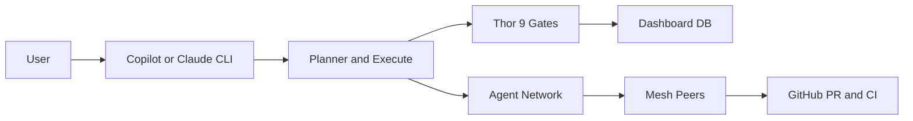

<div align="center">

# MyConvergio

**AI orchestration system for solo builders who need production-grade execution, validation, and recovery.**


</div>

## What's New in v11

- Hardened migration system for breaking upgrades, with mandatory backup and rollback flow.
- Night maintenance agent for issue triage and safe remediation with human review gates.
- Infrastructure alignment across scripts, hooks, database workflows, and orchestration defaults.
- Agent and routing optimization for lower token burn and tighter execution discipline.
- Improved install/upgrade safety checks and post-install validation.

## Prerequisites

> [!IMPORTANT]
> `gh` must be installed **and authenticated** before install or upgrade.
> Run `gh auth status` (or `gh auth login`) first.

| Tool | Required | Install |
| --- | --- | --- |
| git | Yes | https://git-scm.com/downloads |
| make | Yes | https://www.gnu.org/software/make/ |
| bash | Yes | https://www.gnu.org/software/bash/ |
| sqlite3 | Yes | https://www.sqlite.org/download.html |
| jq | Yes | https://jqlang.github.io/jq/download/ |
| gh (GitHub CLI) | **Yes + authenticated** | https://cli.github.com/ |

## Quick Install

```bash
curl -sSL https://raw.githubusercontent.com/Roberdan/MyConvergio/master/install.sh | bash
```

See also: [docs/getting-started.md](./docs/getting-started.md)

## Upgrading from v10 (Migration)

> [!WARNING]
> **BACKUP FIRST.** v10 to v11.0.0 is a breaking migration path.

Migration guide: [docs/MIGRATION-v10-to-v11.md](./docs/MIGRATION-v10-to-v11.md)

```bash
myconvergio backup
./scripts/migrate-v10-to-v11.sh
myconvergio doctor
```

## Backup & Restore

Use backup before upgrades, large refactors, or infrastructure changes.

```bash
myconvergio backup
myconvergio rollback
```

- Backup script: [`scripts/myconvergio-backup.sh`](./scripts/myconvergio-backup.sh)
- Restore / rollback script: [`scripts/myconvergio-restore.sh`](./scripts/myconvergio-restore.sh)
- Migration safety flow: [docs/MIGRATION-v10-to-v11.md](./docs/MIGRATION-v10-to-v11.md)

## Features Overview

| Feature | Summary | Details |
| --- | --- | --- |
| Agents (85+) | Specialized technical, orchestration, business, and ops agents | [docs/agents/agent-portfolio.md](./docs/agents/agent-portfolio.md) |
| Thor gates (9) | Independent quality validation before completion | [docs/workflow.md](./docs/workflow.md) |
| Mesh networking | Multi-machine execution and synchronization | [docs/mesh-networking.md](./docs/mesh-networking.md) |
| Dashboard | Real-time view of plans, tasks, and execution state | [docs/infrastructure.md](./docs/infrastructure.md) |
| Night agent | Scheduled issue triage and safe remediation pipeline | [scripts/myconvergio-nightly-guardian.sh](./scripts/myconvergio-nightly-guardian.sh) |
| Auto-sync | Sync framework assets and agent definitions from source systems | [scripts/sync-from-convergiocli.sh](./scripts/sync-from-convergiocli.sh) |

## Architecture


```mermaid
flowchart LR
    U[User] --> C[Copilot or Claude CLI]
    C --> P[Planner and Execute]
    P --> A[Agent Network]
    P --> T[Thor 9 Gates]
    T --> D[Dashboard DB]
    A --> M[Mesh Peers]
    M --> G[GitHub PR and CI]
```

More architecture detail: [docs/AGENT_ORCHESTRATION_ARCHITECTURE.md](./docs/AGENT_ORCHESTRATION_ARCHITECTURE.md)

## Night Maintenance Agent

Night maintenance runs scheduled triage/fix workflows on peer infrastructure (for example `omarchy-ts`) and keeps safety defaults enabled.

- Runbook: [`.github/agents/night-maintenance.agent.md`](./.github/agents/night-maintenance.agent.md)
- Installer: [`scripts/install-myconvergio-nightly-linux.sh`](./scripts/install-myconvergio-nightly-linux.sh)
- Config template: [`config/myconvergio-nightly.conf.example`](./config/myconvergio-nightly.conf.example)
- Required safety setting: `REQUIRE_HUMAN_REVIEW=true`

## Auto-Sync from .claude

Use sync tooling to align agent definitions and framework assets with upstream sources while previewing changes safely.

```bash
./scripts/sync-from-convergiocli.sh --dry-run
```

Related sync docs: [docs/mesh-networking.md](./docs/mesh-networking.md)

## Installation Tiers

| Tier | Agent Count | Approx Size | When to Use |
| --- | ---: | ---: | --- |
| minimal | 9 | ~50KB | Lowest footprint, core workflows only |
| standard | 20 | ~200KB | Balanced daily setup |
| full | 65 | ~600KB | Complete default capability set |
| lean | optimized subset | ~400KB | Lower context cost with optimized agents |

Reference: [`install.sh`](./install.sh)

## Commands

| Command | Purpose |
| --- | --- |
| `myconvergio help` | Show command help |
| `myconvergio doctor` | Run installation and environment health checks |
| `myconvergio backup` | Create backup snapshot before changes |
| `myconvergio rollback` | Roll back using latest backup workflow |
| `myconvergio agents` | List installed agents |
| `myconvergio upgrade` | Upgrade an existing installation |

## Troubleshooting

See [TROUBLESHOOTING.md](./TROUBLESHOOTING.md) for migration, auth, setup, and runtime fixes.

## Contributing & License

- Contribution guidance: [README_GAP_ANALYSIS.md](./README_GAP_ANALYSIS.md) and project docs under [`docs/`](./docs/)
- License: [CC BY-NC-SA 4.0](./LICENSE)

---

MyConvergio v11.0.0 focuses on safer execution, reproducible upgrades, and operationally reliable agent orchestration.
