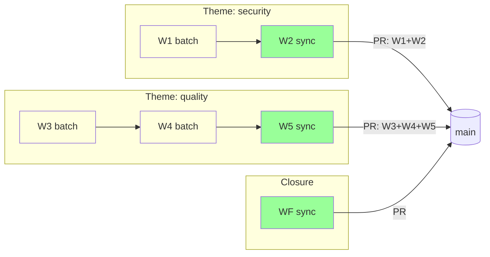
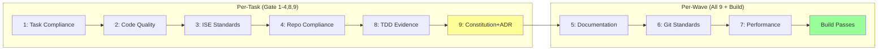
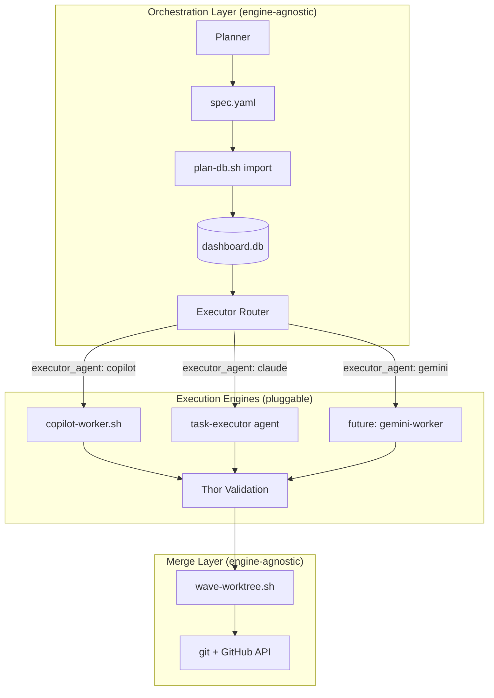
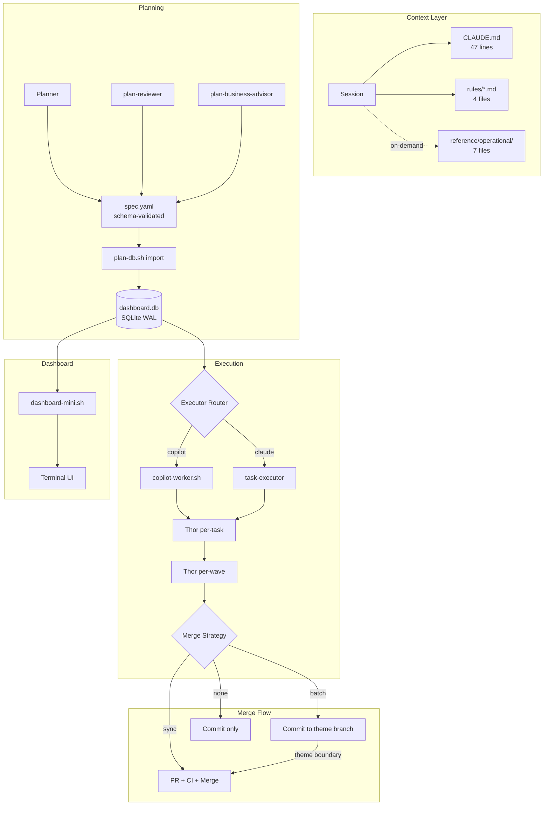
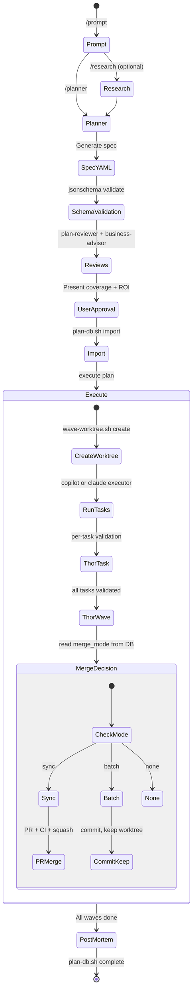
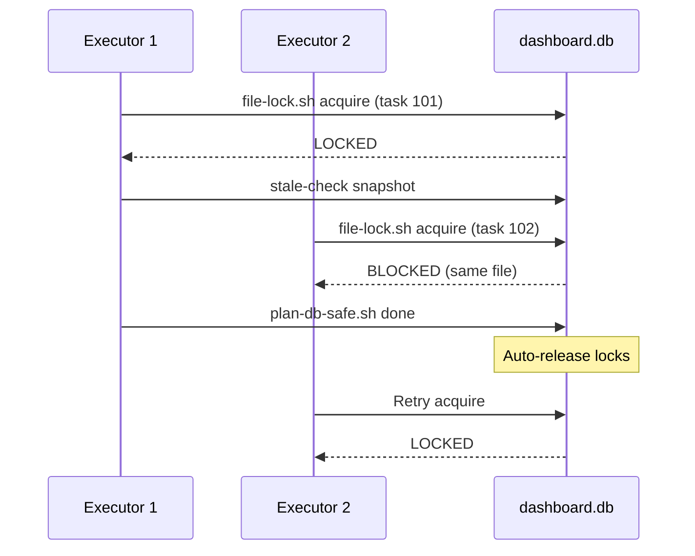

# MyConvergio Platform

An AI-powered software engineering orchestration platform that turns a single user request into a fully planned, executed, validated, and merged codebase change — across multiple AI providers, with zero manual intervention after approval.

**32 agents** | **119 scripts** | **24 ADRs** | **Multi-model, per-task routing** | **SQLite-backed state**

## What Makes This Different

### vs. Cursor / Windsurf / Aider (Single-Agent IDE Tools)

These tools give you one AI assistant editing files in your IDE. MyConvergio gives you an **orchestrated multi-agent pipeline**:

| Capability     | Single-Agent Tools                   | MyConvergio                                                       |
| -------------- | ------------------------------------ | ----------------------------------------------------------------- |
| Planning       | None — user tells AI what to do      | AI planner decomposes into waves, tasks, dependencies             |
| Execution      | One agent, one file at a time        | Parallel executors (up to 5 concurrent), auto-routed              |
| Validation     | User reviews diff                    | Independent Thor validator (9 gates), no self-approval            |
| State tracking | None — context lost between sessions | SQLite DB with full audit trail across sessions                   |
| Model routing  | One model for everything             | Per-task model selection: best model for each task's complexity   |
| Merge strategy | Manual git                           | Automated: batch/sync/none per wave, theme grouping, PR lifecycle |
| Learning       | Starts fresh every time              | CI knowledge base, failed approaches log, post-mortem learnings   |
| Multi-provider | Locked to one provider               | Claude + Copilot + GPT + Gemini in the same plan                  |

### vs. GitHub Copilot Workspace / Devin

| Capability           | Copilot Workspace / Devin | MyConvergio                                                               |
| -------------------- | ------------------------- | ------------------------------------------------------------------------- |
| Provider lock-in     | GitHub / Cognition only   | Any LLM provider, routed per task                                         |
| Quality gates        | Basic CI                  | 9-gate Thor validation + plan-reviewer + business-advisor                 |
| Model intelligence   | One model fits all        | Per-task routing: Opus for architecture, Codex for bulk, Haiku for config |
| Merge intelligence   | One PR per session        | Theme-based batching, planner-decided merge strategy                      |
| Institutional memory | None                      | Per-repo CI knowledge, cross-plan learnings, failed approaches            |
| Concurrency          | Sequential                | Parallel wave execution with file locking + stale detection               |

### vs. Custom Agent Frameworks (CrewAI, AutoGen, LangGraph)

Those are frameworks — you build the pipeline yourself. MyConvergio is the **finished product**: a production-ready orchestration platform with 119 tested scripts, 32 specialized agents, and 24 architectural decisions codified as ADRs. You don't write agent code — you write a user request, and the platform handles the rest.

## Key Innovations

### 1. Intelligent Model Routing

The planner **selects the best model for each task** based on complexity, risk, and domain. Not one model for everything — the right model for each job:

```
T1-01: config change     → gpt-5.1-codex-mini   (fast, simple)
T1-02: standard feature  → gpt-5.3-codex         (capable, bulk work)
T2-01: security review   → claude-opus-4.6       (best judgment, reasoning)
T2-02: complex refactor  → claude-sonnet-4.6     (good balance)
T3-01: architecture      → claude-opus-4.6       (cross-cutting decisions)
T3-02: docs update       → claude-haiku-4.5      (fast, trivial)
```

The planner reasons about **what each task needs**: cross-cutting impact? Use Opus. Mechanical code generation? Use Codex. Security-sensitive? Never delegate to a weak model. This routing is decided at planning time, not hardcoded.

### 2. Planner-Driven Merge Strategy

The planner reasons about merge strategy — not a fixed rule. Waves are grouped into themes; intermediate waves batch on a shared branch, boundary waves trigger PR + CI + merge.


```mermaid
flowchart LR
    subgraph "Theme: security"
        W1[W1 batch] --> W2[W2 sync]
    end
    subgraph "Theme: quality"
        W3[W3 batch] --> W4[W4 batch] --> W5[W5 sync]
    end
    subgraph "Closure"
        WF[WF sync]
    end

    W2 -->|"PR: W1+W2"| Main[(main)]
    W5 -->|"PR: W3+W4+W5"| Main
    WF -->|PR| Main

    style W1 fill:#ffd
    style W3 fill:#ffd
    style W4 fill:#ffd
    style W2 fill:#9f9
    style W5 fill:#9f9
    style WF fill:#9f9
```

A 6-wave plan with batch mode creates **2-3 PRs** instead of 6, saving hours of CI overhead.

### 3. Independent Quality Validation (Thor)

Task executors **cannot self-declare done**. A SQLite trigger physically blocks `status='done'` unless set by the Thor validator. No agent can bypass this — it's enforced at the database level.


```mermaid
graph LR
    subgraph "Per-Task (Gate 1-4,8,9)"
        T1[1: Task Compliance]
        T2[2: Code Quality]
        T3[3: ISE Standards]
        T4[4: Repo Compliance]
        T8[8: TDD Evidence]
        T9[9: Constitution+ADR]
    end
    subgraph "Per-Wave (All 9 + Build)"
        W5[5: Documentation]
        W6[6: Git Standards]
        W7[7: Performance]
        W10[Build Passes]
    end
    T1 --> T2 --> T3 --> T4 --> T8 --> T9
    T9 --> W5 --> W6 --> W7 --> W10
    style T9 fill:#ff9
    style W10 fill:#9f9
```

### 4. Institutional Memory

The system learns from every plan execution:

- **CI Knowledge Base** (`ci-knowledge.md` per repo): recurring review patterns, auto-updated by post-mortem
- **Failed Approaches Log**: what was tried and why it failed — next plan avoids repeating mistakes
- **Plan Intelligence**: calibrated effort estimates from historical actuals, not guesses
- **Constraint Extraction**: hard limits extracted from user brief, validated against every task

### 5. Cross-Engine Architecture

Everything works with **any AI provider**. The architecture is engine-agnostic by design:


```mermaid
flowchart TD
    subgraph "Orchestration Layer (engine-agnostic)"
        P[Planner] --> S[spec.yaml]
        S --> I[plan-db.sh import]
        I --> DB[(dashboard.db)]
        DB --> E[Executor Router]
    end

    subgraph "Execution Engines (pluggable)"
        E -->|"executor_agent: copilot"| C1[copilot-worker.sh]
        E -->|"executor_agent: claude"| C2[task-executor agent]
        E -->|"executor_agent: gemini"| C3[future: gemini-worker]
        C1 --> V[Thor Validation]
        C2 --> V
        C3 --> V
    end

    subgraph "Merge Layer (engine-agnostic)"
        V --> M[wave-worktree.sh]
        M --> G[git + GitHub API]
    end
```

**How it works**: Task executors receive a worktree path and a task description. They write code. They don't know about merge strategy, other tasks, or the plan structure. The coordinator handles everything else. Adding a new engine means writing one worker script.

| Component       | Copilot CLI              | Claude Code                           | Both                              |
| --------------- | ------------------------ | ------------------------------------- | --------------------------------- |
| Plan creation   | `@planner`               | `Skill(skill="planner")`              | spec.yaml is the handoff contract |
| Task execution  | `copilot-worker.sh`      | `Task(subagent_type="task-executor")` | Same DB, same worktree            |
| Thor validation | `@validate`              | `Task(subagent_type="thor")`          | Same 9 gates                      |
| Merge           | `wave-worktree.sh merge` | `wave-worktree.sh merge`              | Identical bash script             |
| Dashboard       | `piani`                  | `piani`                               | Same SQLite DB                    |

## System Architecture


```mermaid
graph TB
    subgraph "Context Layer"
        A[Session] --> B[CLAUDE.md<br/>47 lines]
        A --> C[rules/*.md<br/>4 files]
        A -.->|on-demand| D[reference/operational/<br/>7 files]
    end
    subgraph "Planning"
        E["Planner"] --> F["spec.yaml<br/>schema-validated"]
        F --> G[plan-db.sh import]
        G --> H[(dashboard.db<br/>SQLite WAL)]
        I[plan-reviewer] --> F
        J[plan-business-advisor] --> F
    end
    subgraph "Execution"
        H --> K{Executor Router}
        K -->|copilot| L[copilot-worker.sh]
        K -->|claude| M[task-executor]
        L --> N[Thor per-task]
        M --> N
        N --> O[Thor per-wave]
        O --> P{Merge Strategy}
    end
    subgraph "Merge Flow"
        P -->|sync| Q[PR + CI + Merge]
        P -->|batch| R[Commit to theme branch]
        P -->|none| S[Commit only]
        R -->|theme boundary| Q
    end
    subgraph "Dashboard"
        H --> T[dashboard-mini.sh]
        T --> U[Terminal UI]
    end
```

## Workflow


```mermaid
stateDiagram-v2
    [*] --> Prompt: /prompt
    Prompt --> Research: /research (optional)
    Prompt --> Planner: /planner
    Research --> Planner
    Planner --> SpecYAML: Generate spec
    SpecYAML --> SchemaValidation: jsonschema validate
    SchemaValidation --> Reviews: plan-reviewer + business-advisor
    Reviews --> UserApproval: Present coverage + ROI
    UserApproval --> Import: plan-db.sh import
    Import --> Execute: execute plan

    state Execute {
        [*] --> CreateWorktree: wave-worktree.sh create
        CreateWorktree --> RunTasks: copilot or claude executor
        RunTasks --> ThorTask: per-task validation
        ThorTask --> ThorWave: all tasks validated
        ThorWave --> MergeDecision: read merge_mode from DB

        state MergeDecision {
            [*] --> CheckMode
            CheckMode --> Sync: sync
            CheckMode --> Batch: batch
            CheckMode --> None: none
            Sync --> PRMerge: PR + CI + squash
            Batch --> CommitKeep: commit, keep worktree
        }
    }
    Execute --> PostMortem: All waves done
    PostMortem --> [*]: plan-db.sh complete
```

## Concurrency Control


```mermaid
sequenceDiagram
    participant E1 as Executor 1
    participant E2 as Executor 2
    participant DB as dashboard.db
    E1->>DB: file-lock.sh acquire (task 101)
    DB-->>E1: LOCKED
    E1->>DB: stale-check snapshot
    E2->>DB: file-lock.sh acquire (task 102)
    DB-->>E2: BLOCKED (same file)
    E1->>DB: plan-db-safe.sh done
    Note over DB: Auto-release locks
    E2->>DB: Retry acquire
    DB-->>E2: LOCKED
```

File locking prevents silent overwrites. Stale detection catches external changes before commit. Merge queue serializes merges to main.

## Quick Start

```bash
piani                 # Terminal dashboard (interactive)
piani -n              # Single-shot view
piani -p 265          # Drill-down on plan
```

## Key Commands

```bash
# Planning
planner-init.sh                         # Bootstrap project
plan-db.sh create {proj} "Name"         # Create plan
plan-db.sh import {id} spec.yaml        # Import (YAML or JSON)
plan-db.sh get-context {id}             # Execution context (JSON)

# Execution
wave-worktree.sh create {plan} {wave}   # Create wave worktree
wave-worktree.sh batch {plan} {wave}    # Batch commit (no PR)
wave-worktree.sh merge {plan} {wave}    # PR + CI + merge
wave-worktree.sh status {plan}          # Wave status table
plan-db-safe.sh update-task {id} done   # Submit (Thor required)
plan-db.sh validate-task {id} {plan}    # Thor validation

# Digests (10x token reduction vs raw CLI)
git-digest.sh [--full]                  # Git status + log
service-digest.sh ci|pr|deploy          # CI/PR/Deploy
build-digest.sh, test-digest.sh         # Build/test results

# PR Operations
pr-ops.sh status|reply|resolve|merge    # Full PR lifecycle
copilot-review-digest.sh {pr}           # Review digest

# Discovery
script-versions.sh [--json|--stale]     # 119 scripts indexed
agent-versions.sh [--json|--check]      # 32 agents indexed
```

## Directory Structure

```
~/.claude/
├── CLAUDE.md                     # 47 lines, always loaded
├── rules/                        # Auto-loaded (4 files)
├── reference/operational/        # On-demand (7 files)
├── config/plan-spec-schema.json  # Spec validation schema
├── commands/                     # /prompt, /planner, /execute
├── agents/                       # 32 specialized agents
├── scripts/                      # 119 shell scripts
│   ├── plan-db.sh                # Central DB operations
│   ├── wave-worktree.sh          # Wave lifecycle
│   ├── copilot-worker.sh         # Copilot CLI executor
│   ├── *-digest.sh               # Token-efficient wrappers
│   └── lib/                      # Shared libraries
├── data/dashboard.db             # SQLite WAL (source of truth)
├── docs/adr/                     # 24 ADRs
└── plans/                        # Per-project artifacts
```

## ADRs

| #    | Topic                        | #    | Topic                |
| ---- | ---------------------------- | ---- | -------------------- |
| 0001 | Digest Scripts               | 0013 | Worktree Isolation   |
| 0002 | Inter-Wave Communication     | 0014 | zsh Shell Safety     |
| 0003 | Opus 4.6 Configuration       | 0015 | Agents Cross-Tool    |
| 0004 | Distributed Execution        | 0016 | Session File Locking |
| 0005 | Concurrency Control          | 0017 | CodeGraph MCP-Only   |
| 0006 | System Stability             | 0018 | Memory Protocol      |
| 0007 | CLAUDE.md Restructuring      | 0019 | Plan Intelligence    |
| 0008 | Thor Per-Task Validation     | 0020 | Ecosystem v2.1       |
| 0009 | Compact Markdown Format      | 0021 | Serialization Policy |
| 0010 | Multi-Provider Orchestration | 0022 | Session Reaper       |
| 0011 | Anti-Bypass Protocol         | 0023 | Spotlight Exclusion  |
| 0012 | Token Accounting             | 0024 | Overlapping Waves    |

---

**Version**: 3.0.0 (28 Febbraio 2026) | **Context**: 209 lines auto-loaded (CLAUDE.md + rules/\*)
