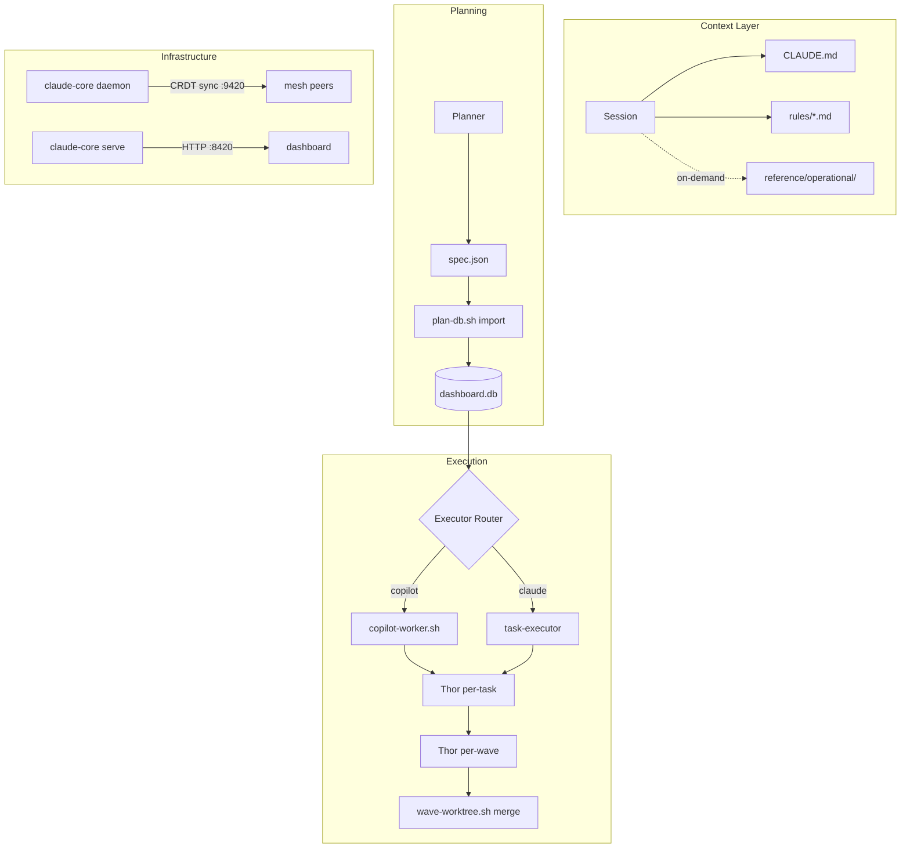

# dotclaude — AI Agent Orchestration

Configuration and runtime for multi-agent AI development workflows. Adds independent validation, file isolation, merge automation, and distributed execution to AI coding agents.

**Stack**: Rust binary (`claude-core`) + SQLite WAL + Bash scripts + Vanilla JS dashboard
**Mesh**: 3 nodes (m3max coordinator, omarchy Linux, m1mario Mac) via Tailscale, CRDT sync on port 9420
**Dashboard**: http://localhost:8420 (`claude-core serve`)
**Version**: 11.3.0

---

## Architecture


```mermaid
graph TB
    subgraph "Context Layer"
        A[Session] --> B[CLAUDE.md]
        A --> C[rules/*.md]
        A -.->|on-demand| D[reference/operational/]
    end
    subgraph "Planning"
        E[Planner] --> F[spec.json]
        F --> G[plan-db.sh import]
        G --> H[(dashboard.db)]
    end
    subgraph "Execution"
        H --> K{Executor Router}
        K -->|copilot| L[copilot-worker.sh]
        K -->|claude| M[task-executor]
        L --> N[Thor per-task]
        M --> N
        N --> O[Thor per-wave]
        O --> P[wave-worktree.sh merge]
    end
    subgraph "Infrastructure"
        Q[claude-core daemon] -->|CRDT sync :9420| R[mesh peers]
        S[claude-core serve] -->|HTTP :8420| T[dashboard]
    end
```

## Workflow

```
/prompt → /planner → /execute → Thor validation → merge → learning loop
```

| Step | Claude Code | Copilot CLI |
|------|-------------|-------------|
| Capture requirements | `/prompt` | `@prompt` |
| Create plan | `/planner` (Opus) | `@planner` |
| Execute tasks | `/execute {id}` | `@execute {id}` |
| Validate | Thor (9 gates) | `@validate` |
| Merge | `wave-worktree.sh merge` | same |

## Thor Validation (9 Gates)

Thor runs as a **separate agent with fresh context**. Tasks move `submitted` → `done` **only** through Thor. SQLite trigger `enforce_thor_done` blocks any bypass.

| Gate | Check | Gate | Check |
|------|-------|------|-------|
| 1 | Task compliance | 5 | Documentation |
| 2 | Code quality | 6 | Git standards |
| 3 | ISE standards | 7 | Performance |
| 4 | Repo compliance | 8 | TDD evidence |
| 9 | Constitution + ADR | 10 | Learning loop |

## Key Commands

```bash
# Server & daemon
claude-core serve                       # Dashboard on :8420
claude-core daemon                      # CRDT mesh sync on :9420

# Planning
plan-db.sh create {proj} "Name"         # Create plan
plan-db.sh import {id} spec.json        # Import tasks
plan-db.sh execution-tree {id}          # Colored tree view

# Execution
wave-worktree.sh create {plan} {wave}   # Wave worktree
wave-worktree.sh merge {plan} {wave}    # PR + CI + merge
plan-db-safe.sh update-task {id} done   # Submit (Thor required)
plan-db.sh validate-task {id} {plan}    # Thor validation

# Digests (10x token reduction)
git-digest.sh [--full]                  # Git status + log
service-digest.sh ci|pr|deploy          # CI/PR/Deploy
build-digest.sh, test-digest.sh         # Build/test results

# Dashboard
piani                                   # Interactive TUI
piani -n                                # Single-shot view
```

## Directory Structure

```
~/.claude/
├── CLAUDE.md                     # Always loaded (agent instructions)
├── AGENTS.md                     # Agent index (lazy-loaded)
├── rules/                        # Auto-loaded rules
├── reference/operational/        # On-demand includes
├── rust/claude-core/             # Rust binary source
├── hooks/                        # Session lifecycle hooks
├── scripts/                      # Shell scripts + dashboard
│   ├── plan-db.sh                # Central DB operations
│   ├── wave-worktree.sh          # Wave lifecycle
│   ├── dashboard_web/            # JS dashboard frontend
│   ├── dashboard_textual/        # Python TUI (alternative)
│   └── *-digest.sh              # Token-efficient wrappers
├── agents/                       # Agent definitions
├── copilot-agents/               # Copilot CLI agents
├── config/                       # Schema, peers, repos
├── data/dashboard.db             # SQLite WAL (source of truth)
└── docs/adr/                     # Architecture Decision Records
```

## Model Routing

| Task type | Model | Rationale |
|-----------|-------|-----------|
| Architecture, security | claude-opus-4.6 | Deep reasoning |
| Standard code gen | gpt-5.3-codex | Capable, bulk work |
| Config, mechanical | gpt-5.1-codex-mini | Fast, cheap |
| Documentation | claude-haiku-4.5 | Fast, trivial |

## Concurrency Control

- **File locking**: `file-lock.sh acquire` prevents silent overwrites between agents
- **Stale detection**: `stale-check.sh` catches external changes before commit
- **Merge queue**: `merge-queue.sh` serializes merges to main
- **Wave isolation**: Each wave gets a dedicated git worktree

## Self-Learning (Thor Gate 10)

Every completed plan triggers a learning loop:
1. **Analyze** — What broke, what was manually fixed, what hooks caught
2. **Propose** — Concrete fixes (new rules, KB entries, script fixes)
3. **Apply** — Generic rules (`.claude/rules/`) + project-specific (`CLAUDE.md`)
4. **Verify** — Confirm the new rule would have caught the original issue

## ADRs

| # | Topic | # | Topic |
|---|-------|---|-------|
| 0001 | Digest Scripts | 0021 | Serialization Policy |
| 0005 | Concurrency Control | 0025 | Tiered Model Strategy |
| 0008 | Thor Per-Task Validation | 0029 | Mesh Networking |
| 0011 | Anti-Bypass Protocol | 0034 | Conversational Plan Builder |
| 0017 | CodeGraph MCP-Only | 0037 | Rust Migration |
| 0019 | Plan Intelligence | 0039 | Self-Learning Loop |
| 0020 | Ecosystem v2.1 | 0040 | Post-Migration Stabilization |

Full list: `ls docs/adr/00*.md` (40 ADRs)

---

**Version**: 11.3.0 (08 Mar 2026)
