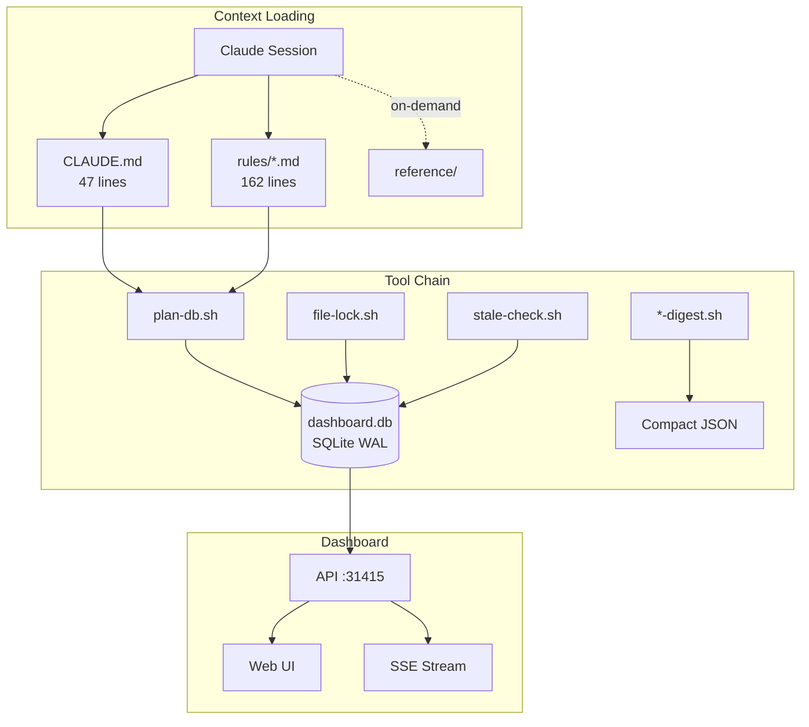
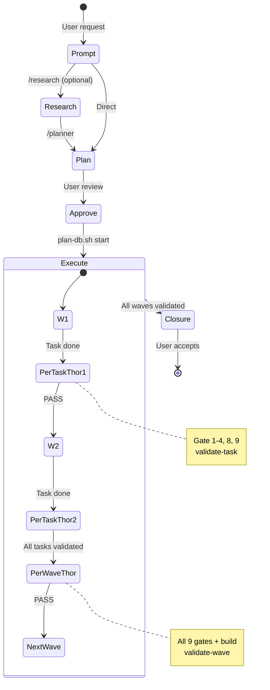
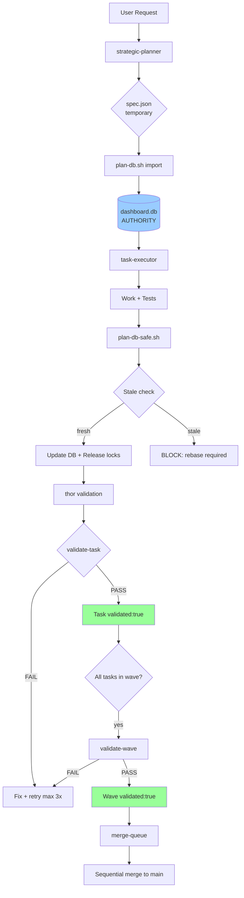
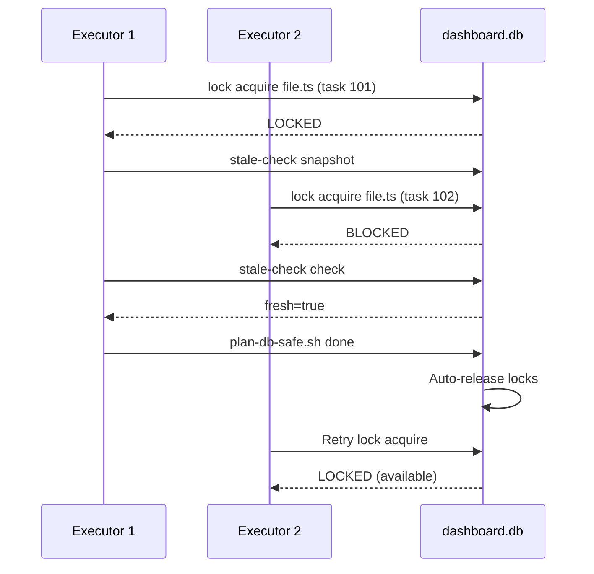

# ~/.claude - Claude Global Configuration

Personal Claude Code configuration with dashboard, scripts, and rules.

## Quick Start

```bash
~/.claude/server.sh start|stop|restart|status|logs  # PM2 management
curl http://localhost:31415/api/health              # Health check
open http://localhost:31415                         # Dashboard
```

## Architecture Overview


```mermaid
graph TB
    subgraph "Context Loading"
        A[Claude Session] --> B[CLAUDE.md<br/>47 lines]
        A --> C[rules/*.md<br/>162 lines]
        A -.->|on-demand| D[reference/]
    end
    subgraph "Tool Chain"
        E[plan-db.sh] --> F[(dashboard.db<br/>SQLite WAL)]
        G[*-digest.sh] --> H[Compact JSON]
        I[file-lock.sh] --> F
        J[stale-check.sh] --> F
    end
    subgraph "Dashboard"
        F --> K[API :31415]
        K --> L[Web UI]
        K --> M[SSE Stream]
    end
    B --> E
    C --> E
```

**Token Optimization**: 65% reduction (209 lines vs 600+ original). See ADR-0007.

## Workflow Flow


```mermaid
stateDiagram-v2
    [*] --> Prompt: User request
    Prompt --> Research: /research (optional)
    Research --> Plan: /planner
    Prompt --> Plan: Direct
    Plan --> Approve: User review
    Approve --> Execute: plan-db.sh start
    state Execute {
        [*] --> W1
        W1 --> PerTaskThor1: Task done
        PerTaskThor1 --> W2: PASS
        W2 --> PerTaskThor2: Task done
        PerTaskThor2 --> PerWaveThor: All tasks validated
        PerWaveThor --> NextWave: PASS
    }
    Execute --> Closure: All waves validated
    Closure --> [*]: User accepts
    note right of PerTaskThor1
        Gate 1-4, 8, 9
        validate-task
    end note
    note right of PerWaveThor
        All 9 gates + build
        validate-wave
    end note
```

## Thor Validation Gates


```mermaid
graph LR
    subgraph "Per-Task (1-4,8,9)"
        T1[1: Task Compliance]
        T2[2: Code Quality]
        T3[3: ISE Standards]
        T4[4: Repo Compliance]
        T8[8: TDD Evidence]
        T9[9: Constitution+ADR]
    end
    subgraph "Per-Wave (All 9)"
        W1[1-4,8,9 from tasks]
        W5[5: Documentation]
        W6[6: Git Standards]
        W7[7: Performance]
        W10[Build Passes]
    end
    T1 --> T2 --> T3 --> T4 --> T8 --> T9
    T9 --> W1
    W1 --> W5 --> W6 --> W7 --> W10
    style T9 fill:#ff9
    style W10 fill:#9f9
```

**Gate 9**: CLAUDE.md, coding-standards, ADRs. ADR-Smart Mode for doc tasks (skips circular enforcement).

## Data Flow & Authority


```mermaid
flowchart TD
    A[User Request] --> B[strategic-planner]
    B --> C{spec.json<br/>temporary}
    C --> D[plan-db.sh import]
    D --> E[(dashboard.db<br/>AUTHORITY)]
    E --> F[task-executor]
    F --> G[Work + Tests]
    G --> H[plan-db-safe.sh]
    H --> I{Stale check}
    I -->|fresh| J[Update DB + Release locks]
    I -->|stale| K[BLOCK: rebase required]
    J --> L[thor validation]
    L --> M{validate-task}
    M -->|PASS| N[Task validated:true]
    M -->|FAIL| O[Fix + retry max 3x]
    N --> P{All tasks in wave?}
    P -->|yes| Q[validate-wave]
    Q -->|PASS| R[Wave validated:true]
    Q -->|FAIL| O
    R --> S[merge-queue]
    S --> T[Sequential merge to main]
    style E fill:#9cf
    style N fill:#9f9
    style R fill:#9f9
```

**Single Source of Truth**: `~/.claude/data/dashboard.db` (SQLite WAL). All agents use `plan-db.sh`.

## Concurrency Control


```mermaid
sequenceDiagram
    participant E1 as Executor 1
    participant E2 as Executor 2
    participant DB as dashboard.db
    E1->>DB: lock acquire file.ts (task 101)
    DB-->>E1: LOCKED
    E1->>DB: stale-check snapshot
    E2->>DB: lock acquire file.ts (task 102)
    DB-->>E2: BLOCKED
    E1->>DB: stale-check check
    DB-->>E1: fresh=true
    E1->>DB: plan-db-safe.sh done
    DB->>DB: Auto-release locks
    E2->>DB: Retry lock acquire
    DB-->>E2: LOCKED (available)
```

See ADR-0005 for full protocol.

## Directory Structure

```
~/.claude/
├── CLAUDE.md, README.md, PLANNER-ARCHITECTURE.md, server.sh
├── data/dashboard.db      # SQLite WAL mode
├── dashboard/             # API :31415
├── docs/adr/              # ADR-0001 to ADR-0008
├── rules/                 # Auto-loaded: coding-standards.md, guardian.md
├── reference/             # NOT auto-loaded: operational/, detailed/
├── scripts/               # 30+ utilities: plan-db.sh, *-digest.sh, file-lock.sh, etc.
├── commands/              # /prompt, /planner, /execute
└── agents/                # task-executor, adversarial-debugger, etc.
```

## Key Scripts

### plan-db.sh

```bash
plan-db.sh create {project_id} "Plan Name"
plan-db.sh add-wave {plan_id} "W1" "Phase Name"
plan-db.sh add-task {wave_id} T1-01 "Task Name" P1 feature
plan-db.sh update-task {task_id} in_progress|done|blocked
plan-db.sh validate-task {task_id} {plan_id}  # Gate 1-4,8,9
plan-db.sh validate-wave {wave_db_id}         # All 9 gates + build
plan-db.sh validate {plan_id}                 # Bulk validation
plan-db.sh validate-fxx {plan_id}             # F-xx from markdown
plan-db.sh lock acquire|release|check|list
plan-db.sh stale-check snapshot|check|diff
plan-db.sh wave-overlap check-spec <spec.json>
plan-db.sh merge-queue enqueue|process|status
```

### Digest Scripts (ADR-0001)

Token-efficient wrappers. Raw CLI = 500-5000 lines. Digests = ~10x reduction.

```bash
git-digest.sh [--full]                # git status + log (ONE call)
service-digest.sh ci|pr|deploy|all    # CI/PR/Deploy status
test-digest.sh, build-digest.sh, diff-digest.sh main feat
```

### Other Utilities

```bash
server.sh start|stop|restart|status|logs
register-project.sh "$(pwd)" --name "Name"
cleanup-cache.sh, session-cleanup.sh [--dry-run]
```

## Configuration

- **MCP source of truth**: `~/.claude/mcp.json` (Desktop mirrors this)
- **Dashboard DB**: `~/.claude/data/dashboard.db` (SQLite WAL)
- **Token API**: `DASHBOARD_API` or `http://127.0.0.1:31415/api/tokens`

## Dashboard API

```
GET  /api/health, /api/plans, /api/plans/:id
POST /api/tokens
GET  /api/tokens/summary/:plan_id, /api/notifications/stream (SSE)
```

## Troubleshooting

```bash
# Dashboard restart
lsof -ti:31415 | xargs kill -9 && cd ~/.claude/dashboard && node reboot.js
# Database check
sqlite3 ~/.claude/data/dashboard.db ".tables"
# PM2 reset
pm2 kill && pm2 start ~/.claude/dashboard/ecosystem.config.js && pm2 save
```

## ADRs

- [0001](docs/adr/0001-digest-scripts-token-optimization.md): Digest Scripts
- [0002](docs/adr/0002-markdown-gate-9-integration.md): Gate 9 Constitution
- [0003](docs/adr/0003-context-layering-references.md): Context Layering
- [0004](docs/adr/0004-planner-sqlite-authority.md): SQLite Authority
- [0005](docs/adr/0005-multi-agent-concurrency-control.md): Concurrency Control
- [0006](docs/adr/0006-system-stability-crash-prevention.md): System Stability
- [0007](docs/adr/0007-token-optimization-compact-format.md): Token Optimization (65% reduction)
- [0008](docs/adr/0008-thor-per-task-validation.md): Per-Task + Per-Wave Thor

---

**Version**: 2.0.0 (15 Febbraio 2026) | **Context**: 209 lines (CLAUDE.md + rules/\*)
