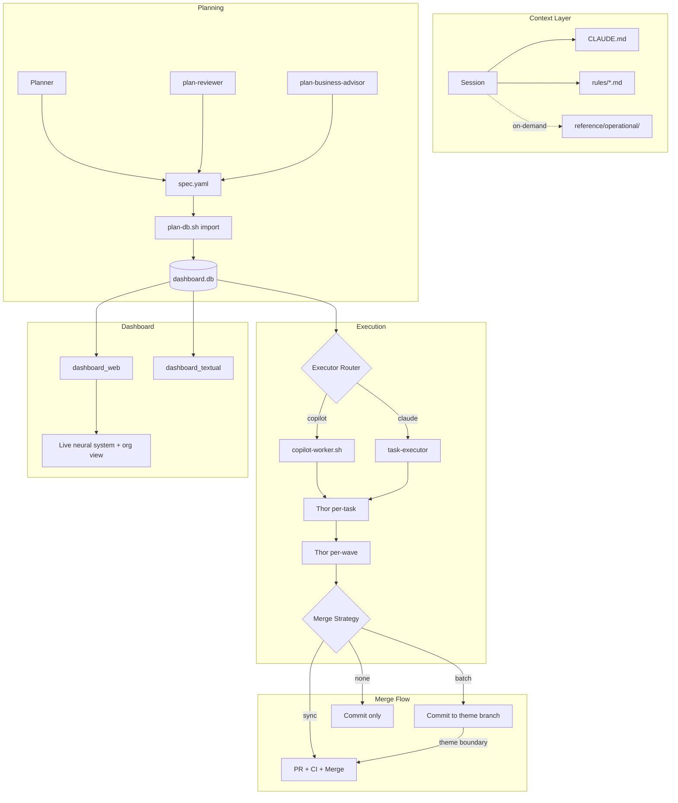
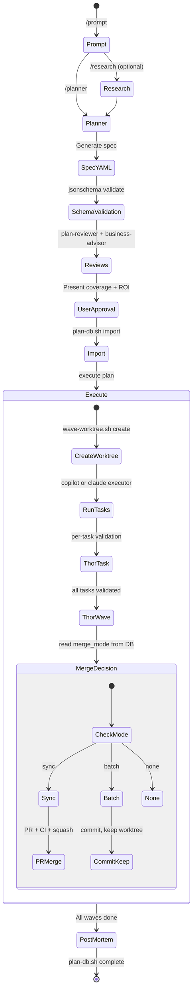
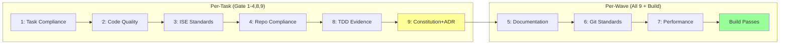
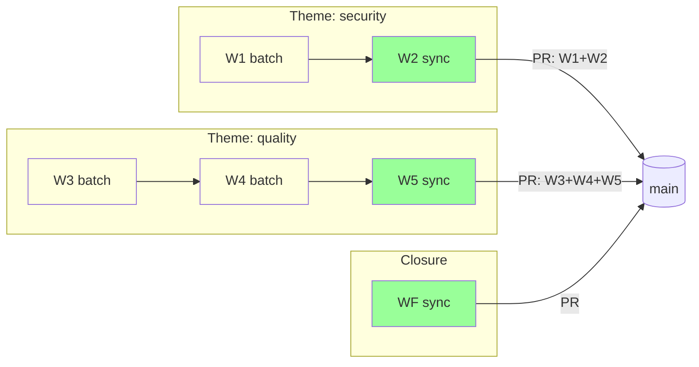
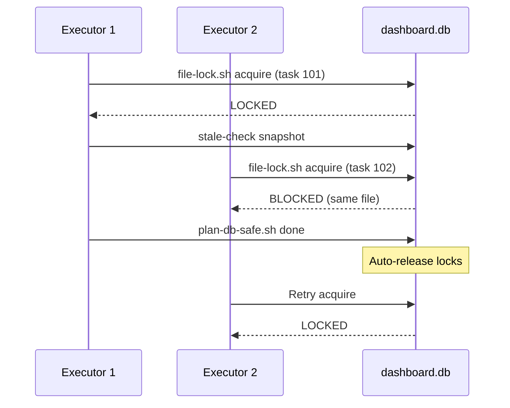
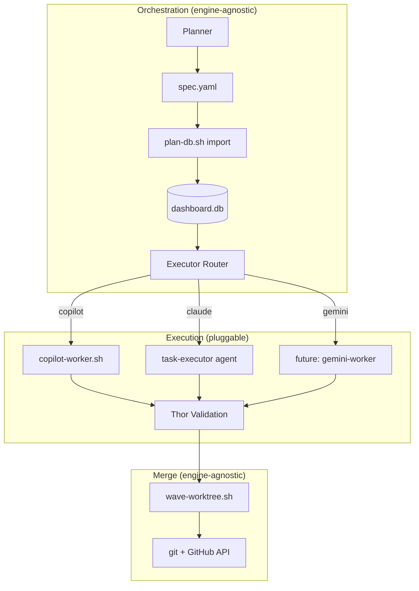

# MyConvergio Platform

**A trust layer between AI agents and your codebase.**

AI coding agents produce [1.7x more logical bugs](https://www.coderabbit.ai/blog/state-of-ai-vs-human-code-generation-report) than human code. Google's DORA Report found [+91% code review time and +154% PR size](https://dora.dev) with AI adoption. The [pattern that works](https://www.codebridge.tech/articles/mastering-multi-agent-orchestration-coordination-is-the-new-scale-frontier) is Planner, Worker, Judge — not equal-status agents hoping for the best.

MyConvergio adds independent validation, file isolation, and merge automation to AI coding workflows. Provider-agnostic: Claude Code, Copilot CLI, Gemini, OpenCode.

---

## Before and after

| Without trust layer                  | With MyConvergio                                                        |
| ------------------------------------ | ----------------------------------------------------------------------- |
| Agent says "done" and you trust it   | Thor validator: 9 gates, fresh context, SQLite-enforced                 |
| Two agents edit same file, last wins | File locking blocks second agent, zero silent overwrites                |
| CI log dumps 2000 lines into context | Digest scripts compress to 50-line JSON, 10x less tokens                |
| "How many tasks are done?" — no idea | SQLite plan state + CLI dashboard + execution tree                      |
| Manual merge, pray nothing breaks    | Wave auto-merge: rebase, CI, squash, cleanup                            |
| Locked into one model provider       | Per-task routing: Opus for architecture, Codex for code, Haiku for bulk |

---

## Architecture


```mermaid
graph TB
    subgraph "Context Layer"
        A[Session] --> B[CLAUDE.md]
        A --> C[rules/*.md]
        A -.->|on-demand| D[reference/operational/]
    end
    subgraph "Planning"
        E["Planner"] --> F["spec.yaml"]
        F --> G[plan-db.sh import]
        G --> H[(dashboard.db)]
        I[plan-reviewer] --> F
        J[plan-business-advisor] --> F
    end
    subgraph "Execution"
        H --> K{Executor Router}
        K -->|copilot| L[copilot-worker.sh]
        K -->|claude| M[task-executor]
        L --> N[Thor per-task]
        M --> N
        N --> O[Thor per-wave]
        O --> P{Merge Strategy}
    end
    subgraph "Merge Flow"
        P -->|sync| Q[PR + CI + Merge]
        P -->|batch| R[Commit to theme branch]
        P -->|none| S[Commit only]
        R -->|theme boundary| Q
    end
    subgraph "Dashboard"
        H --> T[dashboard_web]
        H --> U[dashboard_textual]
        T --> V[Live neural system + org view]
    end
```

### Core pipeline


```mermaid
stateDiagram-v2
    [*] --> Prompt: /prompt
    Prompt --> Research: /research (optional)
    Prompt --> Planner: /planner
    Research --> Planner
    Planner --> SpecYAML: Generate spec
    SpecYAML --> SchemaValidation: jsonschema validate
    SchemaValidation --> Reviews: plan-reviewer + business-advisor
    Reviews --> UserApproval: Present coverage + ROI
    UserApproval --> Import: plan-db.sh import
    Import --> Execute: execute plan

    state Execute {
        [*] --> CreateWorktree: wave-worktree.sh create
        CreateWorktree --> RunTasks: copilot or claude executor
        RunTasks --> ThorTask: per-task validation
        ThorTask --> ThorWave: all tasks validated
        ThorWave --> MergeDecision: read merge_mode from DB

        state MergeDecision {
            [*] --> CheckMode
            CheckMode --> Sync: sync
            CheckMode --> Batch: batch
            CheckMode --> None: none
            Sync --> PRMerge: PR + CI + squash
            Batch --> CommitKeep: commit, keep worktree
        }
    }
    Execute --> PostMortem: All waves done
    PostMortem --> [*]: plan-db.sh complete
```

---

## Thor: the agent that says no

The [industry consensus](https://vadim.blog/verification-gate-research-to-practice): generation without verification is a net negative. Thor is the independent validator.


```mermaid
graph LR
    subgraph "Per-Task (Gate 1-4,8,9)"
        T1[1: Task Compliance]
        T2[2: Code Quality]
        T3[3: ISE Standards]
        T4[4: Repo Compliance]
        T8[8: TDD Evidence]
        T9[9: Constitution+ADR]
    end
    subgraph "Per-Wave (All 9 + Build)"
        W5[5: Documentation]
        W6[6: Git Standards]
        W7[7: Performance]
        W10[Build Passes]
    end
    T1 --> T2 --> T3 --> T4 --> T8 --> T9
    T9 --> W5 --> W6 --> W7 --> W10
    style T9 fill:#ff9
    style W10 fill:#9f9
```

Thor runs as a **separate agent with fresh context**. Tasks move `submitted` to `done` **only** through Thor. A SQLite trigger (`enforce_thor_done`) blocks any bypass — even raw SQL.

---

## Model routing

Per-task model selection based on complexity and risk. [Plan-and-Execute can reduce costs 90%](https://www.pulumi.com/blog/ai-predictions-2026-devops-guide/) vs frontier models for everything.

```
T1-01: config change     → gpt-5.1-codex-mini   (fast, simple)
T1-02: standard feature  → gpt-5.3-codex         (capable, bulk work)
T2-01: security review   → claude-opus-4.6       (best judgment)
T2-02: complex refactor  → claude-sonnet-4.6     (good balance)
T3-01: architecture      → claude-opus-4.6       (cross-cutting)
T3-02: docs update       → claude-haiku-4.5      (fast, trivial)
```

---

## Wave merge strategy


```mermaid
flowchart LR
    subgraph "Theme: security"
        W1[W1 batch] --> W2[W2 sync]
    end
    subgraph "Theme: quality"
        W3[W3 batch] --> W4[W4 batch] --> W5[W5 sync]
    end
    subgraph "Closure"
        WF[WF sync]
    end
    W2 -->|"PR: W1+W2"| Main[(main)]
    W5 -->|"PR: W3+W4+W5"| Main
    WF -->|PR| Main
    style W1 fill:#ffd
    style W3 fill:#ffd
    style W4 fill:#ffd
    style W2 fill:#9f9
    style W5 fill:#9f9
    style WF fill:#9f9
```

Tasks grouped by theme. Batch waves accumulate on a shared branch. Sync waves trigger PR + CI + merge. A 6-wave plan creates 2-3 PRs instead of 6.

---

## Concurrency control


```mermaid
sequenceDiagram
    participant E1 as Executor 1
    participant E2 as Executor 2
    participant DB as dashboard.db
    E1->>DB: file-lock.sh acquire (task 101)
    DB-->>E1: LOCKED
    E1->>DB: stale-check snapshot
    E2->>DB: file-lock.sh acquire (task 102)
    DB-->>E2: BLOCKED (same file)
    E1->>DB: plan-db-safe.sh done
    Note over DB: Auto-release locks
    E2->>DB: Retry acquire
    DB-->>E2: LOCKED
```

File locking prevents silent overwrites. Stale detection catches external changes before commit. Merge queue serializes merges to main.

---

## Cross-engine parity


```mermaid
flowchart TD
    subgraph "Orchestration (engine-agnostic)"
        P[Planner] --> S[spec.yaml]
        S --> I[plan-db.sh import]
        I --> DB[(dashboard.db)]
        DB --> E[Executor Router]
    end
    subgraph "Execution (pluggable)"
        E -->|copilot| C1[copilot-worker.sh]
        E -->|claude| C2[task-executor agent]
        E -->|gemini| C3[future: gemini-worker]
        C1 --> V[Thor Validation]
        C2 --> V
        C3 --> V
    end
    subgraph "Merge (engine-agnostic)"
        V --> M[wave-worktree.sh]
        M --> G[git + GitHub API]
    end
```

| Component       | Copilot CLI              | Claude Code                           | Both                      |
| --------------- | ------------------------ | ------------------------------------- | ------------------------- |
| Plan creation   | `@planner`               | `Skill(skill="planner")`              | spec.yaml is the contract |
| Task execution  | `copilot-worker.sh`      | `Task(subagent_type="task-executor")` | Same DB, same worktree    |

---

## Dashboard surfaces

- `scripts/dashboard_web/` — browser control room with mission, mesh, AI organization, and live-system views.
- `dashboard_textual` — terminal-first monitoring surface for the same `dashboard.db` control plane.
- `scripts/token-usage-normalize.sh` + `scripts/dashboard-db-repair.sh` — maintenance pair for token attribution and DB drift repair.
| Thor validation | `@validate`              | `Task(subagent_type="thor")`          | Same 9 gates              |
| Merge           | `wave-worktree.sh merge` | `wave-worktree.sh merge`              | Identical script          |
| Dashboard       | `piani`                  | `piani`                               | Same SQLite DB            |

---

## Quick start

```bash
piani                 # Terminal dashboard (interactive)
piani -n              # Single-shot view
piani -p 265          # Drill-down on plan
```

## Key commands

```bash
# Planning
planner-init.sh                         # Bootstrap project
plan-db.sh create {proj} "Name"         # Create plan
plan-db.sh import {id} spec.yaml        # Import (YAML or JSON)
plan-db.sh get-context {id}             # Execution context (JSON)

# Execution
wave-worktree.sh create {plan} {wave}   # Create wave worktree
wave-worktree.sh batch {plan} {wave}    # Batch commit (no PR)
wave-worktree.sh merge {plan} {wave}    # PR + CI + merge
wave-worktree.sh status {plan}          # Wave status table
plan-db-safe.sh update-task {id} done   # Submit (Thor required)
plan-db.sh validate-task {id} {plan}    # Thor validation

# Digests (10x token reduction vs raw CLI)
git-digest.sh [--full]                  # Git status + log
service-digest.sh ci|pr|deploy          # CI/PR/Deploy
build-digest.sh, test-digest.sh         # Build/test results

# PR Operations
pr-ops.sh status|reply|resolve|merge    # Full PR lifecycle
copilot-review-digest.sh {pr}           # Review digest

# Discovery
script-versions.sh [--json|--stale]     # Scripts indexed
agent-versions.sh [--json|--check]      # Agents indexed
```

## Directory structure

```
~/.claude/
├── CLAUDE.md                     # Always loaded
├── rules/                        # Auto-loaded
├── reference/operational/        # On-demand
├── config/plan-spec-schema.json  # Spec validation schema
├── commands/                     # /prompt, /planner, /execute
├── agents/                       # Specialized agents
├── scripts/                      # Shell scripts
│   ├── plan-db.sh                # Central DB operations
│   ├── wave-worktree.sh          # Wave lifecycle
│   ├── copilot-worker.sh         # Copilot CLI executor
│   ├── *-digest.sh               # Token-efficient wrappers
│   └── lib/                      # Shared libraries
├── data/dashboard.db             # SQLite WAL (source of truth)
├── docs/adr/                     # ADRs
└── plans/                        # Per-project artifacts
```

## ADRs

| #    | Topic                        | #    | Topic                |
| ---- | ---------------------------- | ---- | -------------------- |
| 0001 | Digest Scripts               | 0013 | Worktree Isolation   |
| 0002 | Inter-Wave Communication     | 0014 | zsh Shell Safety     |
| 0003 | Opus 4.6 Configuration       | 0015 | Agents Cross-Tool    |
| 0004 | Distributed Execution        | 0016 | Session File Locking |
| 0005 | Concurrency Control          | 0017 | CodeGraph MCP-Only   |
| 0006 | System Stability             | 0018 | Memory Protocol      |
| 0007 | CLAUDE.md Restructuring      | 0019 | Plan Intelligence    |
| 0008 | Thor Per-Task Validation     | 0020 | Ecosystem v2.1       |
| 0009 | Compact Markdown Format      | 0021 | Serialization Policy |
| 0010 | Multi-Provider Orchestration | 0022 | Session Reaper       |
| 0011 | Anti-Bypass Protocol         | 0023 | Spotlight Exclusion  |
| 0012 | Token Accounting             | 0024 | Overlapping Waves    |

---

**Version**: 4.0.0 (08 Mar 2026)
