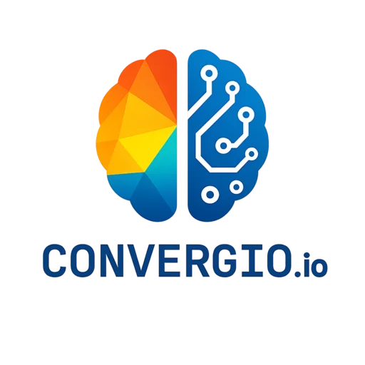
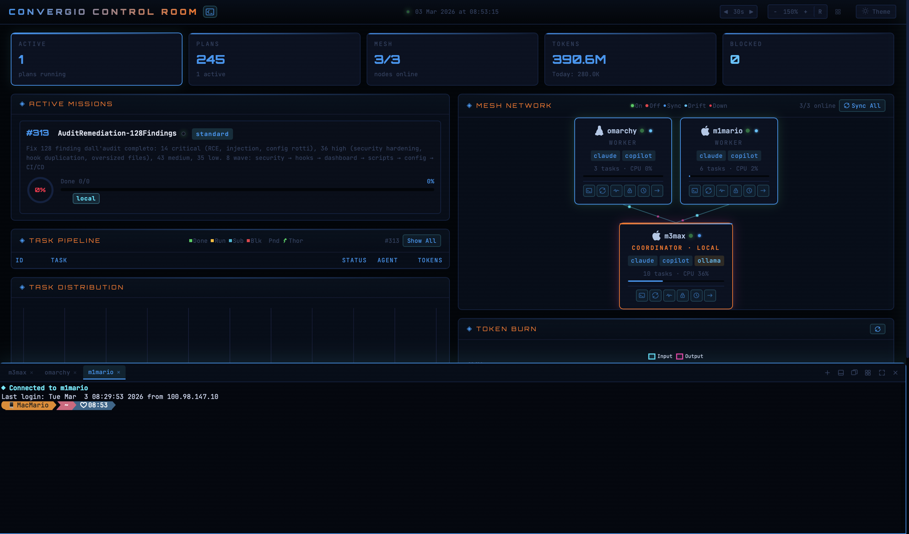
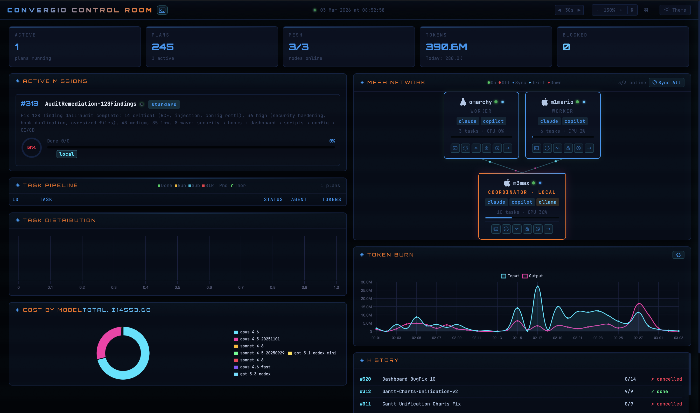
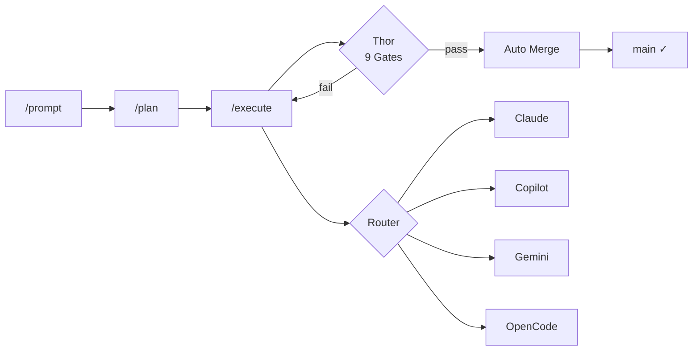
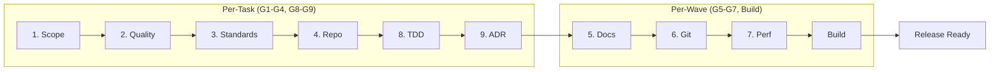
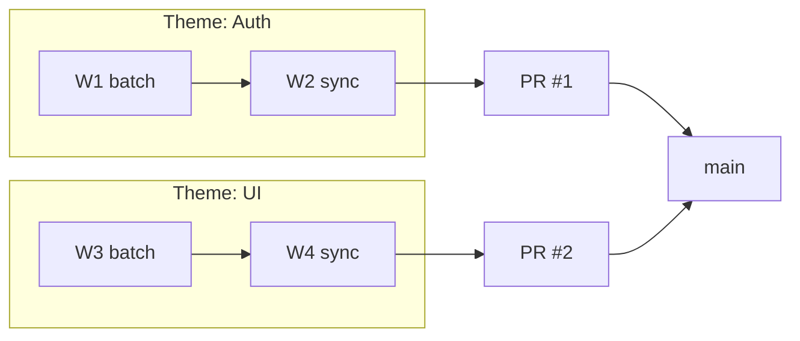
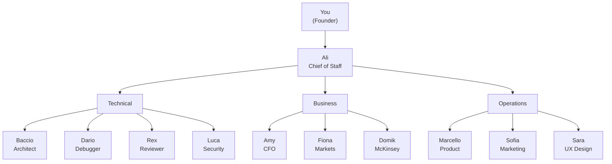
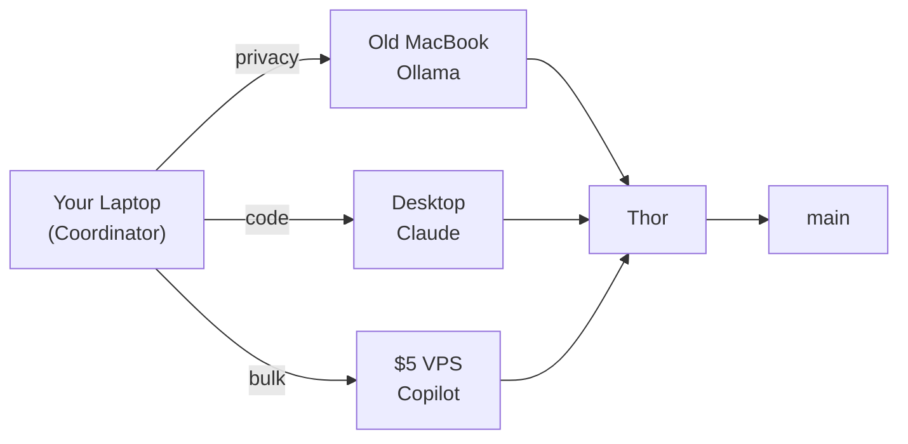

<!-- AGENT_COUNTS: unique:91 claude:82 copilot:85 -->
<div align="center">

# MyConvergio



[](#agent-portfolio)
[](./LICENSE)
[](#model-routing)
[](#whats-new-in-v11)

**You are one person building what used to require fifty.**
**MyConvergio is the team you don't have.**

_Your AI agent says "done." It isn't. There are bugs, no tests, and it pushed to main._
_Sound familiar?_

</div>

---

## The problem

When you work alone with AI, three things break:

1. **No one reviews AI output.** Agents say "done" when they're not. Broken code reaches main because there's no second pair of eyes.
2. **No one plans the architecture.** AI generates code fast — but without a tech architect, security reviewer, or DevOps engineer, the result is fragile and insecure.
3. **No one manages the business.** You're the CEO, CFO, PM, designer, and marketer — all at once. Strategic decisions get no structured analysis.

The pattern that works is **Planner → Worker → Judge**. Not a solo agent hoping for the best.

This isn't opinion — the data is in:

| Finding                                                                 | Source                                                                                                                             |
| ----------------------------------------------------------------------- | ---------------------------------------------------------------------------------------------------------------------------------- |
| AI-assisted code produces **1.7x more logical bugs** than human code    | [CodeRabbit 2026](https://www.coderabbit.ai/blog/state-of-ai-vs-human-code-generation-report)                                      |
| 90% AI adoption → **+9% bugs**, **+91% review time**, **+154% PR size** | [Cortex Engineering Benchmark 2026](https://www.cortex.io/state-of-engineering)                                                    |
| Cognitive complexity rises **39%** in agent-assisted repos              | [Faros AI 2026](https://www.faros.ai/blog/best-ai-coding-agents-2026)                                                              |
| Change failure rate **+30%**, incidents per PR **+23.5%**               | [TFIR 2026](https://tfir.io/ai-code-quality-2026-guardrails/)                                                                      |
| Equal-status multi-agent coordination **failed** at scale               | [Codebridge 2026](https://www.codebridge.tech/articles/mastering-multi-agent-orchestration-coordination-is-the-new-scale-frontier) |

---

## What's new in v11

v11.0.0 is a **breaking upgrade** focused on operational reliability, self-healing infrastructure, and Rust-native performance.

| Feature | What it does |
| --- | --- |
| **Rust core runtime** (`claude-core`) | DB operations, hook enforcement, digest compression, mesh networking, TUI dashboard, and file locking — all rewritten in Rust for 10-100x faster execution. Replaces shell-based hooks with compiled binary enforcement. |
| **Migration system** | `myconvergio-backup.sh` + `myconvergio-restore.sh` + `migrate-v10-to-v11.sh` — mandatory backup before upgrade, checksummed archives, selective restore (full/db-only/agents-only). |
| **Night maintenance agent** | `myconvergio-nightly-guardian.sh` — scheduled GitHub issue triage with configurable fix timeout, human review gates, and per-run SQLite reporting. Runs via systemd timer or launchd. |
| **Auto-sync agent** | `myconvergio-claude-sync-agent.sh` — detects drift between `~/.claude` global state and the MyConvergio repo, generates diff reports, optionally creates PRs with categorized changes. |
| **Doctor command** | `myconvergio-doctor.sh` — 20+ health checks: prerequisites, directory structure, database integrity, hook installation, agent counts, version consistency. |
| **31 enforcement hooks** | Up from 12 in v10. New hooks: `session-reaper`, `session-file-lock/unlock`, `session-tokens`, `model-registry-refresh`, `warn-infra-plan-drift`, `version-check`, and more. |
| **Token-aware agent optimization** | All 82 Claude + 85 Copilot agent definitions rewritten for compact markdown format — 30-40% fewer instruction tokens per agent invocation. |

> **Upgrading from v10?** See [Migration Guide](./docs/MIGRATION-v10-to-v11.md). Run `./scripts/migrate-v10-to-v11.sh --dry-run` first.

---

## What MyConvergio does

MyConvergio gives you a **complete, trusted team of 91 AI specialists** — from code architects to security auditors to CFOs — orchestrated through a quality pipeline that prevents AI from lying about being done.

It installs as a layer on top of Claude Code, GitHub Copilot CLI, Gemini, and OpenCode. You don't change your editor or workflow.

| Working alone with AI                | With MyConvergio                                              |
| ------------------------------------ | ------------------------------------------------------------- |
| Agent says "done" and you trust it   | Thor validator checks 9 quality gates independently           |
| No one reviews your architecture     | Baccio (architect) + Rex (reviewer) + Luca (security)         |
| Financial decisions are gut feelings | Amy (CFO) + Fiona (market analyst) + Domik (McKinsey)         |
| Two agents edit the same file        | Rust file locking blocks the second agent — zero overwrites   |
| CI dumps 2000 lines into context     | Rust digest compresses to 50-line JSON — 10x less tokens      |
| Agents burn $50/day on wasted tokens | Isolated subagents + token tracking save 50-70% per task      |
| "How many tasks are done?" — no idea | SQLite plan DB + real-time Control Room dashboard             |
| One machine, one agent at a time     | Mesh: distribute across every machine you own                 |
| Locked into one AI provider          | 18 models across 4 providers, routed per task                 |
| Shell scripts break at 3am           | Rust core runtime — single binary, no deps, 100x faster       |
| Upgrade = pray nothing breaks        | Backup/restore + migration scripts + doctor health check      |
| GitHub issues pile up overnight      | Night agent triages, fixes, and creates PRs while you sleep   |

---

## Who is this for

**The innovator who builds alone but refuses to ship garbage.**

- **Solo founders** who need an architect, reviewer, security expert, CFO, and PM — without hiring anyone
- **Solopreneurs** building real products for real people, not demo apps that impress nobody
- **Indie developers** who want enterprise-grade quality gates on AI-generated code
- **Small teams (2-5)** who need to punch above their weight with AI agents
- **Anyone who has merged AI-generated code and found bugs in production**

You want AI that ships reliable, secure, production-ready software — with independent verification that the work is actually done. This is your team.

### How does it compare?

> These tools serve different categories (orchestration layer vs coding agent vs framework vs SaaS). Comparison focuses on capabilities relevant to solo builders shipping production software.

| Capability             | MyConvergio                   | CrewAI       | Devin             | Cursor/Windsurf | LangGraph    |
| ---------------------- | ----------------------------- | ------------ | ----------------- | --------------- | ------------ |
| Independent validation | Thor (9 gates + DB trigger)   | Custom       | Plan review       | None            | Custom       |
| Business intelligence  | 15 agents (CFO→VC→McKinsey)   | None         | None              | None            | None         |
| Parallel orchestration | Wave-based + file locking     | Hierarchical | Parallel VMs      | Limited         | Graph-based  |
| Git isolation          | Worktrees + merge automation  | None         | N/A               | None            | None         |
| Provider agnostic      | Claude+Copilot+Gemini+OC      | Any LLM      | Cognition only    | Single LLM      | Any LLM      |
| Cost tracking          | Per-model, per-task, per-plan | None         | Opaque (ACUs)     | None            | None         |
| Multi-machine (mesh)   | SSH/Tailscale routing         | No           | Cloud only        | No              | No           |
| Enforcement hooks      | 31 automatic                  | Custom       | None              | None            | Custom       |
| Token optimization     | Digest+isolation (50-70% cut) | None         | N/A               | None            | None         |
| Native performance     | Rust core (`claude-core`)     | Python       | Unknown           | TypeScript      | Python       |
| Open source            | Yes (CC BY-NC-SA)             | Yes (MIT)    | No ($500/mo team) | No              | Yes (MIT)    |
| Target user            | **Solo builder**              | Dev teams    | Engineering orgs  | Individual devs | ML engineers |

---

## The Control Room

Real-time visibility into plans, agents, mesh peers, costs, and execution — from your browser.



Active missions with per-task execution flow (Execute → Submit → Thor → Done), mesh network topology, live task pipeline, and an **integrated terminal** — SSH into mesh peers, run commands, and manage plans directly from the browser.



Cost-per-model breakdown, token burn over time, plan execution history. Every dollar spent on AI is tracked and attributed to the task that consumed it.

---

## How it works

### Core pipeline


```mermaid
flowchart LR
    A["/prompt"] --> B["/plan"]
    B --> C["/execute"]
    C --> D{"Thor\n9 Gates"}
    D -->|fail| C
    D -->|pass| E["Auto Merge"]
    E --> F["main ✓"]

    C --> R{Router}
    R --> P1["Claude"]
    R --> P2["Copilot"]
    R --> P3["Gemini"]
    R --> P4["OpenCode"]
```

**`/prompt`** extracts structured requirements. **`/plan`** decomposes into waves of parallel tasks with file-level dependency tracking. **`/execute`** runs isolated agents per task with TDD, file locking, and worktree isolation. **Thor** validates each task against 9 gates before allowing merge. **Auto Merge** rebases, runs CI, resolves review comments, squash merges, and cleans up.

### Thor: the agent that says no

[Generation without verification is a net negative](https://vadim.blog/verification-gate-research-to-practice). Thor is the independent validator that rejects incomplete work.


```mermaid
flowchart LR
    subgraph "Per-Task (G1-G4, G8-G9)"
        G1["1. Scope"] --> G2["2. Quality"] --> G3["3. Standards"]
        G3 --> G4["4. Repo"] --> G8["8. TDD"] --> G9["9. ADR"]
    end
    subgraph "Per-Wave (G5-G7, Build)"
        G5["5. Docs"] --> G6["6. Git"] --> G7["7. Perf"] --> GB["Build"]
    end
    G9 --> G5
    GB --> R["Release Ready"]
```

Thor runs as a **separate agent with fresh context** — zero assumptions from the executor. Tasks move from `submitted` → `done` **only** through Thor. A SQLite trigger enforces this — even raw SQL cannot bypass it.

### Wave merge strategy


```mermaid
flowchart LR
    subgraph "Theme: Auth"
        W1["W1 batch"] --> W2["W2 sync"]
    end
    subgraph "Theme: UI"
        W3["W3 batch"] --> W4["W4 sync"]
    end
    W2 --> PR1["PR #1"]
    W4 --> PR2["PR #2"]
    PR1 --> M["main"]
    PR2 --> M
```

Tasks group into waves by theme. Each wave gets its own git worktree. Merge is fully automated: rebase → push → CI → review comment resolution → squash merge → cleanup.

---

## Beyond code: your full AI team

Most AI coding tools give you a code generator. MyConvergio gives you an **entire organization**.


```mermaid
flowchart TB
    YOU["You\n(Founder)"] --> ALI["Ali\nChief of Staff"]
    ALI --> TECH["Technical"]
    ALI --> BIZ["Business"]
    ALI --> OPS["Operations"]

    TECH --> BA["Baccio\nArchitect"]
    TECH --> DA["Dario\nDebugger"]
    TECH --> RX["Rex\nReviewer"]
    TECH --> LU["Luca\nSecurity"]

    BIZ --> AM["Amy\nCFO"]
    BIZ --> FI["Fiona\nMarkets"]
    BIZ --> DM["Domik\nMcKinsey"]

    OPS --> MA["Marcello\nProduct"]
    OPS --> SO["Sofia\nMarketing"]
    OPS --> SA["Sara\nUX Design"]
```

| Domain                    | Agents | What they do                                                            |
| ------------------------- | ------ | ----------------------------------------------------------------------- |
| **Orchestration & QA**    | 27     | Plan, execute, validate, merge. Thor, strategic-planner, wave merge     |
| **Technical Development** | 13     | Architecture, debugging, DevOps, performance, code review, data science |
| **Business Intelligence** | 15     | CFO analysis, market research, VC evaluation, McKinsey frameworks       |
| **Operations & PM**       | 15     | Product management, marketing, sales, HR, customer success              |
| **Compliance & Legal**    | 5      | Security audit, legal review, HIPAA, government affairs, AI ethics      |
| **Design & UX**           | 4      | UX design, creative direction, design thinking, accessibility           |
| **Release Management**    | 6      | Release lifecycle, ecosystem sync, hardening checks                     |

These agents work together through **structured orchestration** — not isolated chatbots:

- **Ali** (Chief of Staff) coordinates cross-domain requests — ask one agent, get a synthesized answer from all relevant specialists
- **Amy** (CFO) builds financial models with cultural market adjustment — global ROI analysis, not just spreadsheets
- **Fiona** (Market Analyst) provides live-verified market intelligence — never hallucinated, always sourced
- **Domik** (McKinsey) applies quantitative scoring across 6 dimensions for investment decisions
- **Research Report Generator** produces institution-grade equity research — LaTeX output, data integrity guaranteed
- **Behice** (Cultural Coach) navigates US, UK, Middle East, Nordic, and Asia-Pacific business dynamics

> See the [Agent Portfolio](./docs/agents/agent-portfolio.md) for sample outputs and detailed capabilities.

---

## Mesh networking: every machine you own becomes a worker

That old MacBook gathering dust? It's now a build worker. A $5/month Linux VPS? A parallel executor. Your desktop at home? Heavy compute while your laptop stays mobile. **Zero extra cost.**


```mermaid
flowchart LR
    CO["Your Laptop\n(Coordinator)"] --> |"privacy"| OL["Old MacBook\nOllama"]
    CO --> |"code"| CP["Desktop\nClaude"]
    CO --> |"bulk"| VM["$5 VPS\nCopilot"]
    OL --> TH["Thor"]
    CP --> TH
    VM --> TH
    TH --> M["main"]
```

The coordinator scores peers by cost, load, and privacy constraints, then routes tasks to the best available machine:

- **Privacy-sensitive code** stays on your local Ollama node — never touches the cloud
- **Compute-heavy tasks** go to your most powerful machine
- **Bulk work** goes to the cheapest peer (free Copilot on a VPS beats paid API calls)
- **Multiple projects** run in parallel across different machines, all feeding one dashboard

All peers sync via SSH/Tailscale. Config, repos, credentials, and the plan DB stay aligned across machines with one command: `mesh-sync-all.sh`. Live migration moves a running plan to another peer mid-execution.

### Dashboard Delegation

Delegate plans directly from the Control Room — click the 🚀 icon on any active mission:

1. **Select target node** — see OS, CPU load, active tasks, online status
2. **Auto preflight** — 6 streaming checks run and self-heal:
   - SSH reachability, heartbeat (auto-restarts if stale), config sync (auto-syncs if diverged), Claude CLI, disk space
3. **One-click delegate** — full sync (Phase 0) + migration (Phase 1-5) streamed live to a modal
4. **tmux session** — plan runs in `plan-{ID}` on target; terminal icons auto-attach

### Node Power Management

| Button | When | What it does |
|--------|------|-------------|
| ⚡ Wake | Node offline | Sends Wake-on-LAN magic packet (needs `mac_address` in peers.conf) |
| 🔄 Reboot | Node frozen | SSH `sudo reboot` with post-reboot polling |

### Auto-Sync Protocol

No manual sync needed — everything propagates automatically:

| Event | Action |
|-------|--------|
| **Plan completes** | Results pushed to all online peers |
| **Node boots / reconnects** | Heartbeat daemon pulls latest from coordinator |
| **Every ~5 minutes** | Heartbeat loop checks for updates |
| **Before delegation** | Full sync (config + DB + repos) to target |

### Quick Start: Mesh Setup

```bash
# 1. Install MyConvergio on each machine
curl -fsSL https://raw.githubusercontent.com/Roberdan/MyConvergio/master/install.sh | bash

# 2. Configure peers (edit with your real hosts)
cp config/peers.conf.example ~/.claude/config/peers.conf
# Set: ssh_alias, user, os, tailscale_ip, capabilities, role, mac_address

# 3. Bootstrap remote peer
scripts/mesh/bootstrap-peer.sh my-linux

# 4. Push credentials
scripts/mesh/mesh-auth-sync.sh push --peer my-linux

# 5. Start heartbeat daemon (auto-syncs on start)
scripts/mesh/mesh-heartbeat.sh start

# 6. Launch Control Room
claude-core server --port 8420
# Open http://localhost:8420
```

---

## Enforcement layer

31 hooks that run automatically on every tool call — no discipline required. In v11, core hooks (`enforce-line-limit`, `secret-scanner`, `session-file-lock`) are compiled into `claude-core` for 50x faster enforcement. Shell versions remain as fallbacks.

| Hook                     | Trigger       | What it does                                        |
| ------------------------ | ------------- | --------------------------------------------------- |
| `worktree-guard`         | git ops       | Blocks commits on protected branches during plans   |
| `secret-scanner`         | pre-commit    | Detects API keys, tokens, credentials (Rust in v11) |
| `enforce-line-limit`     | post-edit     | Rejects files over 250 lines (Rust in v11)          |
| `session-file-lock`      | file edits    | Prevents parallel agents overwriting each other     |
| `session-reaper`         | session end   | Kills orphaned AI agent processes (new in v11)      |
| `enforce-standards`      | all tool calls | Enforces coding standards and conventions          |
| `prefer-ci-summary`      | bash commands | Forces digest scripts over raw CI output            |
| `model-registry-refresh` | session start | Auto-updates available model list (new in v11)      |
| `warn-infra-plan-drift`  | plan ops      | Detects plan staleness vs main (new in v11)         |
| `session-tokens`         | per-turn      | Tracks token usage per session (new in v11)         |
| `version-check`          | session start | Warns if MyConvergio is outdated (new in v11)       |

Hooks work on both Claude Code and Copilot CLI. Zero config after install.

---

## Model routing

18 models across 4 providers. Use the right model for each job. No provider lock-in. User-configurable per task.

| Task            | Primary | Default model     | Fallback        |
| --------------- | ------- | ----------------- | --------------- |
| Requirements    | Claude  | Opus 4.6          | Gemini 3 Pro    |
| Planning        | Claude  | Opus 4.6 (1M ctx) | Gemini 3 Pro    |
| Code generation | Copilot | GPT-5.3-Codex     | Claude Sonnet 4 |
| Validation      | Claude  | Sonnet 4.6        | Copilot         |
| Bulk fixes      | Copilot | GPT-5-mini        | Claude Haiku    |
| Research        | Gemini  | 3 Pro             | Claude Sonnet   |
| Exploration     | Claude  | Haiku 4.5         | GPT-4.1         |

> Frontier models for reasoning, fast models for execution. The plan-and-execute pattern [significantly reduces costs](https://www.pulumi.com/blog/ai-predictions-2026-devops-guide/) vs using frontier models for everything.

---

## Token optimization

AI tokens are money. Every wasted token is a wasted dollar. MyConvergio is obsessively optimized to minimize token consumption:

| Technique                      | Saving     | How                                                                      |
| ------------------------------ | ---------- | ------------------------------------------------------------------------ |
| **Isolated subagents**         | 50-70%     | Each task-executor gets fresh context (~30K tokens vs 100K inherited)    |
| **Rust digest compression**    | 10x        | CI/build/test output compiled to compact JSON via `claude-core digest`  |
| **Compact instruction format** | 30-40%     | All 91 agent definitions rewritten for token-aware compact markdown     |
| **Token tracking per task**    | Visibility | Every token attributed to plan → wave → task → model in SQLite           |
| **Copilot-first delegation**   | $0         | Trivial tasks routed to free Copilot; Claude reserved for reasoning      |
| **Auto context compression**   | Continuous | Long conversations auto-compressed with state preserved in memory        |
| **Rust hook enforcement**      | 50x        | No fork/exec per tool call — `claude-core hook` runs in-process          |

31 hooks enforce this automatically. `prefer-ci-summary` blocks raw `npm build` output (2000+ lines) and forces digest scripts (~50 lines). `enforce-line-limit` rejects files over 250 lines — because agents lose context in long files.

**Result:** A 14-task plan that would burn $80+ in raw Opus tokens costs ~$15 with MyConvergio's optimization stack.

---

## Rust core runtime (`claude-core`)

Starting with v11, performance-critical paths are compiled Rust — not shell scripts waiting to break.

```
claude-core v11.3.0
├── db/       — SQLite operations, WAL checkpointing, cr-sqlite CRDT sync
├── hooks/    — Pre/post tool-call enforcement (line limits, secrets, file locks)
├── digest/   — CI/build/test output compression (2000 lines → 50-line JSON)
├── mesh/     — Peer discovery, SSH routing, heartbeat, live migration
├── lock/     — Session-level file locking (atomic, no race conditions)
├── server/   — Full HTTP/WebSocket API (dashboard, plans, agents, mesh, chat)
└── tui/      — Terminal dashboard (ratatui) — `pianits` replacement
```

| Before (shell) | After (Rust) | Impact |
| --- | --- | --- |
| `plan-db-safe.sh` (300ms per gate) | `claude-core db` (3ms) | **100x** faster task validation |
| `enforce-line-limit.sh` (fork+wc+grep) | `claude-core hook` (in-process) | **50x** less overhead per tool call |
| `mesh-heartbeat.sh` (SSH polling loop) | `claude-core mesh` (async Tokio) | Zero CPU idle burn |
| `service-digest.sh` (jq+sed pipeline) | `claude-core digest` (serde) | **10x** faster, no temp files |
| `dashboard_web/server.py` (Flask) | `claude-core server` (Axum) | Single binary, no Python deps |

The shell scripts remain as fallbacks for environments without the Rust binary. New installations get `claude-core` automatically.

---

## Squad vs MyConvergio

[Squad](https://github.com/bradygaster/squad) by Brady Gaster is a programmable multi-agent runtime for GitHub Copilot. MyConvergio is a workflow engine for rigorous AI-assisted development.

They solve different problems. Here's a direct comparison:

| Dimension | Squad | MyConvergio |
|-----------|-------|-------------|
| **What it is** | Installable SDK/CLI (`npm install`) | Orchestration engine with Rust core runtime |
| **Agent identity** | Casting system with named agents and persistent personality | 91 functional agents (planner, executor, Thor validator, CFO, architect...) |
| **Knowledge** | `history.md` per agent + `decisions.md` (markdown) | Knowledge Base in SQLite with earned skills, auto-promoted to SKILL.md |
| **Quality gates** | Hook pipeline (file-write guards, PII scrubbing, reviewer lockout) | Thor 9-gate validation + Rust-enforced proof-of-work + CI gate |
| **Execution model** | Parallel agent sessions via @github/copilot-sdk | Wave-based plans with dependency tracking, worktree isolation, 18-model routing |
| **Multi-model** | Fallback chains (3 tiers) | 18 models across 4 providers with per-task cost optimization |
| **Performance** | Node.js runtime | Rust core (`claude-core`) — 10-100x faster than shell equivalents |
| **Ecosystem** | Plugin marketplace, community skills | Cross-tool (Claude Code + Copilot CLI + Gemini + OpenCode) |
| **DX** | `squad init` → team ready | Structured workflow: `/prompt` → `/planner` → `/execute` → Thor |

In short: Squad provides an installable AI team runtime, while MyConvergio focuses on execution governance and delivery discipline.

Squad's casting system and knowledge compounding are strong innovations. MyConvergio's rigor (Thor validation, plan-db, worktree isolation) focuses on making AI output verifiable and production-ready. Both projects reflect the same core insight: single-agent AI needs structure, memory, and governance.

---

## Quick start

**Platforms:** macOS and Linux natively. Windows via [WSL 2](https://learn.microsoft.com/en-us/windows/wsl/install) (Ubuntu recommended).

### One-line install

```bash
curl -sSL https://raw.githubusercontent.com/Roberdan/MyConvergio/master/install.sh | bash
```

### Clone and make

```bash
git clone https://github.com/Roberdan/MyConvergio.git && cd MyConvergio
make install
```

### Modular install

```bash
make install-tier TIER=minimal   # 9 core agents (~50KB)
make install-tier TIER=standard  # 20 agents (~200KB)
make install                     # all 91 agents (~600KB)
```

### After install

Pick a settings template based on your hardware:

```bash
cp ~/.myconvergio/.claude/settings-templates/high-spec.json ~/.claude/settings.json  # 32GB+ RAM
cp ~/.myconvergio/.claude/settings-templates/mid-spec.json  ~/.claude/settings.json  # 16GB RAM
cp ~/.myconvergio/.claude/settings-templates/low-spec.json  ~/.claude/settings.json  # 8GB RAM
```

Or run the doctor to validate your installation:

```bash
myconvergio doctor
```

Without this step, hooks won't run. This is the difference between "AI with guardrails" and "AI hoping for the best."

### What happens next

Open your terminal with Claude Code or Copilot CLI and type:

```
/prompt I want to build a REST API for user authentication with JWT
```

MyConvergio extracts requirements, asks clarifying questions, generates a structured plan with parallel tasks, executes each task in isolation with TDD, validates through Thor's 9 quality gates, and auto-merges to main. You approve the plan — the system does the rest.

### CLI commands

```bash
myconvergio doctor     # 20+ health checks on your installation
myconvergio backup     # Create checksummed backup before changes
myconvergio rollback   # Restore from latest backup
myconvergio agents     # List installed agents
myconvergio upgrade    # Upgrade an existing installation
myconvergio help       # Show all commands
```

### Dashboards

MyConvergio includes two dashboards for monitoring plans, agents, and mesh nodes:

| Dashboard | What | How to run |
|-----------|------|------------|
| **Control Room** (web) | Full browser UI with plan drill-down, mesh topology, integrated terminals, cost analytics | `claude-core server --port 8420` (Rust) or `python3 ~/.claude/scripts/dashboard_web/server.py` (legacy) |
| **pianits** (terminal) | Lightweight TUI for quick checks inside tmux/SSH sessions — auto-refresh, drill-down, quit with `q` | `claude-core tui` (Rust) or `~/.claude/scripts/pianits` (legacy) |

#### Recommended aliases

Add these to your shell profile for quick access:

<details>
<summary><strong>macOS / Linux</strong> (~/.zshrc or ~/.bashrc)</summary>

```bash
# Convergio dashboards
alias piani='open http://localhost:8420'           # macOS: opens browser
# alias piani='xdg-open http://localhost:8420'     # Linux: opens browser
alias pianits='~/.claude/scripts/pianits'
```
</details>

<details>
<summary><strong>Windows (PowerShell profile)</strong></summary>

```powershell
# Convergio dashboards
function piani { Start-Process "http://localhost:8420" }
Set-Alias pianits "$env:USERPROFILE\.claude\scripts\pianits"
```
</details>

> **pianits** interactive keys: `q` quit · `r` refresh · `<number>` + Enter = drill-down · `b` back · auto-refreshes every 10s.
>
> To run the Control Room server on startup, add to your shell profile:
> ```bash
> # Start Control Room in background (if not already running)
> pgrep -f "claude-core" >/dev/null || claude-core server --port 8420 &>/dev/null &
> ```

---

## Documentation

| Guide                                               | Description                              |
| --------------------------------------------------- | ---------------------------------------- |
| [Getting Started](./docs/getting-started.md)        | Install, first plan, first execution     |
| [Core Concepts](./docs/concepts.md)                 | Plans, waves, Thor, file locking         |
| [Workflow Guide](./docs/workflow.md)                | End-to-end delivery flow                 |
| [Infrastructure](./docs/infrastructure.md)          | SQLite schema, scripts, hooks            |
| [Agent Portfolio](./docs/agents/agent-portfolio.md) | Full catalog of all 91 agents            |
| [Migration v10→v11](./docs/MIGRATION-v10-to-v11.md) | Breaking upgrade guide with rollback     |
| [ADRs](./docs/adr/INDEX.md)                         | 23 Architecture Decision Records         |
| [Troubleshooting](./TROUBLESHOOTING.md)             | Migration, auth, setup, and runtime fixes |

---

## License

[CC BY-NC-SA 4.0](./LICENSE) — Free for individuals and non-commercial use. This license protects against commercial resale while keeping MyConvergio free for solo builders, students, and open-source projects. Commercial licensing available on request.

---

<div align="center">

**MyConvergio 11.0.0** | **8 Mar 2026**

_You don't need to hire a team. You need a team that can't lie to you._
_Thor makes sure they don't._

If this resonates, [star the repo](https://github.com/Roberdan/MyConvergio) — it helps others find it.

</div>
