<div align="center">

# MyConvergio - Claude Code Plugin


**v5.0.0** | 65 Specialized Agents | Copilot CLI Support | Sync Agent | CLI Dashboard

> _"Intent is human, momentum is agent"_
> — [The Agentic Manifesto](./AgenticManifesto.md)

[](https://creativecommons.org/licenses/by-nc-sa/4.0/)

</div>

---

## What's New in v5.0.0

**Copilot CLI support, ecosystem sync agent, public repo cleanup.**

### GitHub Copilot CLI Support

- **9 Copilot agents** shipped in `copilot-agents/` — same quality, Copilot format
- Workflow agents: `@prompt`, `@planner`, `@execute`, `@validate`, `@tdd-executor`
- Utility agents: `@code-reviewer`, `@compliance-checker`, `@strategic-planner`, `@ecosystem-sync`
- Works with any project — universal, not project-specific

### Ecosystem Sync Agent

- **`ecosystem-sync`** agent (dual format: Claude Code + Copilot CLI)
- On-demand sync from upstream config → MyConvergio with sanitization
- Blocklist enforcement, personal path detection, dry-run mode
- Script: `sync-to-myconvergio.sh --dry-run | --category agents|scripts|copilot|all`

### Public Repo Cleanup

- Removed 7 internal development docs from root
- Removed 6 internal/duplicate docs from `docs/`
- Sanitized personal path references
- Consolidated documentation for public consumption

### Previous Highlights (v4.8.0)

- 5 new agents (60 → 65): sentinel, research-report-generator, task-executor-tdd, thor-validation-gates, app-release-manager-execution
- SQL injection fix + script hardening (89 scripts)
- 11 agents updated, 7 reference docs, 10 commands, 7 skills
- Agent Teams support, Tasks API, memory/maxTurns (v4.7.0)
- Strategic planner modules, worktree scripts, dashboard (v4.5.0)
- Multi-terminal support (Kitty, tmux, Zed, Warp, iTerm2)

---

## Quick Start

### Installation

#### Option A: Clone & Use (Recommended)

```bash
git clone https://github.com/roberdan/MyConvergio.git
cd MyConvergio
claude --plugin-dir .
```

#### Option B: Global npm Install

```bash
# Full install (all 65 agents)
npm install -g myconvergio

# Or choose a profile for lower context usage:
MYCONVERGIO_PROFILE=minimal npm install -g myconvergio  # 9 agents, ~50KB
MYCONVERGIO_PROFILE=lean npm install -g myconvergio     # 65 agents, ~600KB
```

Copies agents to `~/.claude/agents/`. See [Context Optimization Guide](./docs/CONTEXT_OPTIMIZATION.md) for details.

#### Option C: Claude Marketplace (Coming Soon)

```bash
claude plugins install myconvergio
```

_Pending Anthropic approval_

#### Option D: GitHub Copilot CLI

MyConvergio ships Copilot CLI agents in `copilot-agents/`. To use them:

```bash
# Copy agents to your Copilot config
cp copilot-agents/*.agent.md ~/.copilot/agents/

# Or symlink for auto-updates
ln -sf "$(pwd)/copilot-agents"/*.agent.md ~/.copilot/agents/
```

Available Copilot agents: `@code-reviewer`, `@compliance-checker`, `@execute`, `@planner`, `@prompt`, `@strategic-planner`, `@tdd-executor`, `@validate`, `@ecosystem-sync`

### Usage

**Claude Code — invoke any agent:**

```bash
@ali-chief-of-staff Help me design our global expansion strategy
@baccio-tech-architect Design microservices architecture for healthcare platform
@rex-code-reviewer Review this pull request for security issues
```

**Copilot CLI — invoke workflow agents:**

```bash
@prompt Extract requirements for user authentication feature
@planner Create execution plan from requirements
@execute Run task-001 with TDD workflow
@validate Verify completed wave meets quality gates
```

**Use slash commands (Claude Code):**

```bash
/myconvergio:status    # Show ecosystem status
/myconvergio:team      # List all 65 agents by category
/myconvergio:plan      # Create a strategic execution plan
```

---

## How It Works

```mermaid
graph TB
    subgraph USER["👤 You"]
        REQ[Requirements]
    end

    subgraph PLATFORMS["Dual Platform Support"]
        CC["☁️ Claude Code<br/><i>Full orchestration, parallel workers</i>"]
        COP["🤖 Copilot CLI<br/><i>Sequential TDD, same quality</i>"]
    end

    subgraph WORKFLOW["Structured Delivery Pipeline"]
        direction LR
        P["📋 Prompt<br/>Extract F-xx"]
        PL["📐 Plan<br/>Waves & Tasks"]
        EX["⚡ Execute<br/>TDD Cycle"]
        TH["🛡️ Thor<br/>Quality Gate"]
    end

    subgraph AGENTS["65 Specialized Agents"]
        direction TB
        L["7 Leadership<br/><i>ali, satya, dan...</i>"]
        T["9 Technical<br/><i>baccio, rex, dario...</i>"]
        C["11 Core<br/><i>thor, planner, marcus...</i>"]
        B["11 Business<br/><i>amy, davide, oliver...</i>"]
        O["27 More<br/><i>compliance, design,<br/>research, release...</i>"]
    end

    subgraph INFRA["89 Scripts + Hooks + CLI Dashboard"]
        S["Digest Scripts<br/><i>Compact JSON, cached</i>"]
        H["Hook System<br/><i>Pre/Post tool guards</i>"]
        D["SQLite + CLI Dashboard<br/><i>Plans, tokens, waves</i>"]
    end

    REQ --> CC & COP
    CC & COP --> P --> PL --> EX --> TH
    TH -->|PASS| D
    TH -->|FAIL max 3x| EX
    WORKFLOW --> AGENTS
    AGENTS --> INFRA
```



---

## Workflow (Prompt → Plan → Execute → Verify)

MyConvergio follows a structured delivery flow that mirrors Claude Code best practices.
See `docs/workflow.md` for the full reference.

### 1) Prompt

Use `/prompt` to extract requirements (F-xx) and confirm scope before planning.

Docs: `.claude/commands/prompt.md`

### 2) Planner

Use `/planner` to generate a multi-wave plan with tasks tied to F-xx criteria.

Docs: `.claude/commands/planner.md`

### 3) Execution (Executor Tracking)

Use the executor tracking helpers to log execution state and generate task markdown.

Docs: `EXECUTOR_TRACKING.md`  
Scripts: `.claude/scripts/executor-tracking.sh`, `.claude/scripts/generate-task-md.sh`

### 4) Thor QA Guardian

Use the Thor agent to validate completion, evidence, and quality gates.

Agent: `.claude/agents/core_utility/thor-quality-assurance-guardian.md`

### 5) Dashboard

Monitor plans, waves, tasks, and token usage via the CLI mini-dashboard:

```bash
dashboard-mini.sh              # Full project overview
dashboard-mini.sh --overview   # Cross-project summary
dashboard-mini.sh --help       # All options
```

**Requirements**: `bash` + `sqlite3` (preinstalled on macOS/Linux). On Windows, use WSL2.

---

## CLI Dashboard

**Terminal-native project dashboard — no browser, no server, no dependencies.**

### Features

- **Project Overview**: Plans, waves, tasks with progress bars and status
- **Token Tracking**: API token consumption and cost monitoring
- **Wave/Task Drilldown**: Detailed per-wave and per-task status
- **Human Tasks**: Highlights tasks requiring manual intervention
- **Git Integration**: Branch status, PR data (via `gh` CLI, optional)
- **Cross-Platform**: macOS, Linux, WSL2 (bash + sqlite3)
- **Multi-Machine Sync**: Optional remote sync via `sync-dashboard-db.sh`

### Quick Start

```bash
# Make sure dashboard-mini.sh is in your PATH
export PATH="$HOME/.claude/scripts:$PATH"

# Run the dashboard
dashboard-mini.sh

# Overview of all active projects
dashboard-mini.sh --overview
```

### Database

Reads the same SQLite database as Claude Code (`~/.claude/data/dashboard.db`). No additional configuration required.

> **Note**: The web dashboard (Node.js, port 31415) was removed in v5.0.0 in favor of this CLI dashboard. The web version is available in the git history (v4.8.0 and earlier) for reference.

---

## Agent Portfolio (65 Specialists)

### Leadership & Strategy (7)

| Agent                                     | Description                                             |
| ----------------------------------------- | ------------------------------------------------------- |
| `ali-chief-of-staff`                      | Master orchestrator for complex multi-domain challenges |
| `satya-board-of-directors`                | Board-level strategic advisor                           |
| `domik-mckinsey-strategic-decision-maker` | McKinsey Partner-level strategic decisions              |
| `antonio-strategy-expert`                 | Strategy frameworks (OKR, Lean, Agile)                  |
| `amy-cfo`                                 | Chief Financial Officer for financial strategy          |
| `dan-engineering-gm`                      | Engineering General Manager                             |
| `matteo-strategic-business-architect`     | Business strategy architect                             |

### Technical Development (9)

| Agent                           | Description                                  |
| ------------------------------- | -------------------------------------------- |
| `baccio-tech-architect`         | Elite Technology Architect for system design |
| `marco-devops-engineer`         | DevOps for CI/CD and infrastructure          |
| `dario-debugger`                | Systematic debugging expert                  |
| `rex-code-reviewer`             | Code review specialist                       |
| `otto-performance-optimizer`    | Performance optimization                     |
| `paolo-best-practices-enforcer` | Coding standards enforcer                    |
| `omri-data-scientist`           | Data Scientist for ML and AI                 |
| `adversarial-debugger`          | 3-hypothesis parallel bug diagnosis          |
| `task-executor-tdd`             | TDD workflow module (RED→GREEN→REFACTOR)     |

### Business Operations (11)

| Agent                                      | Description                               |
| ------------------------------------------ | ----------------------------------------- |
| `davide-project-manager`                   | Project Manager (Agile, Scrum, Waterfall) |
| `marcello-pm`                              | Product Manager for strategy and roadmaps |
| `oliver-pm`                                | Senior Product Manager                    |
| `luke-program-manager`                     | Program Manager for portfolios            |
| `anna-executive-assistant`                 | Executive Assistant with task management  |
| `andrea-customer-success-manager`          | Customer Success Manager                  |
| `fabio-sales-business-development`         | Sales & Business Development              |
| `sofia-marketing-strategist`               | Marketing Strategist                      |
| `steve-executive-communication-strategist` | Executive Communication                   |
| `enrico-business-process-engineer`         | Business Process Engineer                 |
| `dave-change-management-specialist`        | Change Management specialist              |

### Design & UX (3)

| Agent                                 | Description                            |
| ------------------------------------- | -------------------------------------- |
| `jony-creative-director`              | Creative Director for brand innovation |
| `sara-ux-ui-designer`                 | UX/UI Designer                         |
| `stefano-design-thinking-facilitator` | Design Thinking facilitator            |

### Compliance & Legal (5)

| Agent                                   | Description                        |
| --------------------------------------- | ---------------------------------- |
| `elena-legal-compliance-expert`         | Legal & Compliance expert          |
| `luca-security-expert`                  | Cybersecurity expert               |
| `dr-enzo-healthcare-compliance-manager` | Healthcare Compliance (HIPAA, FDA) |
| `sophia-govaffairs`                     | Government Affairs specialist      |
| `guardian-ai-security-validator`        | AI Security validator              |

### Specialized Experts (14)

| Agent                                    | Description                           |
| ---------------------------------------- | ------------------------------------- |
| `behice-cultural-coach`                  | Cultural intelligence expert          |
| `fiona-market-analyst`                   | Market Analyst for financial research |
| `michael-vc`                             | Venture Capital analyst               |
| `angela-da`                              | Senior Decision Architect             |
| `ethan-da`                               | Data Analytics specialist             |
| `evan-ic6da`                             | Principal Decision Architect (IC6)    |
| `ava-analytics-insights-virtuoso`        | Analytics virtuoso                    |
| `riccardo-storyteller`                   | Narrative designer                    |
| `jenny-inclusive-accessibility-champion` | Accessibility champion                |
| `giulia-hr-talent-acquisition`           | HR & Talent Acquisition               |
| `sam-startupper`                         | Silicon Valley startup expert         |
| `wiz-investor-venture-capital`           | Venture Capital investor              |
| `coach-team-coach`                       | Team Coach                            |
| `research-report-generator`              | Morgan Stanley-style research reports |

### Core Utility (11)

| Agent                                            | Description                       |
| ------------------------------------------------ | --------------------------------- |
| `marcus-context-memory-keeper`                   | Institutional memory guardian     |
| `thor-quality-assurance-guardian`                | Quality watchdog                  |
| `thor-validation-gates`                          | Validation gates module for Thor  |
| `diana-performance-dashboard`                    | Performance dashboard specialist  |
| `socrates-first-principles-reasoning`            | First principles reasoning master |
| `strategic-planner`                              | Wave-based execution plan creator |
| `taskmaster-strategic-task-decomposition-master` | Task decomposition expert         |
| `po-prompt-optimizer`                            | Prompt engineering expert         |
| `wanda-workflow-orchestrator`                    | Workflow orchestrator             |
| `xavier-coordination-patterns`                   | Coordination patterns architect   |
| `sentinel-ecosystem-guardian`                    | Ecosystem config auditor          |

### Release Management (3)

| Agent                           | Description                            |
| ------------------------------- | -------------------------------------- |
| `app-release-manager`           | Release engineering with quality gates |
| `app-release-manager-execution` | Execution phases (3-5) module          |
| `feature-release-manager`       | Feature completion and issue closure   |

---

## Plugin Structure

```
MyConvergio/
├── .claude-plugin/
│   └── plugin.json           # Plugin manifest
├── .claude/
│   ├── CLAUDE.md             # Main config
│   ├── agents/               # 65 agents (8 categories)
│   ├── rules/                # Execution rules
│   ├── scripts/              # 89 digest + utility scripts
│   ├── reference/            # 11 on-demand operational docs
│   ├── skills/               # 10 reusable workflows
│   └── templates/            # State tracking templates
├── copilot-agents/           # 9 Copilot CLI agents
├── hooks/                    # 12 enforcement hooks + lib/
│   ├── prefer-ci-summary.sh
│   ├── enforce-line-limit.sh
│   ├── worktree-guard.sh
│   └── lib/common.sh
├── commands/                 # 3 slash commands
├── scripts/                  # Install/backup/test scripts
└── bin/myconvergio.js        # CLI entry point
```

---

## Architecture

### Agent Ecosystem

```mermaid
graph TB
    subgraph "Platforms"
        CC[Claude Code<br/>65 agents, parallel workers]
        COP[Copilot CLI<br/>9 agents, sequential TDD]
    end

    subgraph "Leadership & Strategy (7)"
        ALI[ali-chief-of-staff<br/>Orchestrator]
        SATYA[satya-board-of-directors]
        DOMIK[domik-mckinsey]
        ANTONIO[antonio-strategy]
        DAN[dan-engineering-gm]
        AMY[amy-cfo]
        MATTEO[matteo-business-architect]
    end

    subgraph "Core Utility (11)"
        SP[strategic-planner<br/>Wave Planner]
        THOR[thor-qa-guardian<br/>Quality Gate]
        TVG[thor-validation-gates]
        TE[task-executor]
        TETDD[task-executor-tdd]
        MARCUS[marcus-memory-keeper]
        SOCRATES[socrates-reasoning]
        WANDA[wanda-workflow]
        XAVIER[xavier-coordination]
        DIANA[diana-dashboard]
        PO[po-prompt-optimizer]
        SENTINEL[sentinel-guardian]
    end

    subgraph "Technical Development (9)"
        BACCIO[baccio-architect]
        REX[rex-reviewer]
        DARIO[dario-debugger]
        ADVDBG[adversarial-debugger]
        OTTO[otto-performance]
        MARCO[marco-devops]
        PAOLO[paolo-enforcer]
        OMRI[omri-data-scientist]
    end

    subgraph "Release Management (4)"
        ARM[app-release-manager]
        ARE[app-release-manager-execution]
        FRM[feature-release-manager]
        ESYNC[ecosystem-sync<br/>Dual Platform]
    end

    CC -->|full suite| ALI
    COP -->|workflow agents| SP
    COP -->|@code-reviewer| REX
    COP -->|@validate| THOR

    ALI -->|orchestrates| SP
    SP -->|creates waves| TE
    TE -->|follows| TETDD
    TE -->|validated by| THOR
    THOR -->|uses| TVG
    THOR -->|delegates| BACCIO
    THOR -->|delegates| REX
    THOR -->|delegates| OTTO
    ARM -->|uses| ARE
    ESYNC -->|syncs| ARM
```

### Execution Flow (Prompt → Plan → Execute → Verify)

```mermaid
sequenceDiagram
    participant U as User
    participant P as /prompt
    participant PL as /planner
    participant SP as strategic-planner
    participant TE as task-executor
    participant TH as thor-qa-guardian
    participant DB as plan-db.sh

    U->>P: Define requirements (F-xx)
    P->>U: Confirm scope
    U->>PL: Create plan
    PL->>SP: Generate waves & tasks
    SP->>DB: Store plan in SQLite

    loop Per Wave
        DB->>TE: Start task (plan-db.sh start)
        TE->>TE: TDD: RED → GREEN → REFACTOR
        TE->>TH: Submit for validation
        TH->>TH: 7 quality gates
        alt PASS
            TH->>DB: plan-db.sh validate ✓
            TH->>TE: APPROVED
        else FAIL
            TH->>TE: REJECTED (max 3 rounds)
            TE->>TE: Fix issues
        end
    end

    DB->>U: All waves complete
```



### Hook System & Token Optimization


### Script Categories


### Model Tiering


---

## Skills

Reusable workflows you can reference in your projects:

| Skill                 | Use Case                                                       |
| --------------------- | -------------------------------------------------------------- |
| `structured-research` | **NEW** Hypothesis-driven research with confidence calibration |
| `code-review`         | Systematic code review process                                 |
| `debugging`           | Root cause analysis methodology                                |
| `architecture`        | System design patterns                                         |
| `security-audit`      | Security assessment framework                                  |
| `performance`         | Performance optimization                                       |
| `strategic-analysis`  | McKinsey-style analysis                                        |
| `release-management`  | Release engineering                                            |
| `project-management`  | Agile/Scrum workflows                                          |
| `orchestration`       | Multi-agent coordination                                       |

### Structured Research (NEW)

Based on [Anthropic best practices](https://docs.anthropic.com/en/docs/build-with-claude/prompt-engineering/overview):

- Generate 2-4 competing hypotheses
- Track confidence levels (0-100%) with evidence
- Verify across multiple independent sources
- Iterative self-critique: "What am I missing?"
- Maintain research state (`hypothesis-tree.json`, `research-notes.md`)

**Example:**

```bash
Research the best approach for implementing authentication in our app.
Use structured-research skill to evaluate OAuth2 vs JWT vs session cookies.
```

---

## Rules

MyConvergio includes two rule systems:

### Primary Rules (Active)

Located in `.claude/rules/` - **Use these for new work:**

| Rule                       | Purpose                                                                                                      |
| -------------------------- | ------------------------------------------------------------------------------------------------------------ |
| `execution.md`             | **UPDATED** How work gets done (context awareness, parallel calls, anti-overengineering, Definition of Done) |
| `guardian.md`              | **NEW** Thor enforcement, PR comment resolution, completion verification                                     |
| `agent-discovery.md`       | **UPDATED** Agent routing, subagent orchestration patterns                                                   |
| `engineering-standards.md` | **UPDATED** Code quality, security (OWASP), testing, API design                                              |
| `file-size-limits.md`      | **NEW** Max 250 lines per file with split strategies                                                         |
| `README.md`                | Rules hierarchy and usage guide                                                                              |

### Domain-Specific Rules

Copy to your project's `.claude/rules/` for consistent standards:

- `code-style.md` - ESLint, Prettier, PEP8
- `security-requirements.md` - OWASP Top 10
- `testing-standards.md` - Unit, integration, coverage
- `documentation-standards.md` - JSDoc, README, ADRs
- `api-development.md` - REST, versioning
- `ethical-guidelines.md` - Privacy, accessibility

### State Tracking Templates (NEW)

Located in `.claude/templates/` for multi-session work:

- `tests.json` - Structured test status tracking
- `progress.txt` - Unstructured progress notes
- `README.md` - Usage guidelines for context refresh scenarios

---

## Execution Framework

This repository is **fully self-contained** with two rule systems:

### Primary Rules (Active)

| Document                                                             | Purpose                                                                              | Priority |
| -------------------------------------------------------------------- | ------------------------------------------------------------------------------------ | -------- |
| [CONSTITUTION.md](./agents/CONSTITUTION.md)                          | Security, Ethics, Identity                                                           | SUPREME  |
| [execution.md](./.claude/rules/execution.md)                         | **NEW** How Work Gets Done (context awareness, parallel calls, anti-overengineering) | 2nd      |
| [guardian.md](./.claude/rules/guardian.md)                           | **NEW** Thor enforcement, PR comment resolution, completion verification             | 3rd      |
| [engineering-standards.md](./.claude/rules/engineering-standards.md) | Code quality, security, testing, API design                                          | 4th      |

### Legacy System (Backward Compatibility)

| Document                                                                         | Purpose                                                        | Priority |
| -------------------------------------------------------------------------------- | -------------------------------------------------------------- | -------- |
| [EXECUTION_DISCIPLINE.md](./.claude/agents/core_utility/EXECUTION_DISCIPLINE.md) | Legacy execution rules (maintained for backward compatibility) | -        |
| CommonValuesAndPrinciples.md                                                     | Organizational Values                                          | -        |

**Recommendation:** New work should reference `.claude/rules/execution.md` instead of EXECUTION_DISCIPLINE.md. See [.claude/rules/README.md](./.claude/rules/README.md) for hierarchy details.

**No external configuration files are required.**

---

## Security Framework

All agents implement the [MyConvergio Constitution](./agents/CONSTITUTION.md):

| Article | Protection                                                  |
| ------- | ----------------------------------------------------------- |
| I       | Identity Lock - Immutable agent identity                    |
| II      | Ethical Principles - Fairness, transparency, accountability |
| III     | Security Directives - Anti-hijacking, input validation      |
| IV      | Operational Boundaries - Role adherence                     |
| V       | Failure Modes - Graceful degradation                        |
| VI      | Collaboration - Safe inter-agent communication              |
| VII     | **Accessibility & Inclusion (NON-NEGOTIABLE)**              |
| VIII    | Accountability - Logging and audit trails                   |

---

## The Agentic Manifesto

_Human purpose. AI momentum._

### What we believe

1. **Intent is human, momentum is agent.**
2. **Impact must reach every mind and body.**
3. **Trust grows from transparent provenance.**
4. **Progress is judged by outcomes, not output.**

### How we act

1. Humans stay accountable for decisions and effects.
2. Agents amplify capability, never identity.
3. We design from the edge first: disability, language, connectivity.
4. Safety rails precede scale.
5. Learn in small loops, ship value early.

_Read the full [Agentic Manifesto](./AgenticManifesto.md)_

---

## Migration from npm Package

If upgrading from v2.x (npm package):

```bash
# Uninstall npm version
npm uninstall -g myconvergio

# Install plugin version
claude plugins install myconvergio
```

---

## License & Legal

Copyright 2025 Convergio.io

Licensed under [Creative Commons Attribution-NonCommercial-ShareAlike 4.0 International](./LICENSE)

### Disclaimers

- **Experimental Software**: Provided "AS IS" without warranties
- **Non-Commercial Use Only**: See LICENSE file for details
- **No Corporate Affiliation**: Not affiliated with Anthropic, OpenAI, or Microsoft
- **Personal Project**: Author is a Microsoft employee; this is a personal initiative

**Author Note**: Roberto D'Angelo is a Microsoft employee. This project is a personal initiative created independently during personal time. This project is NOT affiliated with, endorsed by, or representing Microsoft Corporation.

---

## Contributing

Contributions are welcome! See [CONTRIBUTING.md](./CONTRIBUTING.md) for guidelines.

For questions about commercial licensing: roberdan@fightthestroke.org

---

<div align="center">

_Built with AI assistance in Milano, following the Agentic Manifesto principles_

**v5.0.0** | February 2026 | Claude Code Plugin + Copilot CLI

</div>
