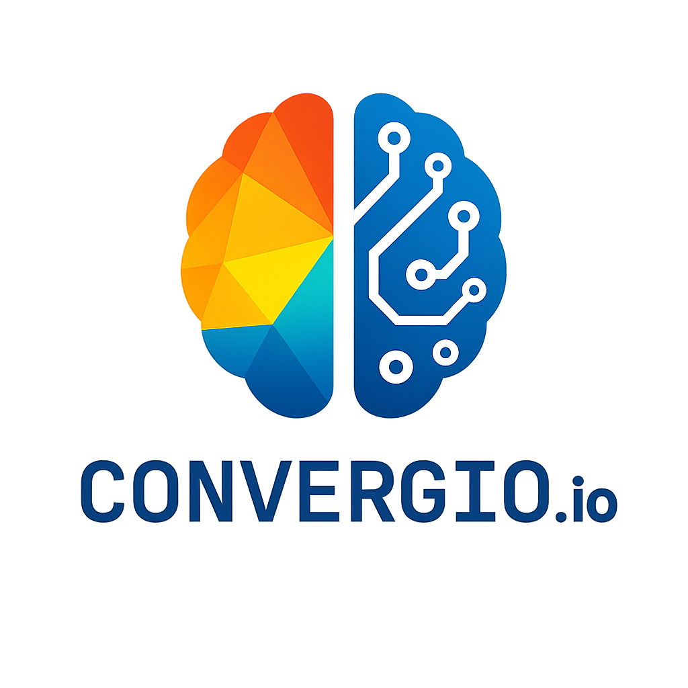

<div align="center">

# MyConvergio - Claude Code Plugin



**v4.7.0** | 60 Specialized Agents | Agent Teams & Claude Code v2.1.42 | Hooks & Token Optimization | Dashboard

> _"Intent is human, momentum is agent"_
> — [The Agentic Manifesto](./AgenticManifesto.md)

[](https://creativecommons.org/licenses/by-nc-sa/4.0/)

</div>

---

## What's New in v4.7.0

**Claude Code v2.1.42 alignment: Agent Teams, Tasks API, memory/maxTurns for all 60 agents.**

### Agent Teams Support (NEW)

- `CLAUDE_CODE_EXPERIMENTAL_AGENT_TEAMS` enabled in all settings templates
- **TeammateIdle** and **TaskCompleted** hooks track team events in token dashboard
- **Setup** hook auto-detects Claude Code version changes (high-spec)

### Agent Frontmatter Upgrade

All 60 invocable agents now include:

- **memory**: `project` (core/tech/release) or `user` (leadership/business/specialists/compliance/design)
- **maxTurns**: 15 (haiku), 20 (sonnet), 30 (opus), 40 (orchestrators), 50 (task-executor)

### Tasks API Migration

- `TodoWrite` replaced with `TaskCreate`, `TaskList`, `TaskGet`, `TaskUpdate`
- Affected agents: strategic-planner, ali-chief-of-staff, anna-executive-assistant

### Full Script & Command Parity

- 84 scripts aligned with global `~/.claude/scripts/` (concurrency control, merge-queue, etc.)
- 8 slash commands including new `/execute`, `/release`, `/research`
- 11 skills including new `documentation` and `report`

### Previous Highlights (v4.5.0)

- Strategic planner modules (templates, thor, git)
- Worktree scripts with automatic .env symlinks
- Safe installation with conflict detection and backup/restore
- Dashboard with real-time git monitoring and SSE

### Previous Highlights (v3.x)

- 60 specialized agents with Constitution-based security
- Installation profiles (minimal/standard/full)
- Multi-terminal support (Kitty, tmux, Zed, Warp, iTerm2)
- Thor Quality Guardian with zero-tolerance validation

---

## Quick Start

### Installation

#### Option A: Clone & Use (Recommended)

```bash
git clone https://github.com/roberdan/MyConvergio.git
cd MyConvergio
claude --plugin-dir .
```

#### Option B: Global npm Install

```bash
# Full install (all 60 agents)
npm install -g myconvergio

# Or choose a profile for lower context usage:
MYCONVERGIO_PROFILE=minimal npm install -g myconvergio  # 9 agents, ~50KB
MYCONVERGIO_PROFILE=lean npm install -g myconvergio     # 60 agents, ~600KB
```

Copies agents to `~/.claude/agents/`. See [Context Optimization Guide](./docs/CONTEXT_OPTIMIZATION.md) for details.

#### Option C: Claude Marketplace (Coming Soon)

```bash
claude plugins install myconvergio
```

_Pending Anthropic approval_

### Usage

**Invoke any agent:**

```bash
@ali-chief-of-staff Help me design our global expansion strategy
@baccio-tech-architect Design microservices architecture for healthcare platform
@rex-code-reviewer Review this pull request for security issues
```

**Use slash commands:**

```bash
/myconvergio:status    # Show ecosystem status
/myconvergio:team      # List all 60 agents by category
/myconvergio:plan      # Create a strategic execution plan
```

---

## Workflow (Prompt → Plan → Execute → Verify)

MyConvergio follows a structured delivery flow that mirrors Claude Code best practices.
See `docs/workflow.md` for the full reference.

### 1) Prompt

Use `/prompt` to extract requirements (F-xx) and confirm scope before planning.

Docs: `.claude/commands/prompt.md`

### 2) Planner

Use `/planner` to generate a multi-wave plan with tasks tied to F-xx criteria.

Docs: `.claude/commands/planner.md`

### 3) Execution (Executor Tracking)

Use the executor tracking helpers to log execution state and generate task markdown.

Docs: `EXECUTOR_TRACKING.md`  
Scripts: `.claude/scripts/executor-tracking.sh`, `.claude/scripts/generate-task-md.sh`

### 4) Thor QA Guardian

Use the Thor agent to validate completion, evidence, and quality gates.

Agent: `.claude/agents/core_utility/thor-quality-assurance-guardian.md`

### 5) Dashboard

Use the dashboard to monitor plans, waves, tasks, and activity in real time.

Quick Start: `dashboard/`  
API Tests: `dashboard/TEST-README.md`

---

## Dashboard

**Production-ready project dashboard with real-time git monitoring.**

### Features

- **Real-Time Git Panel**: Auto-refresh on git changes (commits, checkouts, branch switches) using Server-Sent Events
- **Project Management UI**: Visualize git status, diff, log, branches
- **Gantt Timeline**: True timeline with active wave/task highlighting and progress gradients
- **Kanban Views**: Interactive wave/task boards with drilldowns
- **Markdown Viewer**: Plan, wave, and task markdown rendering
- **Conversation Viewer**: Inspect execution logs and live context
- **Bug Tracker**: Integrated bug tracking and filters
- **Graceful Shutdown**: One-click server termination with browser close
- **Token Usage Tracking**: Monitor API token consumption and costs
- **Notifications**: System-wide notification center

### Quick Start

```bash
cd dashboard
npm install  # First time only (installs chokidar)
node server.js
# Open http://127.0.0.1:31415 in browser
```

### Screenshots

**Dashboard Overview**


**Real-Time Git Panel**


The git panel automatically refreshes when you:

- Make commits
- Switch branches
- Pull/push changes
- Stage/unstage files

### Architecture

- **Backend**: Node.js HTTP server with SQLite database (`~/.claude/data/dashboard.db`)
- **Frontend**: Vanilla JS with SSE for real-time updates
- **File Watcher**: chokidar monitoring `.git` directory for changes
- **API Routes**: RESTful endpoints for projects, git, notifications, system

### Database

Shares the same SQLite database as Claude Code (`~/.claude/data/dashboard.db`). No additional configuration required.

### Known Limitations

- **File Preview**: Markdown rendering focuses on plan/wave/task docs, not arbitrary repo file browsing.
- **Local Repository Only**: The dashboard is designed for local development. Remote repository integrations (GitHub, GitLab) are planned for future releases.

---

## Agent Portfolio (60 Specialists)

### Leadership & Strategy (7)

| Agent                                     | Description                                             |
| ----------------------------------------- | ------------------------------------------------------- |
| `ali-chief-of-staff`                      | Master orchestrator for complex multi-domain challenges |
| `satya-board-of-directors`                | Board-level strategic advisor                           |
| `domik-mckinsey-strategic-decision-maker` | McKinsey Partner-level strategic decisions              |
| `antonio-strategy-expert`                 | Strategy frameworks (OKR, Lean, Agile)                  |
| `amy-cfo`                                 | Chief Financial Officer for financial strategy          |
| `dan-engineering-gm`                      | Engineering General Manager                             |
| `matteo-strategic-business-architect`     | Business strategy architect                             |

### Technical Development (7)

| Agent                           | Description                                  |
| ------------------------------- | -------------------------------------------- |
| `baccio-tech-architect`         | Elite Technology Architect for system design |
| `marco-devops-engineer`         | DevOps for CI/CD and infrastructure          |
| `dario-debugger`                | Systematic debugging expert                  |
| `rex-code-reviewer`             | Code review specialist                       |
| `otto-performance-optimizer`    | Performance optimization                     |
| `paolo-best-practices-enforcer` | Coding standards enforcer                    |
| `omri-data-scientist`           | Data Scientist for ML and AI                 |

### Business Operations (11)

| Agent                                      | Description                               |
| ------------------------------------------ | ----------------------------------------- |
| `davide-project-manager`                   | Project Manager (Agile, Scrum, Waterfall) |
| `marcello-pm`                              | Product Manager for strategy and roadmaps |
| `oliver-pm`                                | Senior Product Manager                    |
| `luke-program-manager`                     | Program Manager for portfolios            |
| `anna-executive-assistant`                 | Executive Assistant with task management  |
| `andrea-customer-success-manager`          | Customer Success Manager                  |
| `fabio-sales-business-development`         | Sales & Business Development              |
| `sofia-marketing-strategist`               | Marketing Strategist                      |
| `steve-executive-communication-strategist` | Executive Communication                   |
| `enrico-business-process-engineer`         | Business Process Engineer                 |
| `dave-change-management-specialist`        | Change Management specialist              |

### Design & UX (3)

| Agent                                 | Description                            |
| ------------------------------------- | -------------------------------------- |
| `jony-creative-director`              | Creative Director for brand innovation |
| `sara-ux-ui-designer`                 | UX/UI Designer                         |
| `stefano-design-thinking-facilitator` | Design Thinking facilitator            |

### Compliance & Legal (5)

| Agent                                   | Description                        |
| --------------------------------------- | ---------------------------------- |
| `elena-legal-compliance-expert`         | Legal & Compliance expert          |
| `luca-security-expert`                  | Cybersecurity expert               |
| `dr-enzo-healthcare-compliance-manager` | Healthcare Compliance (HIPAA, FDA) |
| `sophia-govaffairs`                     | Government Affairs specialist      |
| `guardian-ai-security-validator`        | AI Security validator              |

### Specialized Experts (13)

| Agent                                    | Description                           |
| ---------------------------------------- | ------------------------------------- |
| `behice-cultural-coach`                  | Cultural intelligence expert          |
| `fiona-market-analyst`                   | Market Analyst for financial research |
| `michael-vc`                             | Venture Capital analyst               |
| `angela-da`                              | Senior Decision Architect             |
| `ethan-da`                               | Data Analytics specialist             |
| `evan-ic6da`                             | Principal Decision Architect (IC6)    |
| `ava-analytics-insights-virtuoso`        | Analytics virtuoso                    |
| `riccardo-storyteller`                   | Narrative designer                    |
| `jenny-inclusive-accessibility-champion` | Accessibility champion                |
| `giulia-hr-talent-acquisition`           | HR & Talent Acquisition               |
| `sam-startupper`                         | Silicon Valley startup expert         |
| `wiz-investor-venture-capital`           | Venture Capital investor              |
| `coach-team-coach`                       | Team Coach                            |

### Core Utility (9)

| Agent                                            | Description                       |
| ------------------------------------------------ | --------------------------------- |
| `marcus-context-memory-keeper`                   | Institutional memory guardian     |
| `thor-quality-assurance-guardian`                | Quality watchdog                  |
| `diana-performance-dashboard`                    | Performance dashboard specialist  |
| `socrates-first-principles-reasoning`            | First principles reasoning master |
| `strategic-planner`                              | Wave-based execution plan creator |
| `taskmaster-strategic-task-decomposition-master` | Task decomposition expert         |
| `po-prompt-optimizer`                            | Prompt engineering expert         |
| `wanda-workflow-orchestrator`                    | Workflow orchestrator             |
| `xavier-coordination-patterns`                   | Coordination patterns architect   |

### Release Management (2)

| Agent                     | Description                            |
| ------------------------- | -------------------------------------- |
| `app-release-manager`     | Release engineering with quality gates |
| `feature-release-manager` | Feature completion and issue closure   |

---

## Plugin Structure

```
MyConvergio/
├── .claude-plugin/
│   └── plugin.json           # Plugin manifest
├── .claude/
│   ├── CLAUDE.md             # Main config
│   ├── agents/               # 60 agents (8 categories)
│   ├── rules/                # Execution rules
│   ├── scripts/              # 30 digest + utility scripts
│   ├── reference/            # 7 on-demand operational docs
│   ├── skills/               # 10 reusable workflows
│   └── templates/            # State tracking templates
├── hooks/                    # 10 enforcement hooks + lib/
│   ├── prefer-ci-summary.sh
│   ├── enforce-line-limit.sh
│   ├── worktree-guard.sh
│   └── lib/common.sh
├── dashboard/                # Production dashboard (SSE + SQLite)
├── commands/                 # 3 slash commands
├── scripts/                  # Install/backup/test scripts
└── bin/myconvergio.js        # CLI entry point
```

---

## Skills

Reusable workflows you can reference in your projects:

| Skill                 | Use Case                                                       |
| --------------------- | -------------------------------------------------------------- |
| `structured-research` | **NEW** Hypothesis-driven research with confidence calibration |
| `code-review`         | Systematic code review process                                 |
| `debugging`           | Root cause analysis methodology                                |
| `architecture`        | System design patterns                                         |
| `security-audit`      | Security assessment framework                                  |
| `performance`         | Performance optimization                                       |
| `strategic-analysis`  | McKinsey-style analysis                                        |
| `release-management`  | Release engineering                                            |
| `project-management`  | Agile/Scrum workflows                                          |
| `orchestration`       | Multi-agent coordination                                       |

### Structured Research (NEW)

Based on [Anthropic best practices](https://docs.anthropic.com/en/docs/build-with-claude/prompt-engineering/overview):

- Generate 2-4 competing hypotheses
- Track confidence levels (0-100%) with evidence
- Verify across multiple independent sources
- Iterative self-critique: "What am I missing?"
- Maintain research state (`hypothesis-tree.json`, `research-notes.md`)

**Example:**

```bash
Research the best approach for implementing authentication in our app.
Use structured-research skill to evaluate OAuth2 vs JWT vs session cookies.
```

---

## Rules

MyConvergio includes two rule systems:

### Primary Rules (Active)

Located in `.claude/rules/` - **Use these for new work:**

| Rule                       | Purpose                                                                                                      |
| -------------------------- | ------------------------------------------------------------------------------------------------------------ |
| `execution.md`             | **UPDATED** How work gets done (context awareness, parallel calls, anti-overengineering, Definition of Done) |
| `guardian.md`              | **NEW** Thor enforcement, PR comment resolution, completion verification                                     |
| `agent-discovery.md`       | **UPDATED** Agent routing, subagent orchestration patterns                                                   |
| `engineering-standards.md` | **UPDATED** Code quality, security (OWASP), testing, API design                                              |
| `file-size-limits.md`      | **NEW** Max 250 lines per file with split strategies                                                         |
| `README.md`                | Rules hierarchy and usage guide                                                                              |

### Domain-Specific Rules

Copy to your project's `.claude/rules/` for consistent standards:

- `code-style.md` - ESLint, Prettier, PEP8
- `security-requirements.md` - OWASP Top 10
- `testing-standards.md` - Unit, integration, coverage
- `documentation-standards.md` - JSDoc, README, ADRs
- `api-development.md` - REST, versioning
- `ethical-guidelines.md` - Privacy, accessibility

### State Tracking Templates (NEW)

Located in `.claude/templates/` for multi-session work:

- `tests.json` - Structured test status tracking
- `progress.txt` - Unstructured progress notes
- `README.md` - Usage guidelines for context refresh scenarios

---

## Execution Framework

This repository is **fully self-contained** with two rule systems:

### Primary Rules (Active)

| Document                                                             | Purpose                                                                              | Priority |
| -------------------------------------------------------------------- | ------------------------------------------------------------------------------------ | -------- |
| [CONSTITUTION.md](./agents/CONSTITUTION.md)                          | Security, Ethics, Identity                                                           | SUPREME  |
| [execution.md](./.claude/rules/execution.md)                         | **NEW** How Work Gets Done (context awareness, parallel calls, anti-overengineering) | 2nd      |
| [guardian.md](./.claude/rules/guardian.md)                           | **NEW** Thor enforcement, PR comment resolution, completion verification             | 3rd      |
| [engineering-standards.md](./.claude/rules/engineering-standards.md) | Code quality, security, testing, API design                                          | 4th      |

### Legacy System (Backward Compatibility)

| Document                                                                         | Purpose                                                        | Priority |
| -------------------------------------------------------------------------------- | -------------------------------------------------------------- | -------- |
| [EXECUTION_DISCIPLINE.md](./.claude/agents/core_utility/EXECUTION_DISCIPLINE.md) | Legacy execution rules (maintained for backward compatibility) | -        |
| CommonValuesAndPrinciples.md                                                     | Organizational Values                                          | -        |

**Recommendation:** New work should reference `.claude/rules/execution.md` instead of EXECUTION_DISCIPLINE.md. See [.claude/rules/README.md](./.claude/rules/README.md) for hierarchy details.

**No external configuration files are required.**

---

## Security Framework

All agents implement the [MyConvergio Constitution](./agents/CONSTITUTION.md):

| Article | Protection                                                  |
| ------- | ----------------------------------------------------------- |
| I       | Identity Lock - Immutable agent identity                    |
| II      | Ethical Principles - Fairness, transparency, accountability |
| III     | Security Directives - Anti-hijacking, input validation      |
| IV      | Operational Boundaries - Role adherence                     |
| V       | Failure Modes - Graceful degradation                        |
| VI      | Collaboration - Safe inter-agent communication              |
| VII     | **Accessibility & Inclusion (NON-NEGOTIABLE)**              |
| VIII    | Accountability - Logging and audit trails                   |

---

## The Agentic Manifesto

_Human purpose. AI momentum._

### What we believe

1. **Intent is human, momentum is agent.**
2. **Impact must reach every mind and body.**
3. **Trust grows from transparent provenance.**
4. **Progress is judged by outcomes, not output.**

### How we act

1. Humans stay accountable for decisions and effects.
2. Agents amplify capability, never identity.
3. We design from the edge first: disability, language, connectivity.
4. Safety rails precede scale.
5. Learn in small loops, ship value early.

_Read the full [Agentic Manifesto](./AgenticManifesto.md)_

---

## Migration from npm Package

If upgrading from v2.x (npm package):

```bash
# Uninstall npm version
npm uninstall -g myconvergio

# Install plugin version
claude plugins install myconvergio
```

---

## License & Legal

Copyright 2025 Convergio.io

Licensed under [Creative Commons Attribution-NonCommercial-ShareAlike 4.0 International](./LICENSE)

### Disclaimers

- **Experimental Software**: Provided "AS IS" without warranties
- **Non-Commercial Use Only**: See LICENSE file for details
- **No Corporate Affiliation**: Not affiliated with Anthropic, OpenAI, or Microsoft
- **Personal Project**: Author is a Microsoft employee; this is a personal initiative

**Author Note**: Roberto D'Angelo is a Microsoft employee. This project is a personal initiative created independently during personal time. This project is NOT affiliated with, endorsed by, or representing Microsoft Corporation.

---

## Contributing

Contributions are welcome! See [CONTRIBUTING.md](./CONTRIBUTING.md) for guidelines.

For questions about commercial licensing: roberdan@fightthestroke.org

---

<div align="center">

_Built with AI assistance in Milano, following the Agentic Manifesto principles_

**v4.7.0** | February 2026 | Claude Code Plugin

</div>
