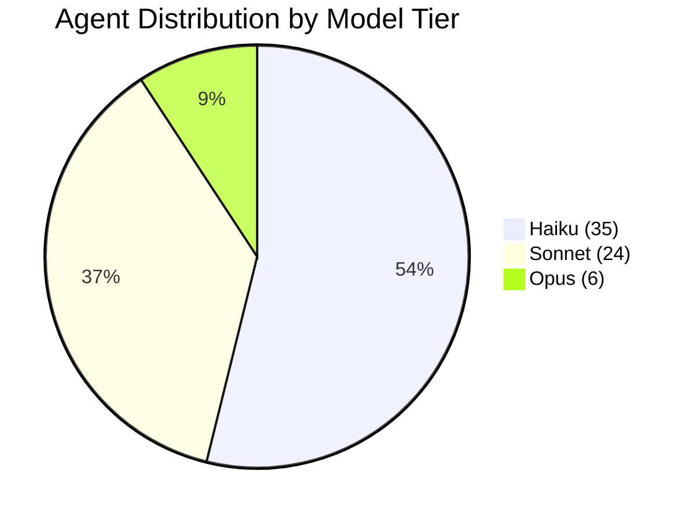

# Agent Portfolio - 65 Specialized Agents

MyConvergio ships with 65 domain-specialized agents across 8 categories.

## Leadership & Strategy (7)

| Agent                                     | Description                                             |
| ----------------------------------------- | ------------------------------------------------------- |
| `ali-chief-of-staff`                      | Master orchestrator for complex multi-domain challenges |
| `satya-board-of-directors`                | Board-level strategic advisor                           |
| `domik-mckinsey-strategic-decision-maker` | McKinsey Partner-level strategic decisions              |
| `antonio-strategy-expert`                 | Strategy frameworks (OKR, Lean, Agile)                  |
| `amy-cfo`                                 | Chief Financial Officer for financial strategy          |
| `dan-engineering-gm`                      | Engineering General Manager                             |
| `matteo-strategic-business-architect`     | Business strategy architect                             |

## Technical Development (9)

| Agent                           | Description                                  |
| ------------------------------- | -------------------------------------------- |
| `baccio-tech-architect`         | Elite Technology Architect for system design |
| `marco-devops-engineer`         | DevOps for CI/CD and infrastructure          |
| `dario-debugger`                | Systematic debugging expert                  |
| `rex-code-reviewer`             | Code review specialist                       |
| `otto-performance-optimizer`    | Performance optimization                     |
| `paolo-best-practices-enforcer` | Coding standards enforcer                    |
| `omri-data-scientist`           | Data Scientist for ML and AI                 |
| `adversarial-debugger`          | 3-hypothesis parallel bug diagnosis          |
| `task-executor-tdd`             | TDD workflow module (RED→GREEN→REFACTOR)     |

## Business Operations (11)

| Agent                                      | Description                               |
| ------------------------------------------ | ----------------------------------------- |
| `davide-project-manager`                   | Project Manager (Agile, Scrum, Waterfall) |
| `marcello-pm`                              | Product Manager for strategy and roadmaps |
| `oliver-pm`                                | Senior Product Manager                    |
| `luke-program-manager`                     | Program Manager for portfolios            |
| `anna-executive-assistant`                 | Executive Assistant with task management  |
| `andrea-customer-success-manager`          | Customer Success Manager                  |
| `fabio-sales-business-development`         | Sales & Business Development              |
| `sofia-marketing-strategist`               | Marketing Strategist                      |
| `steve-executive-communication-strategist` | Executive Communication                   |
| `enrico-business-process-engineer`         | Business Process Engineer                 |
| `dave-change-management-specialist`        | Change Management specialist              |

## Design & UX (3)

| Agent                                 | Description                            |
| ------------------------------------- | -------------------------------------- |
| `jony-creative-director`              | Creative Director for brand innovation |
| `sara-ux-ui-designer`                 | UX/UI Designer                         |
| `stefano-design-thinking-facilitator` | Design Thinking facilitator            |

## Compliance & Legal (5)

| Agent                                   | Description                        |
| --------------------------------------- | ---------------------------------- |
| `elena-legal-compliance-expert`         | Legal & Compliance expert          |
| `luca-security-expert`                  | Cybersecurity expert               |
| `dr-enzo-healthcare-compliance-manager` | Healthcare Compliance (HIPAA, FDA) |
| `sophia-govaffairs`                     | Government Affairs specialist      |
| `guardian-ai-security-validator`        | AI Security validator              |

## Specialized Experts (14)

| Agent                                    | Description                           |
| ---------------------------------------- | ------------------------------------- |
| `behice-cultural-coach`                  | Cultural intelligence expert          |
| `fiona-market-analyst`                   | Market Analyst for financial research |
| `michael-vc`                             | Venture Capital analyst               |
| `angela-da`                              | Senior Decision Architect             |
| `ethan-da`                               | Data Analytics specialist             |
| `evan-ic6da`                             | Principal Decision Architect (IC6)    |
| `ava-analytics-insights-virtuoso`        | Analytics virtuoso                    |
| `riccardo-storyteller`                   | Narrative designer                    |
| `jenny-inclusive-accessibility-champion` | Accessibility champion                |
| `giulia-hr-talent-acquisition`           | HR & Talent Acquisition               |
| `sam-startupper`                         | Silicon Valley startup expert         |
| `wiz-investor-venture-capital`           | Venture Capital investor              |
| `coach-team-coach`                       | Team Coach                            |
| `research-report-generator`              | Morgan Stanley-style research reports |

## Core Utility (11)

| Agent                                            | Description                       |
| ------------------------------------------------ | --------------------------------- |
| `marcus-context-memory-keeper`                   | Institutional memory guardian     |
| `thor-quality-assurance-guardian`                | Quality watchdog                  |
| `thor-validation-gates`                          | Validation gates module for Thor  |
| `diana-performance-dashboard`                    | Performance dashboard specialist  |
| `socrates-first-principles-reasoning`            | First principles reasoning master |
| `strategic-planner`                              | Wave-based execution plan creator |
| `taskmaster-strategic-task-decomposition-master` | Task decomposition expert         |
| `po-prompt-optimizer`                            | Prompt engineering expert         |
| `wanda-workflow-orchestrator`                    | Workflow orchestrator             |
| `xavier-coordination-patterns`                   | Coordination patterns architect   |
| `sentinel-ecosystem-guardian`                    | Ecosystem config auditor          |

## Release Management (3)

| Agent                           | Description                            |
| ------------------------------- | -------------------------------------- |
| `app-release-manager`           | Release engineering with quality gates |
| `app-release-manager-execution` | Execution phases (3-5) module          |
| `feature-release-manager`       | Feature completion and issue closure   |

---

## Model Tiering

**Cost optimization**: 54% of agents run on fast, low-cost Haiku. Premium Opus models reserved for critical tasks (reviews, strategic planning).

---

For invocation patterns and workflows, see [../workflow.md](../workflow.md).
