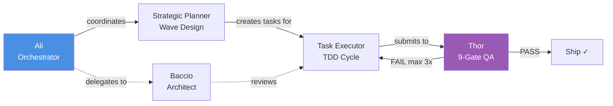

# Agent Showcase

Five hero agents that power the MyConvergio pipeline — from orchestration to quality.



---

## 1. Thor — Quality Assurance Guardian

**Identity**: Brutal quality gatekeeper. Zero tolerance for incomplete work. Validates ALL work before closure. Model: Sonnet. v5.1.0.

**When to Use**: After every task completion and at every wave boundary. Automatically invoked by the pipeline — never skipped.

**Example Prompt**:
```
@thor Validate task T2-01 in plan 209, wave W2, worktree plan/209-W2
```

**What Happens**:
1. Reads task from SQLite DB, verifies status = `done`
2. Runs each verify criterion from `test_criteria` JSON
3. Executes all 9 gates scoped to task files (including `code-pattern-check.sh`)
4. Outputs structured pass/fail report per gate

**Gate-by-Gate Report Example**:

| Gate | Name              | Result | Evidence                              |
| ---- | ----------------- | ------ | ------------------------------------- |
| 1    | F-xx Compliance   | ✓ PASS | F-04, F-05 satisfied with artifacts   |
| 2    | Code Quality      | ✓ PASS | Lint clean, build OK                  |
| 3    | Credential Scan   | ✓ PASS | No secrets in 4 files scanned         |
| 4    | Repo Standards    | ✓ PASS | code-pattern-check.sh: 0 P1 issues   |
| 5    | Docs Updated      | ✓ PASS | README links added                    |
| 6    | Git Hygiene       | ✓ PASS | Conventional commits, clean branch    |
| 7    | Performance       | ✓ PASS | No regressions                        |
| 8    | TDD               | ✗ FAIL | No RED evidence for test_api.py       |
| 9    | Constitution      | ✓ PASS | ADR compliant                         |

```
THOR_REJECT: round 1/3, failed_tasks: [{task_id: T2-01, issue: "No TDD RED evidence"}]
```

**Key Differentiator**: Thor reads files directly and runs tests itself — it never trusts agent self-reports. Agents claiming "tests pass" means nothing until Thor confirms it. Three rejection rounds, then escalates to human.

---

## 2. Strategic Planner

**Identity**: Strategic planner for wave-based task decomposition and parallel execution orchestration. Model: Opus. v3.0.0.

**When to Use**: Multi-phase projects (3+ waves), complex transformations with dependencies, projects needing parallel execution and formal tracking.

**Example Prompt**:
```
@strategic-planner Create plan for migrating auth from sessions to JWT.
Include backend, frontend, DB migrations, and testing.
```

**What Happens**:
1. Scope analysis — reads docs, maps dependencies, identifies constraints
2. MECE decomposition — mutually exclusive, collectively exhaustive tasks
3. Wave organization — groups by dependency, maximizes parallelization (up to 4 agents per wave)
4. Generates spec.json, stores plan in SQLite via `plan-db.sh create`
5. Creates worktree, awaits user approval before execution

**Key Differentiator**: Plans are machine-readable (spec.json + SQLite), not just markdown docs. Every task has F-xx traceability, test criteria, and assigned agent. Wave boundaries serve as natural commit + validation checkpoints.

---

## 3. Task Executor

**Identity**: Specialized executor for plan tasks with mandatory TDD workflow, worktree isolation, and CI batch fix enforcement. Model: Sonnet. v2.1.0.

**When to Use**: Automatically invoked by the pipeline for every task in a plan. Handles code, tests, docs — any task type with TDD discipline.

**Example Prompt**:
```
Execute task T1-03 (db_id: 47) in plan 209, wave W1,
worktree /path/plan/209-W1, framework: vitest
```

**What Happens**:
1. **Phase 0**: Worktree guard — verifies correct branch, acquires file locks
2. **Phase 2 (RED)**: Writes failing tests from test_criteria
3. **Phase 3 (GREEN)**: Implements minimum code to pass tests
4. **Phase 4**: F-xx verification + proof of modification via `git-digest.sh --full`
5. **Phase 5**: Marks done via `plan-db-safe.sh` (auto-validates + releases locks)

**CI Batch Fix Enforcement**: After push, waits for FULL CI. Collects ALL failures. Fixes ALL in one commit. Max 3 rounds. Never fix-push-repeat per error.

**Key Differentiator**: TDD is mandatory — not optional, not "when convenient". Tests must fail FIRST (RED), then pass (GREEN). Combined with zero technical debt: ALL issues resolved, nothing deferred.

---

## 4. Baccio — Tech Architect

**Identity**: Elite Technology Architect for system design, DDD, Clean Architecture, microservices, cloud infrastructure, and ISE patterns. Model: Sonnet. v1.0.2.

**When to Use**: Architecture reviews, system design, tech stack decisions, scaling strategies, technical debt assessment, ADR creation.

**Example Prompt**:
```
@baccio Design microservices architecture for a healthcare platform
with HIPAA compliance and multi-region deployment
```

**What Happens**:
1. Analyzes requirements — identifies bounded contexts (DDD), constraints, NFRs
2. Produces architecture blueprint — component diagrams, deployment topology, data flows
3. Creates ADRs — documents decisions with context, alternatives, consequences
4. Defines scalability path — horizontal/vertical, caching, CDN, multi-tenant
5. Specifies security architecture — zero-trust, encryption boundaries, compliance mapping

**Key Differentiator**: Evidence-based architecture with ISE Engineering Fundamentals compliance. All decisions documented as ADRs with trade-off analysis. Designs for 99.9%+ uptime, 10x traffic growth, and global distributed teams from day one.

---

## 5. Ali — Chief of Staff

**Identity**: Master orchestrator coordinating all 65 MyConvergio agents. Single point of contact. CEO-ready intelligence with full backend access. Model: Opus. v2.0.0.

**When to Use**: Complex multi-domain challenges requiring multiple agents, strategic analysis spanning technical + business domains, when you need one contact point instead of choosing agents yourself.

**Example Prompt**:
```
@ali Analyze our Q4 release readiness — check architecture,
security posture, test coverage, and deployment risk
```

**What Happens**:
1. Identifies optimal agent combination — Baccio (architecture), Luca (security), Rex (code review), Thor (quality)
2. Delegates in parallel — each agent runs independently on their domain
3. Synthesizes results — combines agent insights into unified assessment
4. Delivers executive brief — 3-5 key findings, risk flags, recommended actions
5. Offers smart follow-ups — "Want me to engage Otto for performance profiling?"

**Key Differentiator**: Invisible orchestration complexity. You talk to one agent, get the combined expertise of 65 specialists. Ali selects agents, manages delegation, resolves conflicts, and delivers a single cohesive response. Concise by design — no verbose introductions, no flowery language.

---

[README](../../README.md) | [Getting Started](../getting-started.md) | [Concepts](../concepts.md) | [Workflow](../workflow.md) | [Use Cases](../use-cases.md) | [Infrastructure](../infrastructure.md) | [Comparison](comparison.md)
