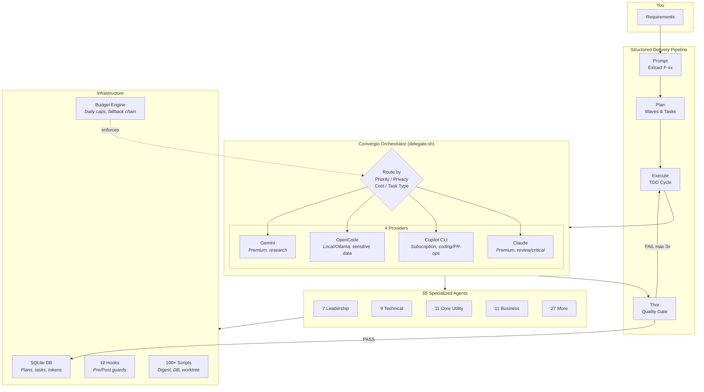
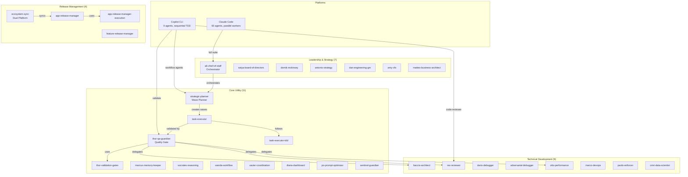
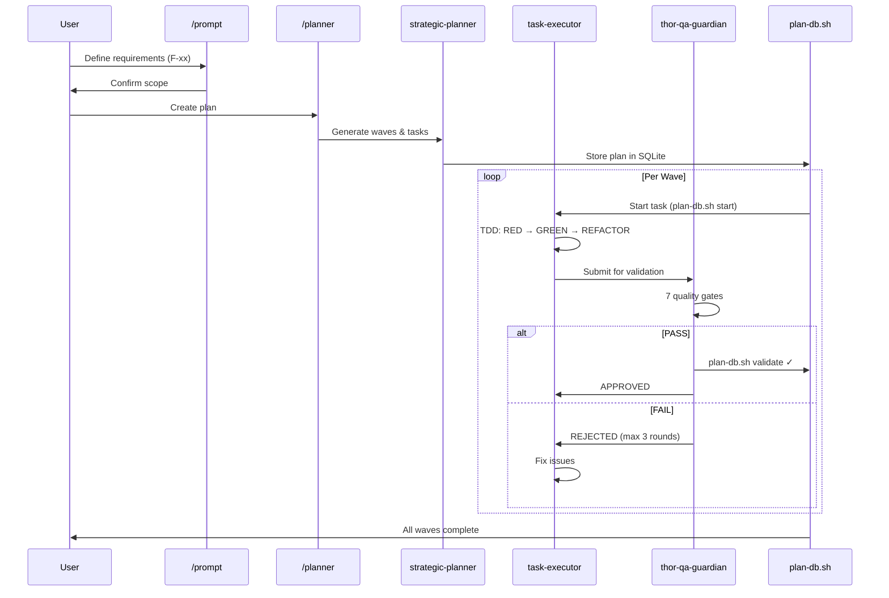
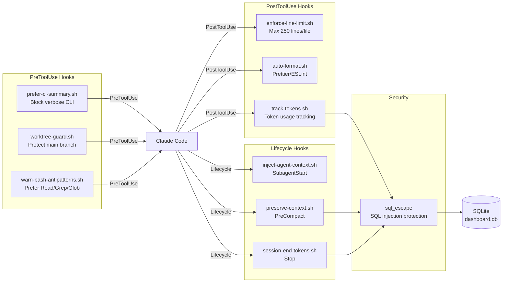
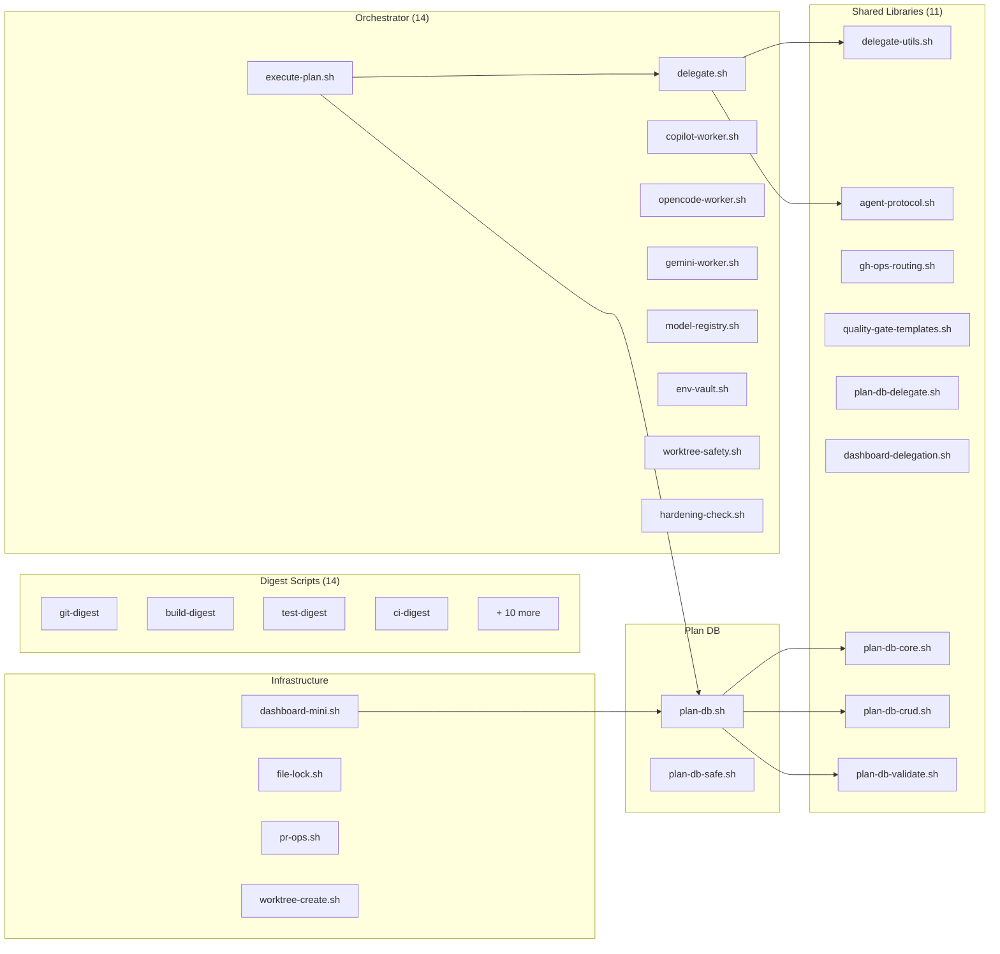

# Architecture & Diagrams

This document contains the detailed architecture diagrams and technical deep-dives for MyConvergio.

## How It Works - High-Level Flow



## Agent Ecosystem Architecture



## Execution Flow (Prompt → Plan → Execute → Verify)



## Hook System & Token Optimization



## Script Architecture (100+ Scripts)



## Plugin Structure

```
MyConvergio/
├── .claude-plugin/
│   └── plugin.json           # Plugin manifest
├── .claude/
│   ├── CLAUDE.md             # Main config
│   ├── agents/               # 65 agents (8 categories)
│   ├── config/               # orchestrator.yaml (with learnings section)
│   ├── docs/                 # gemini-setup.md, ADRs
│   ├── hooks/                # model-registry-refresh.sh
│   ├── rules/                # Execution rules
│   ├── scripts/              # 100+ scripts (digest, orchestrator, DB, worktree)
│   │   └── lib/              # Shared libs (delegate-utils, agent-protocol, etc.)
│   ├── reference/            # 11 on-demand operational docs
│   ├── skills/               # 10 reusable workflows + hardening
│   └── templates/            # State tracking templates
├── copilot-agents/           # 9 Copilot CLI agents
├── hooks/                    # 12 enforcement hooks + lib/
├── commands/                 # 3 slash commands
├── scripts/                  # Install/backup/test scripts
├── tests/                    # 25 test files (0 failures)
└── bin/myconvergio.js        # CLI entry point
```

---

For orchestrator details, see [orchestrator.md](./orchestrator.md).
For agent portfolio, see [agent-portfolio.md](./agent-portfolio.md).
