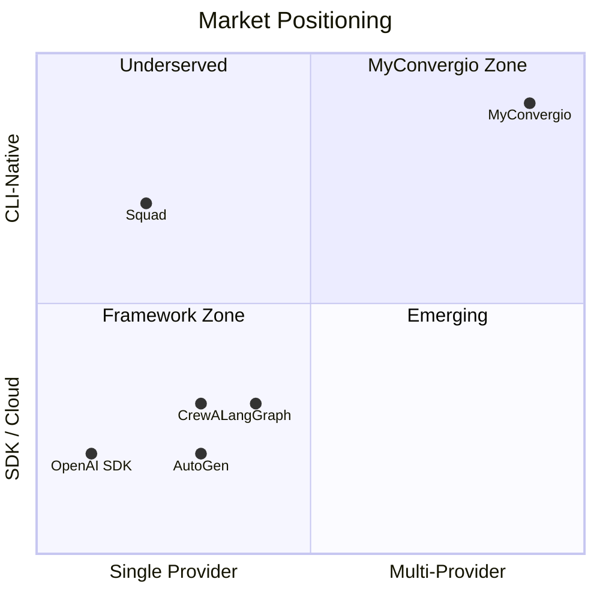
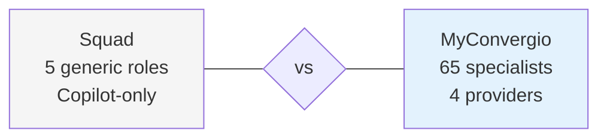

# Market Comparison

How MyConvergio differs from every agent framework on the market.

## Core Positioning

MyConvergio is a **practitioner's toolkit** — not an SDK for building agent apps. It wraps your existing AI coding assistants (Claude, Copilot, Gemini, local models) with structure, quality gates, and cost control. Frameworks build agent infrastructure; MyConvergio uses the agents you already have.

---

## Comparison Matrix (12 Dimensions)

| Dimension             | MyConvergio                         | Squad           | AutoGen            | CrewAI           | LangGraph        | OpenAI Agents SDK |
| --------------------- | ----------------------------------- | --------------- | ------------------ | ---------------- | ---------------- | ----------------- |
| **Runtime**           | bash + sqlite3, zero deps           | Node.js 22+     | Python SDK         | Python SDK       | Python SDK       | Python SDK        |
| **LLM Providers**     | 4+ (Claude, Copilot, Gemini, local) | Copilot only    | Azure OpenAI       | Single per agent | Single per chain | OpenAI only       |
| **Quality Assurance** | Thor 9 gates, independent           | Self-report     | Self-report        | Self-report      | Self-report      | Self-report       |
| **State Management**  | SQLite (portable)                   | Git markdown    | Redis/memory       | Memory/cloud DB  | Checkpointers    | In-memory         |
| **Git Safety**        | Worktree isolation per plan         | None            | None               | None             | None             | None              |
| **TDD Enforcement**   | Mandatory RED→GREEN cycle           | None            | None               | None             | None             | None              |
| **CI Discipline**     | Batch fix (wait full CI)            | None            | None               | None             | None             | None              |
| **Debt Policy**       | Zero-debt, never defer              | None            | None               | None             | None             | None              |
| **Autonomous Mode**   | `--yolo` flag, Thor validates       | None            | None               | None             | None             | None              |
| **Cost Control**      | Budget caps + fallback chains       | Subscription    | Pay-per-token      | Pay-per-token    | Pay-per-token    | Pay-per-token     |
| **Agent Count**       | 65 domain specialists               | 5 generic roles | Templates          | Role templates   | Node templates   | Generic agents    |
| **Target User**       | Engineers using AI daily            | Copilot users   | Platform engineers | Python devs      | ML engineers     | OpenAI devs       |

---

## Squad Deep-Dive (Closest Competitor)

| Dimension             | Squad                                   | MyConvergio                                      |
| --------------------- | --------------------------------------- | ------------------------------------------------ |
| Agent model           | 5 generic roles (coder, reviewer, etc.) | 65 domain specialists with personas              |
| Provider support      | Copilot only                            | Claude, Copilot, Gemini, OpenCode (local)        |
| Quality validation    | Agents self-report success              | Thor 9 gates — independent, reads files directly |
| State management      | Git markdown files                      | SQLite DB — queryable, portable, inspectable     |
| Dependencies          | Node.js 22+ required                    | Zero deps (bash + sqlite3)                       |
| CI discipline         | None                                    | CI batch fix: wait full CI, fix ALL, push once   |
| Technical debt policy | None                                    | Zero-debt: resolve ALL issues, never defer       |
| Autonomous execution  | No flag equivalent                      | `--yolo` mode — Thor validates independently     |
| TDD enforcement       | None                                    | Mandatory RED→GREEN per task                     |
| Git safety            | No worktree isolation                   | Worktree per plan, branch protection hooks       |
| Cost tracking         | Subscription-only                       | Per-task token tracking + budget caps            |
| Maturity              | ~320 stars, experimental                | v9.3.0, 115+ scripts, 12 hooks, production       |

---

## Framework Comparison

| Framework      | Strength                         | Limitation for Daily Engineering               |
| -------------- | -------------------------------- | ---------------------------------------------- |
| **AutoGen**    | Multi-agent conversation         | No git awareness, no quality gates, cloud-only |
| **CrewAI**     | Role-based team coordination     | Python runtime, single provider, no TDD        |
| **LangGraph**  | Stateful graphs with checkpoints | Complex setup, ML-focused, no CI integration   |
| **OpenAI SDK** | Guardrails + tool integration    | OpenAI lock-in, no independent validation      |

---

## When to Use What (Honest Assessment)

| Scenario                                          | Best Choice        |
| ------------------------------------------------- | ------------------ |
| Building a multi-agent SaaS product               | LangGraph, AutoGen |
| Research prototype with agent dialogue            | AutoGen, CrewAI    |
| Content generation with role teams                | CrewAI             |
| **Daily software engineering with AI assistants** | **MyConvergio**    |
| **Multi-provider cost optimization**              | **MyConvergio**    |
| **Privacy-sensitive codebases**                   | **MyConvergio**    |
| **Structured execution with quality gates**       | **MyConvergio**    |
| **Copilot-only workflow (simple)**                | Squad              |

---

## Engineering Foundations

### ISE Playbook Alignment

| ISE Concept                  | MyConvergio Equivalent                            | Status       |
| ---------------------------- | ------------------------------------------------- | ------------ |
| Definition of Ready          | `/prompt` F-xx extraction                         | Aligned      |
| Definition of Done (feature) | Thor per-task validation (Gates 1-4, 8, 9)        | **Enhanced** |
| Definition of Done (sprint)  | Thor per-wave validation (all 9 gates + build)    | **Enhanced** |
| PR reviewer checklist        | Thor Gates 2 + 3 + 8 (automated, zero bottleneck) | **Enhanced** |
| TDD (Red-Green-Refactor)     | Thor Gate 8 (MANDATORY per-task, not just CI)     | **Enhanced** |
| Credential scanning          | Thor Gate 3 (AWS/API/GitHub/password patterns)    | Aligned      |
| Design reviews / ADRs        | `/research` phase + Thor Gate 9                   | Aligned      |
| Conventional commits         | Git Hygiene gate (Gate 6)                         | Aligned      |

### HVE Core Alignment

| HVE Pattern                | MyConvergio Implementation                                |
| -------------------------- | --------------------------------------------------------- |
| Failed Approaches Tracking | `plan-db.sh log-failure` — planner reads prior failures   |
| Schema-Driven Validation   | `plan-spec-schema.json` validates spec.json before import |
| Phase 5 Discover           | Knowledge Codification: errors → ADRs + lint rules        |
| Discrepancy Logging        | F-xx verification: `[x] PASS / [ ] FAIL` with evidence    |

### Beyond Both

- **Multi-provider routing** — ISE/HVE don't address provider orchestration
- **Independent validation** — ISE uses human reviewers; HVE uses self-review; Thor trusts nothing
- **Budget-aware execution** — Daily caps, fallback chains, per-task cost tracking
- **Git worktree isolation** — Plans in isolated branches, no main branch corruption

---

[README](../../README.md) | [Getting Started](../getting-started.md) | [Concepts](../concepts.md) | [Workflow](../workflow.md) | [Use Cases](../use-cases.md) | [Infrastructure](../infrastructure.md) | [Comparison](comparison.md)
