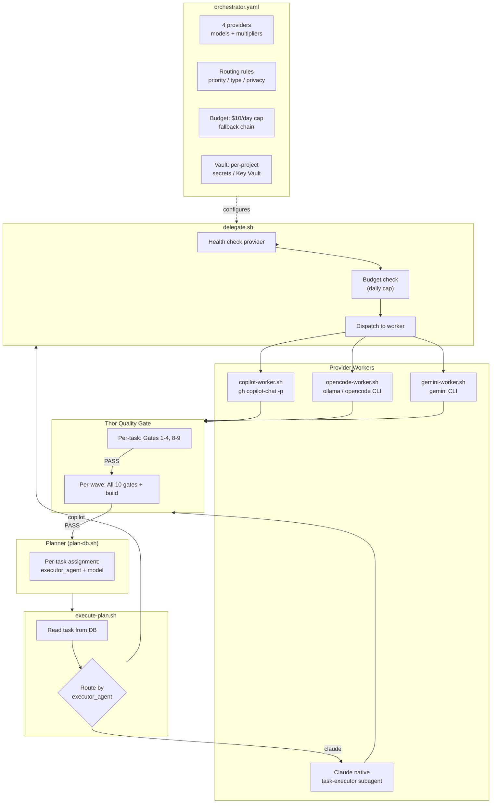

# Convergio Orchestrator - Multi-Provider Intelligence

The Convergio Orchestrator is the core innovation of v6.0.0. It enables **intelligent multi-provider task delegation** — each task in your execution plan is routed to the best AI provider based on four dimensions.

## How Delegation Works

1. **Planner assigns per-task routing**: When `/planner` creates the execution plan, each task gets `executor_agent` (which provider) and `model` (which model) stored in SQLite
2. **Executor reads routing from DB**: `/execute` reads the task's routing and dispatches accordingly
3. **delegate.sh orchestrates**: Health-checks the provider, enforces budget, dispatches to the appropriate worker script
4. **Workers execute independently**: Each worker (`copilot-worker.sh`, `opencode-worker.sh`, `gemini-worker.sh`, or Claude native) runs the task with provider-specific CLI flags
5. **Thor validates independently**: Quality gates run after every task regardless of provider

## Routing Dimensions

| Dimension            | Rules                                                                                                    | Example                            |
| -------------------- | -------------------------------------------------------------------------------------------------------- | ---------------------------------- |
| **Priority (P0-P3)** | P0 critical → Claude/Gemini; P1 sprint → Copilot/Claude; P2 backlog → Copilot/Gemini; P3 bulk → OpenCode | Production bug fix → Claude Opus   |
| **Task Type**        | Coding → Copilot; Research → Gemini; Code review → Claude; Tests → Copilot; Bulk → OpenCode              | API research → Gemini 2.5 Pro      |
| **Privacy**          | Public → all providers; Internal → Copilot/OpenCode; Sensitive (PII) → OpenCode only                     | Healthcare data → local Ollama     |
| **Budget**           | $10/day cap; fallback chain: Claude → Copilot → Gemini → OpenCode; alert at 80%                          | Cap hit → auto-fallback to Copilot |

## Configuration (`orchestrator.yaml`)

```yaml
providers:
  claude: # Premium, cloud (Anthropic)
  copilot: # Included in GitHub Copilot subscription
  opencode: # Free, local (Ollama)
  gemini: # Premium, cloud (Google)

routing:
  by_priority: { P0: [claude, gemini], P1: [copilot, claude], ... }
  by_type: { coding: copilot, research: gemini, review: claude, ... }
  by_privacy: { sensitive: [opencode], internal: [copilot, opencode], ... }

budget:
  max_premium_per_day: 10.00
  fallback_chain: [claude, copilot, gemini, opencode]
  enforce_budget: true
```

## Provider Workers

| Worker               | CLI                      | Use Case                   | Cost                             |
| -------------------- | ------------------------ | -------------------------- | -------------------------------- |
| `copilot-worker.sh`  | `gh copilot-chat`        | Coding, tests, PR-ops      | Included in Copilot subscription |
| `opencode-worker.sh` | `opencode` / Ollama      | Sensitive data, bulk tasks | Free (local)                     |
| `gemini-worker.sh`   | `gemini` CLI             | Research, analysis         | Metered                          |
| Claude (native)      | `task-executor` subagent | Reviews, critical tasks    | Premium                          |

## Quality Gates (Same for All Providers)

Every task, regardless of which provider executed it, goes through the same Thor validation:

- **Per-task**: Gates 1-4 (compliance, quality, standards, repo) + 8 (TDD) + 9 (constitution)
- **Per-wave**: All 10 gates + full build verification
- **Max 3 rejection rounds** before escalation to user

This ensures consistent quality whether code was written by Claude, Copilot, Gemini, or a local model.

## Architecture



## Supporting Infrastructure

### Model Registry

```bash
model-registry.sh refresh  # Refresh from orchestrator.yaml
model-registry.sh list     # Show all models
model-registry.sh check    # Validate registry integrity
```

### Environment Vault

Per-project secrets management with Key Vault integration:

```bash
env-vault.sh init PROJECT_ID        # Create project vault
env-vault.sh set PROJECT_ID KEY VAL  # Store secret
env-vault.sh get PROJECT_ID KEY      # Retrieve secret
```

### Worktree Safety

Pre-flight checks for worktree isolation:

```bash
worktree-safety.sh /path/to/worktree
```

### Hardening Check

Personal data scanner for public repo safety:

```bash
hardening-check.sh         # Scan for PII, credentials
hardening-check.sh --fix   # Auto-sanitize where possible
```

---

For detailed workflow instructions, see [../workflow.md](../workflow.md).
