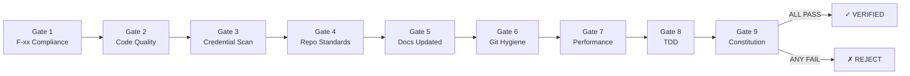
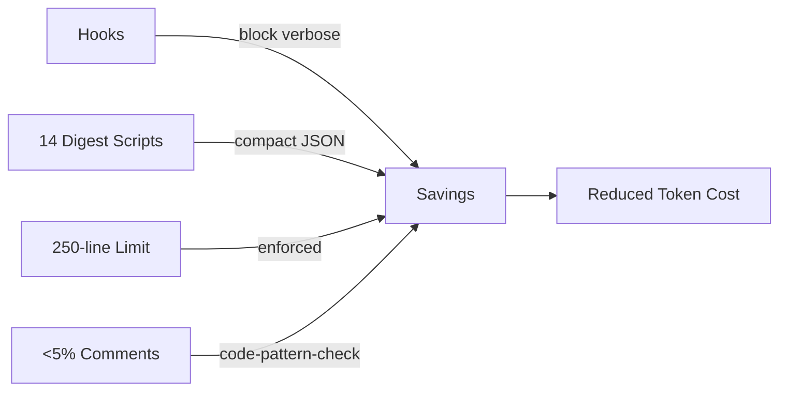

# Core Concepts & Glossary

Everything you need to understand the MyConvergio system.

```mermaid
graph TD
    A[65 Agents] -->|organized in| W[Waves]
    W -->|contain| T[Tasks]
    T -->|follow| TDD[TDD Cycle]
    T -->|validated by| TH[Thor 9 Gates]
    TH -->|results in| DB[(SQLite DB)]
    DB -->|displayed by| D[Dashboard]
    P[/prompt] -->|extracts| F[F-xx Requirements]
    F -->|mapped to| T
```

---

## Core Concepts

| Concept          | Definition                                                                          |
| ---------------- | ----------------------------------------------------------------------------------- |
| **Agent**        | Specialized AI assistant with persona, domain expertise, and model tier (65 total)  |
| **Wave**         | Execution phase grouping related tasks — Wave 1 runs before Wave 2                  |
| **Task**         | Atomic work unit with TDD cycle, F-xx traceability, and Thor validation             |
| **F-xx**         | Traceable requirement extracted by `/prompt` (e.g., F-01, F-02)                     |
| **Plan**         | Multi-wave execution plan stored in SQLite, created by `/planner`                   |
| **Worktree**     | Isolated git worktree per plan — no branch conflicts                                |
| **Thor**         | Independent QA guardian — validates by reading files, never trusts self-reports      |
| **Provider**     | LLM backend: Claude, Copilot, Gemini, OpenCode (local)                              |
| **Digest Script**| Compact JSON output wrapper replacing verbose CLI commands                           |

---

## Thor Quality System — 9 Gates

Thor validates every task and every wave independently. It reads files directly — never trusts agent self-reports.



| Gate | Name                  | What It Checks                                                    |
| ---- | --------------------- | ----------------------------------------------------------------- |
| 1    | F-xx Compliance       | All referenced F-xx requirements satisfied with evidence          |
| 2    | Code Quality          | Lint clean, type-safe, no warnings                                |
| 3    | Credential Scanning   | No secrets, API keys, or tokens in source                         |
| 4    | Repo Standards        | `code-pattern-check.sh` — 9 pattern checks, 250-line limit       |
| 5    | Documentation Updated | Relevant docs updated for changes made                            |
| 6    | Git Hygiene           | Clean commits, conventional format, no merge conflicts            |
| 7    | Performance           | No regressions, bundle size checked                               |
| 8    | TDD                   | RED → GREEN → REFACTOR cycle with evidence                        |
| 9    | Constitution & ADR    | Compliant with CONSTITUTION.md and Architecture Decision Records  |

**Rejection**: Any gate failure → task rejected → executor must fix and resubmit (max 3 rounds).

---

## Enforcement Policies

Three NON-NEGOTIABLE policies enforced across all agents:

### CI Batch Fix

**NON-NEGOTIABLE**: After push, wait for FULL CI to complete. Collect ALL failures. Fix ALL in one commit. Push once. Maximum 3 rounds.

Prevents the push-fix-push-fix antipattern that wastes CI resources and creates noisy git history. Enforced in `execute.agent.md`, `task-executor.md`, `guardian.md`, and `pr-comment-resolver`.

### Zero Technical Debt

**NON-NEGOTIABLE**: Resolve ALL issues before marking a task done — not just high-priority ones. Never defer to "later". Accumulated technical debt is a VIOLATION.

Enforced across all executor agents. Thor Gate 2 and Gate 4 verify compliance.

### Copilot `--yolo` Mode

Full autonomous execution via `copilot-worker.sh --yolo`. Replaces the older `--allow-all` flag. All Copilot worker executions use it for maximum throughput. No confirmation prompts — Thor validates independently after completion.

Enforced in `copilot-worker.sh`, `orchestrate.sh`, `worker-launch.sh`.

---

## Execution Model

### Worktree Isolation

Each plan runs in a dedicated git worktree (`plan/{id}-W{n}`). No branch pollution. Merges via `wave-worktree.sh`.

### SQLite State Management

All state in a single portable file: `~/.claude/data/dashboard.db`

| Table    | Purpose                                    |
| -------- | ------------------------------------------ |
| plans    | Plan metadata, status, timestamps          |
| waves    | Wave groupings within plans                |
| tasks    | Task status, F-xx mapping, token costs     |
| tokens   | Per-task API token consumption             |

Queryable with standard `sqlite3`. No cloud dependencies.

### plan-db.sh

Central CLI for all plan operations:

```bash
plan-db.sh create myproject "Feature X" --auto-worktree
plan-db.sh list-tasks 42
plan-db-safe.sh update-task T1-01 done "Summary"
```

---

## Token Optimization



| Technique          | Mechanism                                        |
| ------------------ | ------------------------------------------------ |
| Digest Scripts     | 14 scripts replacing verbose CLI (git, npm, CI)  |
| Token-Aware Writing| <5% comment density, compact commits/PRs         |
| 250-line Limit     | Per-file limit enforced by hooks                 |
| Hooks              | Auto-block verbose patterns before they ship     |

---

## Multi-Provider Routing

| Provider  | Worker               | Best For                 | Cost         |
| --------- | -------------------- | ------------------------ | ------------ |
| Claude    | `task-executor`      | Reviews, critical tasks  | Premium      |
| Copilot   | `copilot-worker.sh`  | Coding, tests, PRs       | Subscription |
| Gemini    | `gemini-worker.sh`   | Research, analysis       | Metered      |
| OpenCode  | `opencode-worker.sh` | Sensitive data, bulk     | Free (local) |

Routing based on: **Priority** (P0→Claude) · **Privacy** (sensitive→local) · **Budget** (cap→fallback) · **Type** (code→Copilot)

---

---

[README](../README.md) | [Getting Started](getting-started.md) | [Concepts](concepts.md) | [Workflow](workflow.md) | [Use Cases](use-cases.md) | [Infrastructure](infrastructure.md) | [Comparison](agents/comparison.md)
