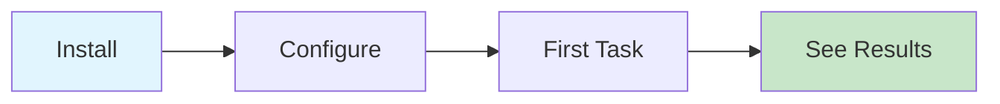
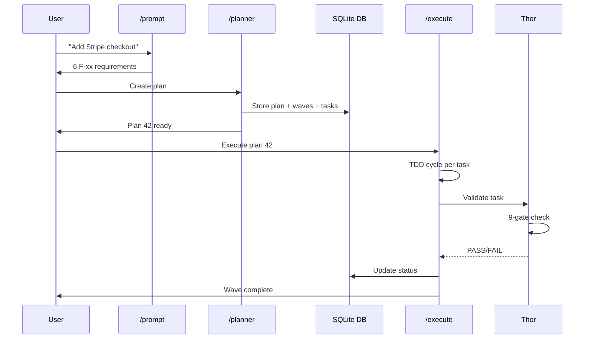

# Getting Started with MyConvergio

From zero to a completed plan in 10 minutes.



---

## Prerequisites

| Tool     | Required | Notes                              |
| -------- | -------- | ---------------------------------- |
| `bash`   | Yes      | Preinstalled on macOS/Linux        |
| `sqlite3`| Yes      | Preinstalled on macOS/Linux        |
| `git`    | Yes      | For worktree isolation             |
| `claude` | Yes      | Claude Code CLI                    |
| `gh`     | Optional | For Copilot CLI + PR automation    |

**Windows**: Use WSL2. All tools work identically.

---

## Installation

### Option A: One-Line Install

```bash
curl -sSL https://raw.githubusercontent.com/roberdan/MyConvergio/main/install.sh | bash
```

Expected output:

```
✓ Cloned to ~/.myconvergio/
✓ Installed 65 agents to ~/.claude/agents/
✓ CLI installed to ~/.local/bin/myconvergio
✓ Ready! Run: claude
```

### Option B: Clone & Make

```bash
git clone https://github.com/roberdan/MyConvergio.git && cd MyConvergio
make install
```

### Option C: Modular (Minimal)

```bash
myconvergio install --minimal   # 9 core agents (~50KB)
```

### Copilot CLI Setup

```bash
cp copilot-agents/*.agent.md ~/.copilot/agents/
```

---

## Your First Workflow

**Scenario**: "Add Stripe checkout to my SaaS"

### Step 1: Extract Requirements

```bash
@prompt Add Stripe checkout with subscription management to my Next.js SaaS
```

Output:

```
Extracted 6 requirements:
  F-01: Stripe SDK integration with API keys management
  F-02: Checkout session creation endpoint
  F-03: Webhook handler for payment events
  F-04: Subscription CRUD with customer portal
  F-05: Pricing page with plan selection UI
  F-06: Error handling and retry logic
Saved to: .copilot-tracking/stripe-prompt.md
```

### Step 2: Create Plan

```bash
@planner Create plan from .copilot-tracking/stripe-prompt.md
```

Output:

```
Plan 42 created: "Stripe Checkout Integration"
  Wave 1: Payment Infrastructure (F-01, F-02, F-03) — 3 tasks
  Wave 2: Subscription & UI (F-04, F-05, F-06) — 3 tasks
  Worktree: plan/42-W1 (auto-created)
  DB: ~/.claude/data/dashboard.db
```

### Step 3: Execute with TDD

```bash
@execute 42
```

The executor runs each task through the TDD cycle: write failing test → implement → pass → Thor validates.

### Step 4: Thor Validates

Thor runs 9 independent quality gates per task:

```
Thor Gate Results — Task T1-01:
  ✓ Gate 1: F-xx Compliance (F-01 satisfied)
  ✓ Gate 2: Code Quality
  ✓ Gate 3: Credential Scanning (no secrets)
  ✓ Gate 4: Repo Standards
  ✓ Gate 5: Documentation Updated
  ✓ Gate 6: Git Hygiene
  ✓ Gate 7: Performance
  ✓ Gate 8: TDD (3 tests, all passing)
  ✓ Gate 9: Constitution & ADR
  VERDICT: PASS
```

### Step 5: Ship

```bash
wave-worktree.sh merge 42 W1   # Auto: commit → push → PR → CI → squash merge
```

---

## Copilot `--yolo` Mode

For fully autonomous delegation, Copilot workers run with `--yolo`:

```bash
copilot-worker.sh ${task_id} --model gpt-5 --timeout 600
# Internally uses: copilot --yolo (no confirmation prompts)
```

This enables maximum throughput — the agent executes without pausing for approval. Thor validates independently after completion.

---

## Understanding the Output

### Dashboard

```bash
dashboard-mini.sh              # Full project overview
dashboard-mini.sh --overview   # Cross-project summary
plan-db.sh list-tasks 42       # Task-level status
```

### SQLite Database

The DB tracks all state: plans, waves, tasks, tokens, timestamps.

```bash
sqlite3 ~/.claude/data/dashboard.db "SELECT id, status FROM tasks WHERE plan_id=42"
```

---

## First Workflow Sequence



---

## Next Steps

| Goal                    | Document                                |
| ----------------------- | --------------------------------------- |
| Understand core concepts | [Concepts & Glossary](./concepts.md)   |
| Full workflow reference  | [Workflow Guide](./workflow.md)         |
| See real scenarios       | [Use Cases](./use-cases.md)            |
| Browse all agents        | [Agent Portfolio](./agents/agent-portfolio.md) |

---

---

[README](../README.md) | [Getting Started](getting-started.md) | [Concepts](concepts.md) | [Workflow](workflow.md) | [Use Cases](use-cases.md) | [Infrastructure](infrastructure.md) | [Comparison](agents/comparison.md)
