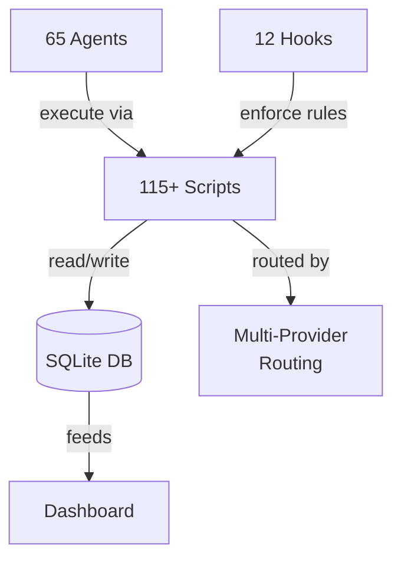
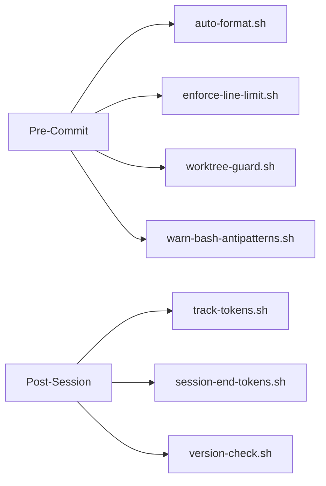
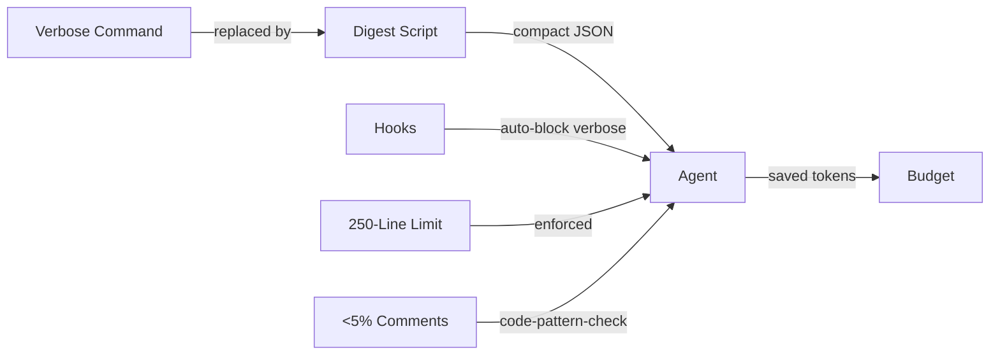

# Infrastructure

MyConvergio's infrastructure: 115+ scripts, 12 hooks, SQLite state, token optimization, and enforcement policies.



---

## Scripts Ecosystem

115+ scripts in `.claude/scripts/`, organized by category:

| Category       | Count | Key Scripts                                                             |
| -------------- | ----- | ----------------------------------------------------------------------- |
| Digest         | 14    | `git-digest.sh`, `build-digest.sh`, `test-digest.sh`, `ci-digest.sh`   |
| Orchestration  | 14    | `orchestrate.sh`, `delegate.sh`, `copilot-worker.sh`, `worker-launch.sh`|
| Plan DB        | 10    | `plan-db.sh`, `plan-db-safe.sh`, `plan-db-autosync.sh`, `execute-plan.sh`|
| Dashboard      | 10    | `dashboard-mini.sh`, `execution-monitor.sh`, `claude-monitor.sh`        |
| Worktree       | 8     | `worktree-create.sh`, `worktree-guard.sh`, `wave-worktree.sh`           |
| Migration      | 10    | `migrate-db.sh`, `migrate-v4.sh` through `migrate-v8-wave-worktree.sh`  |
| Quality        | 8     | `code-pattern-check.sh`, `thor-validate.sh`, `hardening-check.sh`       |
| Concurrency    | 5     | `file-lock.sh`, `stale-check.sh`, `merge-queue.sh`                     |
| Collector      | 6     | `collect-all.sh`, `collect-tests.sh`, `collect-quality.sh`              |
| Workers        | 4     | `copilot-worker.sh`, `gemini-worker.sh`, `opencode-worker.sh`           |
| PR & Git       | 8     | `pr-digest.sh`, `pr-ops.sh`, `pr-threads.sh`, `diff-digest.sh`         |
| Deploy & Infra | 6     | `deploy-digest.sh`, `env-vault.sh`, `vercel-helper.sh`                  |
| Utilities      | 12    | `context-audit.sh`, `cleanup-cache.sh`, `session-recovery.sh`           |

### Key Scripts

| Script               | Purpose                                              |
| -------------------- | ---------------------------------------------------- |
| `plan-db.sh`         | Central CLI for all plan CRUD and state management   |
| `plan-db-safe.sh`    | Safe wrapper — auto-validates on `done`, releases locks |
| `copilot-worker.sh`  | Copilot delegation with `--yolo` (full autonomy)     |
| `dashboard-mini.sh`  | Terminal dashboard — project overview, token tracking |
| `code-pattern-check.sh` | 9 pattern checks, 250-line limit, P1=reject       |
| `wave-worktree.sh`   | Merge validated waves — commit, push, PR, CI, squash |

---

## Hooks System

12 hooks in `hooks/` enforcing quality at commit and session boundaries:



| Hook                        | Trigger      | Action                                     |
| --------------------------- | ------------ | ------------------------------------------ |
| `auto-format.sh`            | Pre-commit   | Format code before commit                  |
| `enforce-line-limit.sh`     | Pre-commit   | Block files exceeding 250 lines            |
| `worktree-guard.sh`         | Pre-commit   | Prevent commits to main/master             |
| `warn-bash-antipatterns.sh` | Pre-commit   | Flag dangerous shell patterns              |
| `inject-agent-context.sh`   | Pre-exec     | Load agent context into session            |
| `preserve-context.sh`       | Pre-exec     | Save context state across sessions         |
| `prefer-ci-summary.sh`      | Pre-exec     | Route to digest scripts over raw commands  |
| `debug-hook-input.sh`       | Debug        | Diagnostic hook for troubleshooting        |
| `track-tokens.sh`           | Post-session | Record token consumption to DB             |
| `session-end-tokens.sh`     | Post-session | Finalize token tracking at session end     |
| `version-check.sh`          | Post-session | Verify agent versions match                |

---

## SQLite DB Architecture

All state in `~/.claude/data/dashboard.db` — portable, inspectable, zero dependencies.

| Table      | Columns (key)                                           | Purpose                    |
| ---------- | ------------------------------------------------------- | -------------------------- |
| `plans`    | id, project, name, status, worktree_path, created_at    | Plan metadata and status   |
| `waves`    | id, plan_id, wave_id, status, worktree_path             | Wave groupings within plans|
| `tasks`    | id, plan_id, wave_id_fk, title, status, test_criteria   | Task tracking with F-xx    |
| `tokens`   | plan_id, wave_id, task_id, agent, model, cost_usd       | Per-task API costs         |

```bash
sqlite3 ~/.claude/data/dashboard.db "SELECT status, COUNT(*) FROM tasks GROUP BY status;"
```

### Multi-Machine Sync

`sync-dashboard-db.sh` — portable SQLite file syncs across machines. No cloud DB required.

---

## Token Optimization



| Technique            | Savings     | Mechanism                                          |
| -------------------- | ----------- | -------------------------------------------------- |
| Digest scripts (14)  | ~60-80%     | Replace `git log`, `npm test`, `gh run` with JSON  |
| 250-line limit       | ~30-50%     | Hooks block oversized files before commit           |
| Token-aware writing  | ~20-40%     | <5% comments, compact commits/PRs, tables > prose  |
| Hook auto-blocking   | ~15-25%     | `prefer-ci-summary.sh` redirects verbose patterns  |
| Per-task tracking    | Visibility  | `tokens` table tracks cost per task/wave/plan      |

---

## Concurrency Control

| Mechanism           | Script             | Purpose                                    |
| ------------------- | ------------------ | ------------------------------------------ |
| File locking        | `file-lock.sh`     | Per-file locks with agent + task ownership |
| Stale detection     | `stale-check.sh`   | Hash snapshots detect concurrent changes   |
| Merge queue         | `merge-queue.sh`   | Serializes merge operations                |
| Session locks       | `file-lock-session.sh` | Session-scoped lock management         |

---

## Enforcement Policies

Three NON-NEGOTIABLE policies with specific enforcement locations:

| Policy              | Rule                                                   | Enforced In                                              |
| ------------------- | ------------------------------------------------------ | -------------------------------------------------------- |
| **CI Batch Fix**    | Wait full CI → collect ALL failures → fix ALL → push once (max 3 rounds) | `execute.agent.md`, `task-executor.md`, `guardian.md`, `pr-comment-resolver` |
| **Zero Tech Debt**  | Resolve ALL issues before done — never defer            | All executor agents, Thor Gates 2 + 4                   |
| **`--yolo` Mode**   | Full Copilot autonomy, no confirmation prompts          | `copilot-worker.sh`, `orchestrate.sh`, `worker-launch.sh` |

---

[← Use Cases](./use-cases.md) · [Concepts](./concepts.md) · [Comparison →](./agents/comparison.md)
