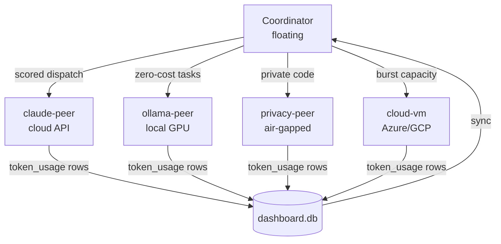
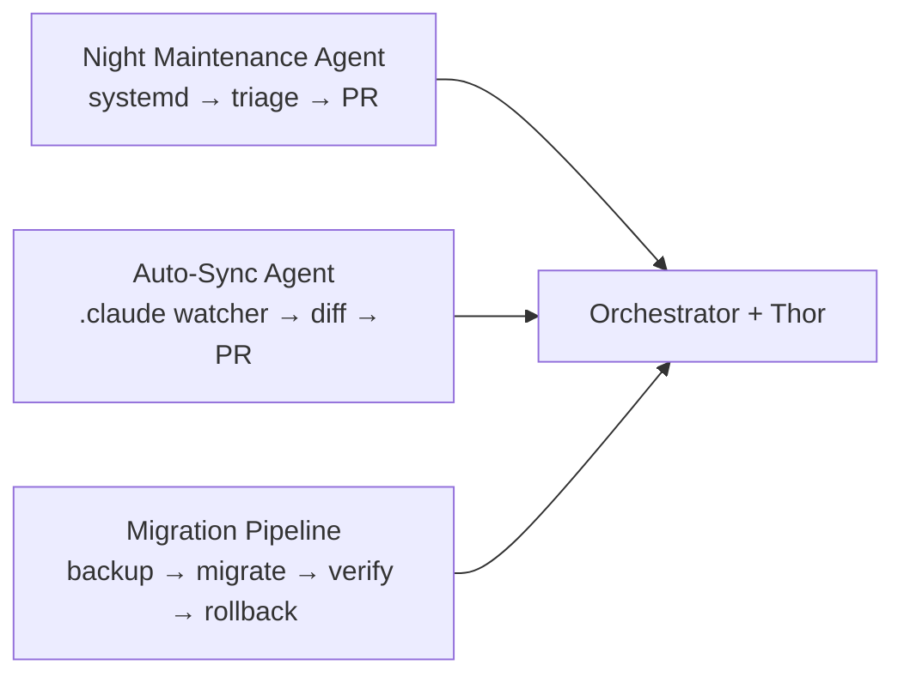

# Mesh Networking

Your AI agents now span multiple machines. The mesh spreads tasks across peers — local Macs, Linux servers, cloud VMs — each contributing capacity, cost efficiency, or privacy isolation.



---

## What is Mesh Networking?

The mesh is a peer-to-peer network of machines running the Claude toolchain. The **floating coordinator** (`mesh-dispatcher.sh`) scores all online peers and dispatches each task to the best match — by cost, load, capability, or privacy requirement. No central server required; peers communicate via SSH over Tailscale or direct LAN.

---

## Value Proposition

| Benefit                      | How                                                            |
| ---------------------------- | -------------------------------------------------------------- |
| **3x throughput**            | Parallel execution across 3+ peers instead of sequential local |
| **Zero-cost tasks**          | Ollama peer handles routine tasks with no API charges          |
| **Private code stays local** | `privacy_required=true` tasks never leave your network         |
| **Burst capacity**           | Cloud VM spins up for large plans, terminates after wave merge |

---

## Prerequisites

| Tool            | Install                                    | Notes                        |
| --------------- | ------------------------------------------ | ---------------------------- |
| Tailscale       | [tailscale.com](https://tailscale.com)     | Free tier: 3 machines        |
| SSH key pair    | `ssh-keygen -t ed25519`                    | Shared to all peers          |
| Claude Code     | `npm install -g @anthropic-ai/claude-code` | On each peer                 |
| `jq`, `sqlite3` | `brew install jq` / `apt install jq`       | Preinstalled on most distros |

Optional (Ollama peer): `curl -fsSL https://ollama.com/install.sh | sh` then `ollama pull llama3.2`

---

## Quick Start — 2 Machines in 5 Minutes

**Step 1** — Install tools on the new machine:

```bash
mesh-env-setup.sh --full
```

Installs Claude Code, `jq`, `sqlite3`, sets up `~/.claude/`, initializes `dashboard.db`, configures hooks.

**Step 2** — Register and bootstrap from master. Add to `~/.claude/config/peers.conf`:

```ini
[my-linux-server]
host=my-linux-server.tailnet.ts.net
user=ubuntu
cost_tier=free
privacy_safe=false
capabilities=claude,copilot
```

```bash
bootstrap-peer.sh my-linux-server   # SSH key exchange + remote DB init
```

**Step 3** — Sync credentials (via SSH encrypted channel, no plaintext temp files):

```bash
mesh-auth-sync.sh push --peer my-linux-server
```

**Step 4** — Verify:

```bash
mesh-dispatcher.sh --dry-run --all-plans
# my-linux-server  score=5  cost_tier=free  load=0.3  tasks=0
```

---

## Adding More Peers

| Peer Type    | peers.conf key                          | Notes                          |
| ------------ | --------------------------------------- | ------------------------------ |
| Local Mac    | `host=mac.tailnet.ts.net`               | High-memory tasks              |
| Linux server | `host=dev-box.tailnet.ts.net`           | GPU for Ollama, bulk execution |
| Cloud VM     | `host=azure-vm.tailnet.ts.net`          | Burst capacity                 |
| Ollama peer  | `cost_tier=zero`, `capabilities=ollama` | Zero API cost                  |
| Air-gapped   | `privacy_safe=true`, `host=<lan-ip>`    | Sensitive code only            |

Repeat Steps 2–4 for each peer.

---

## Cost Routing

The dispatcher scores peers per task — higher score wins.

| Peer Type          | `cost_tier` | Bonus | Typical Use                      |
| ------------------ | ----------- | ----- | -------------------------------- |
| Ollama (local GPU) | `zero`      | +1    | Routine generation, summaries    |
| Copilot CLI peer   | `free`      | +2    | Code tasks within Copilot quota  |
| Cloud API peer     | `premium`   | +0    | Complex reasoning, large context |

Additional factors: capability match `+3`, privacy match `+3`, high CPU load penalty, capacity cap (`MESH_MAX_TASKS_PER_PEER=3`).

Override: `mesh-dispatcher.sh --plan 42 --force-provider ollama-peer`

---

## Privacy Routing

Tasks flagged `privacy_required: true` are pinned to peers with `privacy_safe=true`. Any other peer receives score `-99` (disqualified).

```yaml
tasks:
  - id: T1-03
    title: "Refactor auth module"
    privacy_required: true
```

Privacy peer config:

```ini
[privacy-peer]
host=192.168.1.50
user=dev
cost_tier=free
privacy_safe=true
capabilities=claude
```

---

## Ollama Integration

Ollama provides **zero-cost** inference for tasks that don't need frontier reasoning.

```bash
curl -fsSL https://ollama.com/install.sh | sh
ollama pull llama3.2     # 2GB — general tasks
ollama pull codestral    # 5GB — code tasks
```

Register as a peer with `cost_tier=zero`, `capabilities=ollama,claude`. On the Ollama peer, set `~/.claude/config/provider.conf`:

```
provider=ollama
ollama_base_url=http://localhost:11434
ollama_model=llama3.2
```

---

## Cloud VM as Peer

```bash
# Azure: create VM, install Tailscale, bootstrap
az vm create -g mesh-rg -n mesh-worker --image Ubuntu2404 \
  --size Standard_D4s_v3 --admin-username dev \
  --ssh-key-values ~/.ssh/id_ed25519.pub
ssh dev@<vm-ip> "curl -fsSL https://tailscale.com/install.sh | sh && sudo tailscale up"
bootstrap-peer.sh azure-worker
mesh-auth-sync.sh push --peer azure-worker
# Teardown: az vm deallocate -g mesh-rg -n mesh-worker
```

---

## Managing Credentials

`mesh-auth-sync.sh` syncs credentials from master to peers via SSH (no HTTP, no plaintext files).

| Credential | Source                        | Transport        |
| ---------- | ----------------------------- | ---------------- |
| Claude     | `~/.claude/.credentials.json` | `scp`            |
| Copilot    | `gh auth token` output        | SSH pipe         |
| OpenCode   | `~/.opencode/config.json`     | `scp` if present |

```bash
mesh-auth-sync.sh push --peer <name>   # one peer
mesh-auth-sync.sh push --all           # all active peers
mesh-auth-sync.sh status               # verify per peer
```

Sync only to machines you own. Revoke access by deleting `~/.claude/.credentials.json` on the peer.

---

## Configuration Reference

**`~/.claude/config/peers.conf`** — one stanza per peer:

```ini
[peer-name]
host=hostname.tailnet.ts.net        # Tailscale hostname or IP
user=username                       # SSH user
cost_tier=free|zero|premium         # free=Copilot, zero=Ollama, premium=API
privacy_safe=true|false
capabilities=claude,copilot,ollama  # comma-separated
status=active|inactive
```

**`orchestrator.yaml`** mesh section: `enabled`, `max_tasks_per_peer` (default 3), `dispatch_timeout` (600s), `prefer_cost_tier`, `heartbeat_interval` (60s).

**Env vars**: `PEERS_CONF`, `MESH_MAX_TASKS_PER_PEER`, `MESH_DISPATCH_TIMEOUT`, `DB_PATH`, `CLAUDE_HOME`.

---

## Troubleshooting & FAQ

**Peer offline in `--dry-run`**

```bash
tailscale ping <peer-hostname>                    # network check
ssh -o ConnectTimeout=5 <user>@<host> echo ok     # SSH check
sqlite3 ~/.claude/data/dashboard.db \
  "SELECT * FROM peer_heartbeats ORDER BY ts DESC LIMIT 5;"
```

**bootstrap-peer.sh fails at SSH key exchange** — generate key first: `ssh-keygen -t ed25519 -f ~/.ssh/id_ed25519 -N ""`; all steps are idempotent, safe to re-run.

**Credentials missing after sync** — `mesh-auth-sync.sh status` then `push --all`.

**Tasks going to wrong peer** — `mesh-dispatcher.sh --dry-run` to inspect scores, then `--force-provider` to override.

**Do all peers need the same OS?** No — macOS ARM/Intel and Linux x86_64 are both supported; pure bash, POSIX deps only.

**Can I skip Tailscale?** Yes — set `host=` to a direct LAN IP or any SSH-reachable hostname.

**Peer goes offline mid-dispatch?** Task stays `in_progress` until `MESH_DISPATCH_TIMEOUT` expires; re-dispatch manually with `mesh-dispatcher.sh --plan <id>`.

**Token tracking for remote peers?** Each remote execution writes a `token_usage` row; `sync-dashboard-db.sh` syncs rows back to the master DB each cycle.

---

## Dashboard Delegation

Delegate plans to mesh nodes from the Convergio Control Room web dashboard.

### Workflow

```
Plan Card → 🚀 Delegate → Select Peer → Preflight (auto-fix) → Sync → Migrate → tmux session
```

### Preflight Checks

All checks stream via SSE (Server-Sent Events) — you see each one appear in real-time. Failures are auto-fixed when possible:

| Check | Auto-Fix | Blocking |
|-------|----------|----------|
| Plan status (todo/doing) | — | Yes |
| SSH reachable via `ssh_alias` | — | Yes |
| Heartbeat stale | Restarts daemon via SSH | No (auto-fixed) |
| Config out of sync | Runs `mesh-sync-all.sh --peer` | No (auto-fixed) |
| Claude CLI available | Searches `~/.local/bin`, `/opt/homebrew/bin` | Yes |
| Disk space ≥ 5GB | — | Yes |

### Delegation Process

1. **Phase 0 (auto-sync)**: `mesh-sync-all.sh --peer <target>` — config, DB, repos
2. **Phase 1-5**: `mesh-migrate.sh` — preflight, file sync, DB migration, tmux launch, verify

All output streams live to the browser modal.

### tmux Sessions

Each delegated plan runs in `tmux plan-{ID}` on the target node:
- Dashboard terminal icons auto-attach to the plan's tmux session
- `openAllTerminals()` connects each peer to its active plan session
- Manual: `ssh <peer> -t "tmux attach -t plan-{ID}"`

---

## Power Management

Control node power from the dashboard:

| Action | When to use | How it works |
|--------|-------------|-------------|
| **⚡ Wake** | Node is offline/sleeping | Sends 3x Wake-on-LAN magic packets (pure Python, broadcast UDP:9). Polls SSH for 15s. Requires `mac_address` in `peers.conf`. |
| **🔄 Reboot** | Node is online but frozen | Sends `sudo reboot` via SSH (OS-aware: macOS/Linux/Windows). Polls SSH for 40s to confirm comeback. |

Wake button appears on **offline** nodes. Reboot button on **online** nodes.

---

## Auto-Sync Protocol

Sync happens automatically — no manual intervention needed:

| Trigger | Direction | What syncs |
|---------|-----------|-----------|
| **Plan completes** | Coordinator → all online peers | Config + DB + repo changes |
| **Heartbeat starts** | Peer → coordinator | Pulls latest config (git bundle) |
| **Every ~5 minutes** | Peer → coordinator | Heartbeat loop pulls updates |
| **Before delegation** | Coordinator → target peer | Full sync (Phase 0) |

**Conflict resolution**: Remote dirty files → auto-stash before merge. Diverged git history → force-reset + rsync fallback. GitHub token expired → git bundle over SSH.

---

## peers.conf Reference

```ini
[my-node]
ssh_alias=my-node.tailnet.ts.net   # SSH config alias (required)
user=myuser                         # SSH username (required)
os=macos                            # macos | linux | windows (required)
tailscale_ip=100.x.x.x             # Tailscale IP (optional)
capabilities=claude,copilot,ollama  # Comma-separated (optional)
role=worker                         # coordinator | worker | hybrid (required)
status=active                       # active | inactive (default: active)
mac_address=AA:BB:CC:DD:EE:FF      # For Wake-on-LAN (optional)
```

---

[README](../README.md) | [Getting Started](getting-started.md) | [Infrastructure](infrastructure.md) | [Concepts](concepts.md) | [Workflow](workflow.md)

## v11 Automation Components


