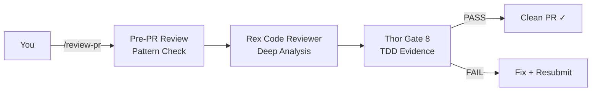

# Use Cases

You are a solo developer or founder. Here is how MyConvergio handles your daily challenges.

---

## 1. "My API is returning 500 errors in production"

**Problem**: Production down, logs are noisy, you need root cause fast.

```mermaid
graph LR
    U[You] -->|@dario| D[Dario Debugger<br/>Root Cause]
    D -->|hypothesis| AD[Adversarial Debugger<br/>Challenge Fix]
    AD -->|verified fix| TE[Task Executor<br/>TDD Patch]
    TE --> TH[Thor<br/>9-Gate Validate]
    TH -->|PASS| SH[Ship Hotfix ✓]
```

**Agents**: Dario (systematic debugging, 5 Whys, log analysis) → Adversarial Debugger (stress-tests the fix) → Task Executor (TDD patch) → Thor (validates)

**Commands**:
```bash
@dario API returning 500 since last deploy — here are the logs
# Dario: hypothesis-driven investigation, identifies root cause
@task-executor Fix the N+1 query in /api/orders endpoint
# Executor: writes regression test (RED), fixes query (GREEN), Thor validates
```

**Outcome**: Root cause identified with evidence, regression test prevents recurrence, hotfix ships with Thor approval.

---

## 2. "I need to add Stripe payments to my SaaS"

**Problem**: Multi-day feature — checkout, webhooks, subscription management, error handling. Too much for one session.

```mermaid
graph LR
    U[You] -->|@prompt| P[/prompt<br/>Extract F-xx]
    P --> PL[/planner<br/>3 Waves]
    PL --> W1[Wave 1: API<br/>Copilot --yolo]
    PL --> W2[Wave 2: UI<br/>Copilot --yolo]
    PL --> W3[Wave 3: Webhooks<br/>Copilot --yolo]
    W1 --> TH1[Thor ✓]
    W2 --> TH2[Thor ✓]
    W3 --> TH3[Thor ✓]
    TH3 --> MG[Merge & Ship]
```

**Agents**: /prompt (F-xx extraction) → /planner (wave decomposition) → Copilot workers (`--yolo`) → Thor (per-wave)

**Commands**:
```bash
@prompt Add Stripe checkout with subscriptions, webhooks, and error handling
@planner Create plan from .copilot-tracking/stripe-prompt.md
# Planner: 3 waves, 9 tasks, stored in SQLite, worktree created
copilot-worker.sh T1-01 --model gpt-5 --timeout 600
# Copilot runs with --yolo (full autonomy) — Thor validates independently
```

**Outcome**: Structured plan, parallel execution across providers, each wave Thor-validated. Full Stripe integration in hours, not days. `--yolo` mode means zero confirmation prompts — Thor catches quality issues independently.

---

## 3. "I want to ship a PR but I'm nervous about quality"

**Problem**: You've written code but aren't sure it meets production standards. You want confidence before the PR.



**Agents**: /review-pr (automated pattern check) → Rex (deep code review: security, DRY, error handling) → Thor Gate 8 (TDD evidence)

**Commands**:
```bash
/review-pr                          # code-pattern-check.sh on staged changes
@rex Review my auth middleware for security issues
@thor Validate — focus on Gate 3 (credentials) and Gate 8 (TDD)
```

**Outcome**: Three-layer quality check catches issues before they reach CI. Pattern violations, security gaps, missing tests — all identified and fixed pre-PR.

---

## 4. "I need my startup architecture designed from scratch"

**Problem**: Greenfield project — you need to make the right technology decisions early, with proper documentation.

```mermaid
graph LR
    U[You] -->|@baccio| B[Baccio Architect<br/>System Design]
    B -->|ADRs| ALI[Ali<br/>Coordinate Review]
    ALI -->|delegate| SP[Strategic Planner<br/>Execution Plan]
    SP --> ADR[ADR Docs<br/>Decisions Recorded]
```

**Agents**: Baccio (DDD, Clean Architecture, cloud strategy) → Ali (coordinates review) → Strategic Planner (execution roadmap) → ADR documentation

**Commands**:
```bash
@baccio Design architecture for a multi-tenant SaaS with
real-time collaboration, GDPR compliance, and global CDN
# Baccio: bounded contexts, deployment topology, NFRs, ADRs
@ali Review Baccio's architecture — check security and scalability
# Ali: delegates to Luca (security), Otto (performance), synthesizes
@strategic-planner Create implementation plan from architecture docs
```

**Outcome**: Production-ready architecture with ADRs, security review, performance analysis, and a structured implementation plan with waves and milestones.

---

## 5. "I need a pitch deck for my investor meeting tomorrow"

**Problem**: You have a product but no visual assets. You need a professional presentation fast.

```mermaid
graph LR
    U[You] -->|@jony| J[Jony Creative Director<br/>Skill Routing]
    J -->|/presentation-builder| PB[Presentation Builder<br/>React Slides]
    PB --> DECK[Animated Deck<br/>HLS Video + Liquid Glass]
```

**Agents**: Jony Creative Director (routes to Presentation Builder skill) → Animated React slide deck with HLS video backgrounds and liquid glass aesthetics

**Commands**:
```bash
@jony I need a 12-slide investor pitch deck for my AI productivity tool.
Include: problem, solution, market, traction, team, ask.
# Jony routes to /presentation-builder skill
# Output: React + Tailwind animated slides, ready to present
```

**Outcome**: Professional animated slide deck built as a React app — not PowerPoint. HLS video backgrounds, liquid glass effects, responsive design. From brief to presentation in one session.

---

## Pattern Summary

| Scenario                 | Lead Agent     | Key Feature                     | Time Saved |
| ------------------------ | -------------- | ------------------------------- | ---------- |
| Production debugging     | Dario          | Hypothesis-driven, regression   | 60-80%     |
| Multi-day feature        | /planner       | Waves + Copilot `--yolo`        | 50-70%     |
| Pre-PR confidence        | Rex + Thor     | Three-layer quality check       | 40-60%     |
| Greenfield architecture  | Baccio + Ali   | ADRs + coordinated review       | 50-70%     |
| Investor presentation    | Jony           | React animated deck             | 80-90%     |

---

[← Getting Started](./getting-started.md) · [Agent Showcase](./agents/agent-showcase.md) · [Infrastructure →](./infrastructure.md)
