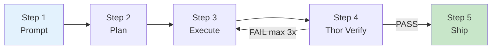
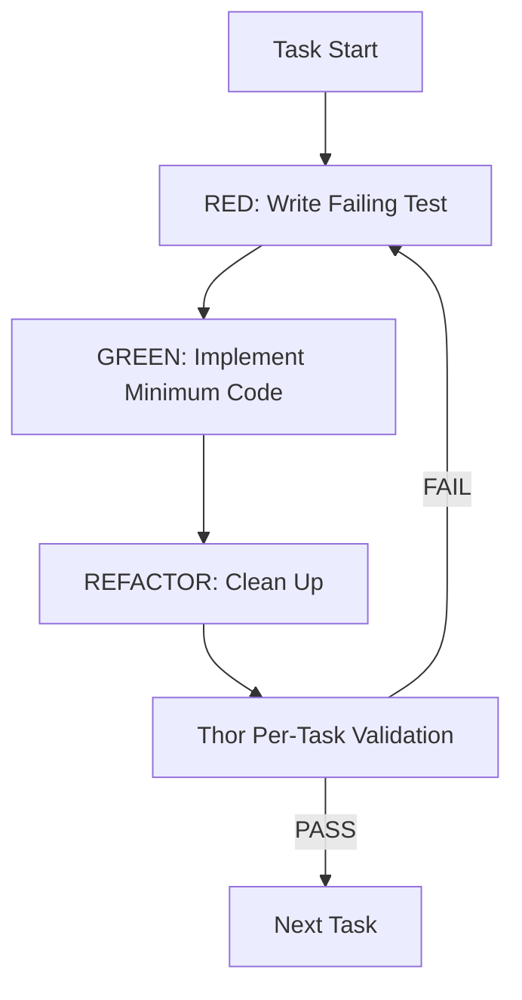
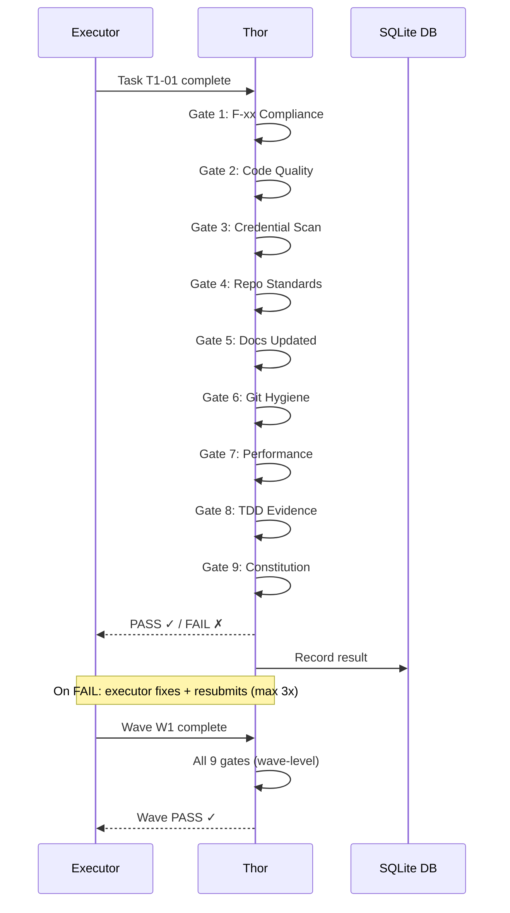
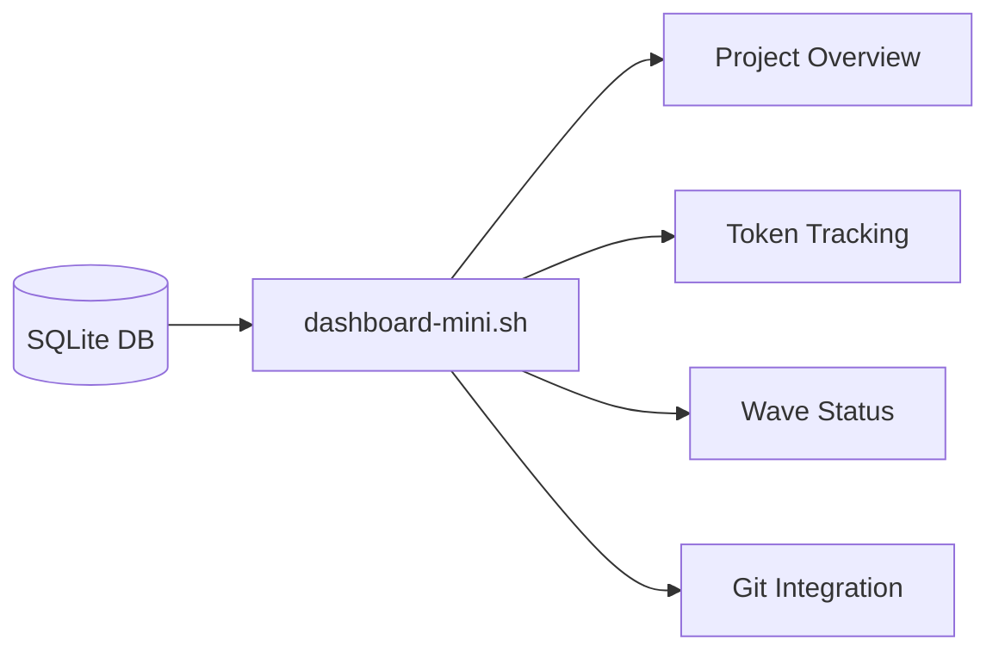

# MyConvergio Workflow

Complete pipeline from user intent to shipped code.



---

## Step 1: `/prompt` — Extract Requirements

Transform user intent into traceable F-xx requirements.

```bash
@prompt Add real-time notifications with WebSocket support
```

**What happens**:

| Action                | Output                                      |
| --------------------- | ------------------------------------------- |
| Parse user intent     | Identify features, constraints, edge cases   |
| Generate F-xx list    | F-01 through F-xx with acceptance criteria   |
| Confirm scope         | User approves/edits before planning          |
| Save                  | `.copilot-tracking/{name}-prompt.md`         |

---

## Step 2: `/planner` — Create Execution Plan

Generate multi-wave plan with tasks mapped to F-xx requirements.

```bash
@planner Create plan from .copilot-tracking/notifications-prompt.md
```

**What happens**:

| Action              | Output                                        |
| ------------------- | --------------------------------------------- |
| Decompose into waves | Wave 1: Infrastructure, Wave 2: UI, etc.     |
| Create tasks        | T1-01, T1-02... with F-xx mapping             |
| Generate spec.json  | Machine-readable plan specification            |
| Store in SQLite     | `plan-db.sh create` → dashboard.db             |
| Create worktree     | `git worktree add plan/{id}-W1`                |
| **User approval**   | Review plan before execution begins            |

---

## Step 3: `/execute` — TDD Cycle + Enforcement

Execute tasks with strict TDD and enforcement policies.



### TDD Cycle (Per Task)

| Phase    | What Happens                                      |
| -------- | ------------------------------------------------- |
| RED      | Write test that fails — proves requirement exists  |
| GREEN    | Write minimum code to make test pass               |
| REFACTOR | Clean up while keeping tests green                 |

### Copilot `--yolo` Mode

For autonomous delegation, Copilot workers run without confirmation:

```bash
copilot-worker.sh ${task_id} --model gpt-5 --timeout 600
# Uses copilot --yolo internally — no prompts, maximum throughput
```

### Parallel Execution

Multiple tasks can execute in parallel across providers:

```bash
# Claude handles T1-01 (review), Copilot handles T1-02 (code), Gemini handles T1-03 (research)
```

### Worktree Isolation

Each plan runs in a dedicated git worktree. No branch conflicts. No cross-plan interference.

### CI Batch Fix Policy

**NON-NEGOTIABLE** — After pushing changes:

1. Wait for FULL CI pipeline to complete (do not push again)
2. Collect ALL failures (lint, type, test, build)
3. Fix ALL failures in ONE commit
4. Push once
5. Maximum 3 rounds — escalate if still failing

Prevents the push-fix-push-fix antipattern that creates noisy history and wastes CI resources.

### Zero Technical Debt Policy

**NON-NEGOTIABLE** — Before marking any task done:

- Resolve ALL issues, not just high-priority ones
- Never defer to "later" or "follow-up PR"
- Accumulated debt = violation, triggers Thor rejection

---

## Step 4: Thor Validation

Independent 9-gate quality validation per task and per wave.



**Key**: Thor reads files directly. It never trusts agent self-reports. This is why independent validation matters — it catches what agents miss.

---

## Step 5: Ship

Merge validated work into the main branch.

```bash
wave-worktree.sh merge {plan_id} W1
```

**What happens**:

| Action         | Detail                                        |
| -------------- | --------------------------------------------- |
| Auto-commit    | Squash commits with conventional message       |
| Push           | Push to remote branch                          |
| Create PR      | `gh pr create` with summary + test plan        |
| Wait for CI    | CI batch fix policy applies here too           |
| Squash merge   | Clean single commit on main                    |

---

## Dashboard

Monitor everything from the terminal:

```bash
dashboard-mini.sh              # Full project overview
dashboard-mini.sh --overview   # Cross-project summary
plan-db.sh list-tasks {id}     # Task-level drilldown
plan-db.sh sync {id}           # Refresh status from DB
```



---

[README](../README.md) | [Getting Started](getting-started.md) | [Concepts](concepts.md) | [Workflow](workflow.md) | [Use Cases](use-cases.md) | [Infrastructure](infrastructure.md) | [Comparison](agents/comparison.md)
