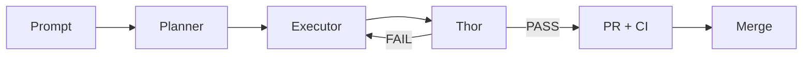

# MyConvergio Workflow

Complete pipeline from user intent to shipped code or validated non-code deliverables.


```mermaid
graph LR
    P[Prompt] --> PL[Planner]
    PL --> EX[Executor]
    EX --> TH[Thor]
    TH -->|PASS| PR[PR + CI]
    PR --> MG[Merge]
    TH -->|FAIL| EX
```

## Command cheat sheet

| Step | Claude Code | Copilot CLI | Result |
| --- | --- | --- | --- |
| Capture goal | `/prompt "<goal>"` | `@prompt "<goal>"` | Structured requirements |
| Create plan | `/planner` | `@planner` or `cplanner "<goal>"` | plan-db plan + waves/tasks |
| Execute | `/execute {plan_id}` | `@execute {plan_id}` | Specialized execution |
| Validate | Thor / project validator | `@validate {plan_id or task}` | Independent approval gate |
| Close | PR + CI + merge, or deliverable approval | PR + CI + merge, or deliverable approval | Plan closure |

> Copilot CLI `/plan` is **not** the MyConvergio planner. Use `@planner`, `/agent -> planner`, or `cplanner`.

## 1. Prompt

```bash
@prompt Add real-time notifications with WebSocket support
```

Convert intent into explicit requirements, constraints, and expected deliverables.

## 2. Planner

```bash
@planner Create plan from .copilot-tracking/notifications-prompt.md
```

Planner decomposes work into waves and tasks, stores them in SQLite, assigns the right agents/models, and creates execution context. This is the same whether the output is code, a strategy document, a design audit, or an operational checklist.

## 3. Executor

```bash
@execute 42
```

Executor runs the task workflow and submits proof of work. For software tasks this usually means RED → GREEN → REFACTOR. For non-code tasks it means producing the promised artifacts and evidence.

## 4. Thor validation

Thor independently validates the task before status can move from `submitted` to `done`.

Key checks:

- F-xx coverage
- tests and type checks when code is involved
- docs and repo hygiene
- token attribution and execution trace integrity
- no silent bypass of hooks / plan DB flow
- artifact-specific evidence for business/design/research work

## 5. Closure path

### Repo-backed work

After a validated wave, MyConvergio creates the PR, waits for CI, fixes failures in batches, then merges.

### Non-code work

If the plan does not change repo artifacts, closure happens through validated deliverables instead of PR merge. Typical outputs:

- business memo or decision package
- roadmap or prioritization matrix
- UX/design audit
- architecture ADR or process spec
- release/checklist package

In these cases, Thor validates evidence and consistency, then the plan closes on approval.

## Control Room

Start the dashboard:

```bash
python3 ~/.claude/scripts/dashboard_web/server.py
```

The web dashboard shows:

- current plans, waves, tasks
- live AI organization grouped by node and role
- active agent runs, handoffs, and recent task events
- tokens / costs with exact task attribution where available

## Choosing the right process

| Objective | Use PR/CI/merge? | Notes |
| --- | --- | --- |
| Feature, bug fix, infra change | Yes | Full engineering workflow |
| Architecture decision in repo | Usually yes | ADR/docs change tracked in git |
| Business analysis only | No | Deliverable package + validation |
| Design audit/spec only | No, unless saved in repo | Same planner/executor/Thor flow |

## Bootstrap workflow

Before starting serious work on a new machine:

```bash
myconvergio setup --standard --with-shell --with-devtools
myconvergio doctor
```

For a full maintainer-style workstation:

```bash
myconvergio setup --full --with-workstation
```

## Ecosystem release sync

When preparing a public release from your private `~/.claude` source of truth:

```bash
myconvergio ecosystem-sync all --dry-run
myconvergio ecosystem-sync all
```

This ensures:

- sanitized upstream sync into `.claude/`
- mirrored runtime copies under `scripts/` stay consistent
- Copilot agents are regenerated and validation checks run
